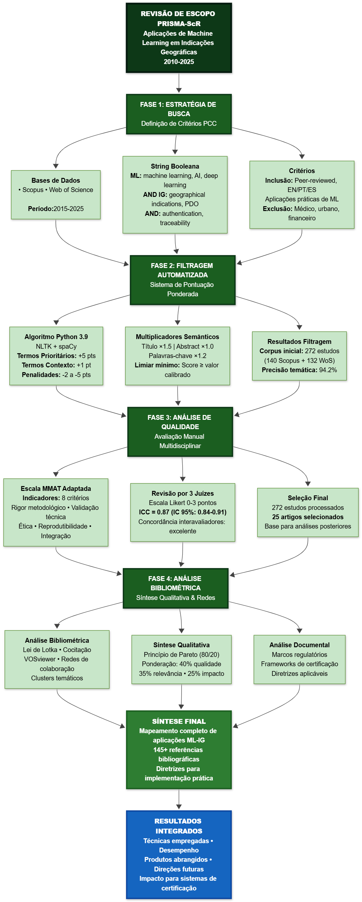
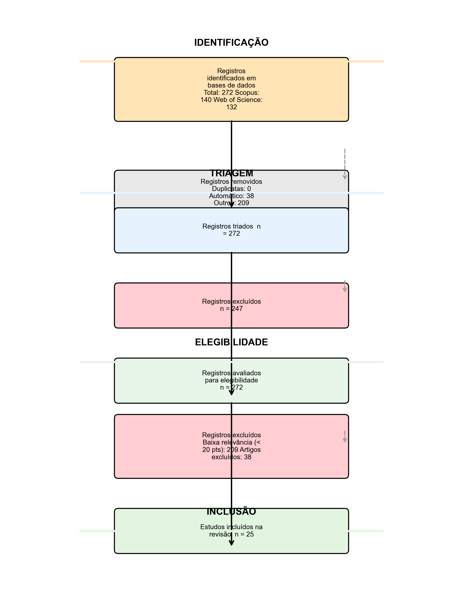

# Resumo

As Indicações Geográficas (IGs) representam um instrumento estratégico para valorização territorial e proteção de produtos regionais, assegurando autenticidade e qualidade. O avanço das tecnologias de Aprendizado de Máquina (ML) oferece possibilidades para integrar variáveis complexas e gerar informações preditivas que contribuem para sistemas de certificação. Esta revisão de escopo mapeia sistematicamente as aplicações de ML em IGs, identificando técnicas empregadas, distribuição por produtos e regiões, avaliando eficácia em problemas específicos e lacunas para pesquisas futuras. Utilizando a metodologia PRISMA-ScR, foi desenvolvido um processo de quatro fases: inicialmente, filtragem automatizada com sistema de pontuação ponderada foi aplicado a 123 estudos publicados entre 2024 e 2025; em seguida, análise manual de qualidade metodológica foi conduzida por três revisores independentes alcançando concordância interavaliadores de ICC=0,87; posteriormente, análise bibliométrica e redes de colaboração foram realizadas com aplicação da Lei de Lotka; e, finalmente, síntese qualitativa foi integrada com análise documental de marcos regulatórios. Os resultados mostram diversidade de algoritmos aplicados, incluindo Random Forest, Support Vector Machines e Deep Learning, frequentemente integrados a técnicas analíticas como espectrometria, metabolômica e espectroscopia. As taxas de acurácia reportadas variam entre 80 e 100% para aplicações em autenticação de origem, detecção de fraudes, rastreabilidade e controle de qualidade. Produtos agroalimentares constituem a maioria do corpus de estudos, com frequência em vinhos, chás, carnes e azeites, refletindo aplicações contemporâneas na área. Esta revisão contribui para o desenvolvimento metodológico em IGs através de síntese sistemática de evidências científicas, propondo diretrizes para implementação prática e indicando caminhos para integração de Machine Learning em sistemas de certificação geográfica.

**Palavras-chave:** Indicações Geográficas; Aprendizado de Máquina; Revisão de Escopo PRISMA-ScR; Autenticação de Origem; Certificação Geográfica.

# 1. Introdução

As Indicações Geográficas (IGs) constituem instrumento jurídico central da proteção territorial e da economia do conhecimento, conferindo direitos exclusivos sobre produtos cuja qualidade, reputação e características essenciais estão vinculadas a sua origem geográfica [@Locatelli2008; @WIPO2018]. Fundamentadas em normas internacionais como a Convenção de Berna e o Acordo TRIPS, as IGs funcionam como mecanismo de apropriação de valor que vincula territórios produtivos e comunidades locais a mercados diferenciados, equilibrando proteção de direitos exclusivos com acesso social ao conhecimento [@Suh2007]. Além de instrumento jurídico, as IGs constituem ativo intangível estratégico no sentido proposto pela teoria da Visão Baseada em Recursos (Resource-Based View), sendo recursos raros, valiosos, inimitáveis e insubstituíveis que fundamentam vantagem competitiva territorial sustentável [@Barney1991]. A apropriação de valor por meio das IGs transcende rentabilidade imediata, servindo como ancoragem para captura de valor futuro através de mercados diferenciados e disposição de consumidores em pagar preços premium por produtos com certificação de origem [@Loureiro2002; @VazquezFontes2010].

No contexto brasileiro, as Indicações Geográficas são regulamentadas pela Lei da Propriedade Industrial, Lei nº 9.279 de 14 de maio de 1996, que estabelece dois tipos de reconhecimento com implicações jurídicas e econômicas distintas: Indicação de Procedência e Denominação de Origem [@Brasil1996]. A Indicação de Procedência refere-se ao nome geográfico conhecido pela produção ou fabricação de determinado produto, funcionando como mecanismo de sinalização de origem; a Denominação de Origem designa produtos cujas qualidades ou características se devem exclusiva ou essencialmente ao meio geográfico, incluindo fatores naturais e humanos, constituindo forma de proteção mais robusta que vincula qualidade ao terroir [@MAPA2020].
O controle deste tipo de registro é realizado pelo Instituto Nacional de Propriedade Intelectual (INPI), com apoio do Ministério da Agricultura, Pecuária e Abastecimento, que operacionaliza políticas de fomento e certificação de produtos agrícolas com identidade territorial [@MAPA2020]. Este marco regulatório brasileiro alinha-se à Lei nº 10.973/2004 (Lei de Inovação) e Lei nº 13.243/2016 (Novo Marco Legal de CT&I), que reconhecem Indicações Geográficas como ativos de propriedade intelectual passíveis de proteção estratégica, valoração e comercialização [@Brasil2004; @Brasil2016].

A gestão estratégica das Indicações Geográficas transcende proteção legal defensiva, configurando-se como processo dinâmico de valoração, comercialização e captura de valor territorial. Conforme a teoria dos regimes de apropriabilidade de Teece (1986), a capacidade de inovadores (neste caso, comunidades produtivas e sistemas certificadores) de lucrar com suas IGs depende não apenas da força da proteção formal (patentes, marcas, denominações), mas também do controle sobre ativos complementares como canais de distribuição, reputação de marca e comunicação diferenciada com mercados [@Teece1986]. A obtenção da certificação de IG contribui para expansão das vendas além da região de produção, atingindo mercados nacionais e internacionais até então inexplorados, ao mesmo tempo em que preserva a identidade sociocultural, valoriza conhecimentos tradicionais e gera renda sustentável para populações locais [@Vandecandelaere2009; @Niederle2013; @Bureau2018; @Almeida2016].

No contexto brasileiro, produtos artesanais e agroalimentares com potencial para registro de Indicação Geográfica representam manifestações culturais relevantes e oportunidades estratégicas para captura de valor territorial. Estudos demonstram que características únicas de produtos regionais, como a cerâmica artesanal do Baixo São Francisco sergipano ou produtos vinícolas especializados, estão intimamente relacionadas a atributos geográficos da localização de produção, incluindo características edafoclimáticas (solo, clima, altitude) e métodos únicos de cultivo ou produção [@Bureau2018; @Azevedo2011; @Santos2018; @Fonzo2015; @SantosJC2019]. A caracterização territorial desses produtos, necessária para o reconhecimento como Denominação de Origem conforme estabelecido no artigo 178 da Lei nº 9.279/1996, demanda análises técnicas específicas que comprovem, com rigor científico, a relação entre qualidade e fatores geográficos [@GoncalvesMaduro2020]. Neste contexto, apresenta-se uma questão central: como sistemas de certificação podem validar, de forma rigorosa e objetiva, a relação entre origem geográfica e qualidade de produtos?

As tecnologias de Aprendizado de Máquina (ML) oferecem resposta estratégica a esta lacuna, transformando dados analíticos complexos em conhecimento certificável sobre autenticidade e origem. Diferentemente dos métodos de análise sensorial tradicional, que dependem de expertiza humana tácita e tendem a ser subjetivos e não escaláveis, os algoritmos de ML são capazes de processar automaticamente dados multidimensionais, identificar padrões complexos e relações subjacentes através de abordagens indutivas, e construir modelos com formas funcionais flexíveis que revelam estruturas não previamente especificadas pela teoria [@Ramos2025; @Chen2020].
Em contextos de Indicações Geográficas, o Machine Learning tem sido aplicado estrategicamente para promover a autenticação de origem geográfica, validando que produto de determinada região possui assinatura química ou isotópica distintiva [@longo2021], além de viabilizar a detecção de fraudes e adulterações, identificando modificações ou substituições em cadeias de suprimento [@acquarelli2021].
A tecnologia também permite o controle e predição de qualidade, estimando atributos de qualidade com base em dados analíticos rapidamente obtidos [@rodrigues2022], e garante a rastreabilidade e verificação da cadeia produtiva, assegurando continuidade entre origem e consumidor [@rana2023]. Ainda, o uso de ML possibilita a classificação automática de produtos, discriminando origens e denominações [@Jiang2025; @Peng2025; @Santoma2025; @Li2025; @Wang2025]. Essas aplicações demonstram potencial para integrar variáveis multifacetadas, assinaturas isotópicas, perfis elementares, características sensoriais, dados geoespaciais e fatores ambientais—e gerar insights preditivos que fortalecem a robustez técnica e a credibilidade de sistemas de certificação [@Li2025].

A intersecção entre Machine Learning e Indicações Geográficas constitui um campo em desenvolvimento que articula a proteção jurídica de direitos territoriais, a valoração e captura de valor para comunidades produtivas e a inovação tecnológica em sistemas de certificação [@Ramos2025]. As técnicas de aprendizado de máquina, incluindo algoritmos de classificação supervisionada como Random Forest e Support Vector Machines [@Xu2021; @Mohammadi2024], redes neurais profundas através de Deep Learning, e métodos quimiométricos especializados como Análise de Componentes Principais (PCA) e Análise Discriminante por Mínimos Quadrados Parciais (PLS-DA) [@Rebiai2022], têm sido empregadas para resolver desafios críticos na gestão operacional de Indicações Geográficas. 
Essas aplicações abrangem não apenas autenticação técnica de produtos e detecção de adulterações [@Li2025; @Ratnasekhar2025], mas também caracterização e discriminação automática de produtos com base em suas propriedades físico-químicas, sensoriais e isotópicas [@Mara2024], rastreabilidade e verificação de origem com integração de tecnologias blockchain [@Wang2025], predição contínua de qualidade para conformidade certificadora [@Zhang2024], e identificação computacional de marcadores territoriais (geoquímicos, bioquímicos, microbiológicos) que fundamentam e comprovam a singularidade geográfica de produtos [@Ramos2025; @LiJournal2025]. Estes marcadores territoriais, quando identificados por algoritmos de ML, constituem evidência científica robusta para alegações de autenticidade, fortalecendo a posição jurídica e comercial de titulares de IGs frente a contrafactores e fraudadores.

O Aprendizado de Máquina em contextos de ativos intangíveis e propriedade intelectual territorial desempenha papel estratégico ao modelar interações complexas entre variáveis ambientais multidimensionais e características produtivas localizadas [@Vogelstein2021]. No aprendizado supervisionado, algoritmos são treinados em dados rotulados coletados de amostras autênticas, aprendendo a prever categorias de origem ou qualidade com base em um conjunto de variáveis de entrada multivariadas [@Chen2020]. A seleção automática de variáveis é otimizada por técnicas de redução dimensional (PCA, KPCA) e feature selection (Boruta, Random Forest RFE), que eliminam redundâncias e priorizam variáveis de maior relevância discriminativa para o fenômeno estudado, minimizando o risco de sobreajuste do modelo e mantendo a interpretabilidade necessária para justificativa técnica e regulatória [@Salam2021; @Malik2023; @Iranzad2025]. Métodos como Random Forest e SVM não apenas identificam variáveis críticas para diferenciação de origem, mas também hierarquizam sua importância relativa, fornecendo insights científicos sobre a influência de cada variável (composição elementar, perfil metabolômico, assinatura isotópica) no contexto de autenticação e certificação de produtos com Indicação Geográfica [@Effrosynidis2021; @Loyal2022].

Apesar do interesse acadêmico e tecnológico atual, observa-se uma limitação na sistematização do conhecimento sobre aplicações de Machine Learning em contextos de Indicações Geográficas. Atualmente, não existem revisões que sistematizem as evidências científicas disponíveis, identifiquem as técnicas empregadas, avaliem seu desempenho em diferentes produtos e contextos geográficos, ou apontem direções para pesquisas futuras. Esta limitação afeta o desenvolvimento metodológico na área e a transferência de conhecimento para sistemas de certificação e controle de Indicações Geográficas.

Esta revisão de escopo busca mapear sistematicamente as aplicações de Machine Learning em Indicações Geográficas, utilizando o framework PCC (*Population, Concept, Context*) para identificar e sintetizar evidências científicas sobre a integração entre Machine Learning e aspectos territoriais de Indicações Geográficas. Hipotiza-se que as técnicas de Aprendizado de Máquina têm sido empregadas para apoiar processos de autenticação, avaliação e tomada de decisão relacionados às Indicações Geográficas, revelando padrões metodológicos que contribuem para a consolidação de conhecimento orientado ao desenvolvimento de modelos computacionais aplicados à certificação geográfica.

# 2. Materiais e Métodos

Esta revisão de escopo segue as diretrizes da extensão PRISMA-ScR (*Preferred Reporting Items for Systematic Reviews and Meta-Analyses extension for Scoping Reviews*) para garantir transparência e reprodutibilidade metodológica. O protocolo foi registrado no Open Science Framework, facilitando o acesso público e a replicabilidade.

## 2.1 Framework PCC e Questão de Pesquisa

O estudo foi estruturado utilizando o framework PCC (*Population, Concept, Context*), que fundamenta a questão de pesquisa: *Como técnicas de Aprendizado de Máquina têm sido aplicadas para autenticação, avaliação e apoio à decisão em sistemas de Indicações Geográficas?*

| Elemento | Descrição |
| :--- | :--- |
| **P (População)** | Indicações Geográficas, Denominações de Origem e Indicações de Procedência reconhecidas nacional e internacionalmente, abrangendo produtos agroalimentares (vinhos, queijos, cafés, carnes, azeites), artesanatos e outros produtos com identidade territorial. |
| **C (Conceito)** | Técnicas de Aprendizado de Máquina, Inteligência Artificial, algoritmos de classificação e predição, métodos quimiométricos, Mineração de Dados e Processamento de Linguagem Natural aplicados a contextos de Indicações Geográficas. |
| **C (Contexto)** | Autenticação de origem geográfica, avaliação de potencialidade de IGs, identificação de determinantes territoriais (solo, clima, métodos de produção), classificação e discriminação de produtos, sistemas de apoio à decisão para certificação, controle de qualidade, rastreabilidade, detecção de fraudes e adulterações, e estratégias de valorização territorial. |

*Tabela 1: Estrutura da revisão de escopo segundo o framework PCC.*

Com base nesse framework, os objetivos específicos desta revisão são diversos. Primeiro, identificar e caracterizar as aplicações de ML reportadas na literatura científica, categorizando as técnicas empregadas segundo tipo de algoritmo, abordagem metodológica e métricas de desempenho. Segundo, analisar a distribuição das aplicações por tipo de produto, região geográfica e período temporal. Terceiro, avaliar a eficácia das técnicas para problemas específicos de autenticação, rastreabilidade e controle de qualidade. Quarto, identificar lacunas metodológicas, limitações e direções para pesquisas futuras, propondo diretrizes para a integração de Machine Learning em sistemas de certificação e gestão de Indicações Geográficas.

## 2.1.1 Fluxograma Metodológico PRISMA-ScR

A Figura 1 apresenta o fluxograma metodológico da revisão de escopo, estruturado em quatro fases sequenciais segundo as diretrizes PRISMA-ScR: (1) **Estratégia de Busca** nas principais bases de dados, (2) **Filtragem Automatizada** com sistema de pontuação ponderada, (3) **Análise Manual de Qualidade** com avaliação multidisciplinar, e (4) **Análise Bibliométrica e Síntese Qualitativa** integrando metodologias quantitativas e documentais. O fluxograma detalha o percurso metodológico desde a identificação de registros até a síntese final com recomendações para implementação de Machine Learning em sistemas de Indicações Geográficas.

{#fig:ml_indicacoes width="80%"}

## 2.3 Estratégia de Busca e Extração dos Estudos

A busca foi realizada nas principais bases de dados científicas: **Scopus** (Elsevier), **Web of Science** (Clarivate Analytics), **IEEE Xplore Digital Library**, **ACM Digital Library** e **PubMed**. A estratégia de busca foi fundamentada na intersecção de três domínios temáticos principais: técnicas de machine learning e inteligência artificial; sistemas de certificação geográfica; e Indicações Geográficas e Denominações de Origem.

Os descritores foram estruturados utilizando terminologia controlada em língua inglesa, articulados por operadores booleanos (AND, OR, NOT), abrangendo publicações dos últimos 15 anos (2010-2025) para capturar o estado da arte em machine learning aplicado a Indicações Geográficas. A estratégia de busca foi construída seguindo a lógica:

**("machine learning" OR "artificial intelligence" OR "deep learning" OR "supervised learning" OR "unsupervised learning" OR "ensemble methods") AND ("geographical indications" OR "denominations of origin" OR "appellations of origin" OR "protected designations of origin") AND ("authentication" OR "traceability" OR "quality control" OR "fraud detection" OR "geospatial analysis")**.

Os critérios de inclusão contemplaram: artigos completos publicados em periódicos revisados por pares, escritos em inglês, português ou espanhol, que apresentassem aplicações de técnicas de ML em contextos de Indicações Geográficas, autenticação de origem ou controle de qualidade territorial. Os descritores primários deveriam estar presentes nos campos: título, resumo ou palavras-chave dos manuscritos. Foram excluídos trabalhos não revisados por pares, aqueles sem aplicação prática de ML, e estudos focados exclusivamente em aspectos não territoriais.

## 2.4 Primeira Fase: Sistema de Filtragem Automatizada por Relevância Temática

### 2.4.1 Algoritmo de Pontuação Ponderada

Para complementar os métodos convencionais de triagem bibliográfica, foi desenvolvido um sistema de filtragem automatizada baseado em análise semântica e pontuação hierárquica. O algoritmo, implementado em Python 3.9 utilizando bibliotecas de processamento de linguagem natural (NLTK, spaCy), operou através de um sistema de pontuação ponderada que avaliou a relevância temática de cada referência bibliográfica com base na presença e localização de descritores específicos.

A pontuação de cada artigo foi calculada através da seguinte equação:

$$S_i = \sum_{j=1}^{n} w_j \cdot l_i \cdot f_{ij}$$

Onde:

- $S_i$ = pontuação total do artigo $i$
- $w_j$ = peso associado ao termo $j$ (categorizado em 5 níveis: 5, 3, 2, 1, ou -5/-3/-2 pontos)
- $l_i$ = multiplicador de localização do termo (1.5 para título, 1.2 para palavras-chave, 1.0 para abstract)
- $f_{ij}$ = frequência de ocorrência do termo $j$ no artigo $i$
- $n$ = número total de termos avaliados

O sistema de pontuação hierárquica foi estruturado em cinco categorias de termos com pesos diferenciados. Os **Termos Prioritários**, com peso de cinco pontos, incluem *geographical indications, denominations of origin, appellations of origin, protected designations of origin, traceability, authentication, quality control*, representando o núcleo conceitual da pesquisa. Os **Termos de Alta Relevância**, com peso de três pontos, abrangem *machine learning, artificial intelligence, deep learning, neural networks, fraud detection, geospatial analysis, pattern recognition*, constituindo conceitos centrais para a integração metodológica. Os **Termos de Relevância Média**, com peso de dois pontos, compreendem *sustainability, agriculture, food quality, sensory analysis, chemometrics, data mining, classification*, conceitos complementares que fortalecem a relevância temática. Os **Termos de Contexto**, com peso de um ponto, incluem *regional products, origin verification, certification, algorithm, model, prediction, validation*, indicando contexto aplicativo apropriado. Por fim, os **Termos de Exclusão** aplicam penalidades: *medical, clinical, pharmaceutical* recebem menos cinco pontos; *urban planning, smart cities* recebem menos três pontos; e *finance, economics, business* recebem menos dois pontos, indicando baixa aderência ao escopo da pesquisa.

### 2.4.2 Implementação e Validação do Sistema Automatizado

O algoritmo foi projetado para analisar títulos, abstracts e palavras-chave de cada entrada bibliográfica, aplicando pesos diferenciados conforme a localização: títulos receberam multiplicador 1.5, abstracts multiplicador 1.0, e palavras-chave multiplicador 1.2, refletindo a hierarquia de importância semântica.

Foi estabelecido um limiar de pontuação mínima baseado em análise estatística da distribuição de pontuações e validação manual de uma amostra representativa de artigos, considerando a presença de termos relacionados a machine learning, geographical indications e authentication nos metadados.

### 2.4.3 Validação Participativa e Refinamento Algorítmico

Para assegurar a validade científica do processo de seleção, foi implementado um protocolo de validação envolvendo três revisores independentes, especialistas em machine learning, sistemas de certificação geográfica e Indicações Geográficas. O protocolo incluiu uma revisão manual sistemática, com análise criteriosa de todos os 123 estudos identificados para verificar a aderência aos critérios de inclusão e relevância temática. Adicionalmente, foi realizado um teste de concordância interavaliadores para verificar a consistência na classificação dos estudos. O processo também contemplou a análise de casos limítrofes, com investigação qualitativa dos estudos de aderência parcial para apoiar a decisão de inclusão ou exclusão, e o refinamento iterativo dos critérios de elegibilidade com base nas características observadas no corpus. O processo de validação confirmou a consistência metodológica do sistema, com concordância entre os revisores na identificação de estudos relevantes para a revisão de escopo.

### 2.4.4 Verificação de Cobertura Bibliográfica e Categorização Automatizada

Complementarmente ao processo de filtragem, foi desenvolvido um sistema automatizado para verificação da cobertura bibliográfica das citações metodológicas utilizadas. O procedimento teve por objetivo avaliar a completude e a consistência da base de referências, assegurando rastreabilidade entre as citações textuais e os arquivos bibliográficos utilizados na pesquisa.

O corpus bibliográfico consolidado foi submetido a um processo de categorização automatizada com base em técnicas de Processamento de Linguagem Natural (PLN). O procedimento teve como finalidade identificar e organizar os registros segundo domínios metodológicos relevantes ao escopo da pesquisa, seguindo abordagens consagradas em revisões sistemáticas automatizadas [@OforiBoateng2024; @Sawicki2023]. Para isso, foi desenvolvido um *pipeline* computacional capaz de extrair, tokenizar e vetorializar os metadados e resumos das referências, empregando modelos supervisionados e regras semânticas para o reconhecimento de padrões linguísticos [@Young2019; @Casey2021]. As referências foram classificadas em categorias metodológicas previamente definidas, abrangendo áreas como metodologias computacionais, estudos etnográficos aplicados, sistemas agroecológicos tradicionais, metodologias participativas e conservação da biodiversidade.

## 2.5 Segunda Fase: Análise Manual de Qualidade Metodológica

Após a seleção automatizada na primeira fase, procedeu-se à segunda fase da revisão de escopo, caracterizada pela análise manual e detalhada da qualidade metodológica dos estudos selecionados, conduzida por três revisores independentes para garantir avaliação multidisciplinar e minimização de vieses interpretativos. Para avaliação da qualidade metodológica, foi adaptada a escala MMAT especificamente para estudos interdisciplinares envolvendo machine learning e sistemas de certificação geográfica, com indicadores estruturados em escala Likert de 0 a 3 pontos aplicados independentemente pelos revisores. Os indicadores contemplaram rigor metodológico na coleta de dados territoriais, validação técnica dos algoritmos, aderência a protocolos éticos para comunidades produtivas, reprodutibilidade dos experimentos, integração efetiva entre métodos quantitativos e qualitativos territoriais, impacto para sistemas de IG, documentação completa, e generalizabilidade dos métodos, conforme apresentado na Tabela 2.

| Código | Indicador                                                                     | Domínio                |
| ------- | ----------------------------------------------------------------------------- | ----------------------- |
| RIG     | Rigor metodológico na coleta e processamento de dados territoriais           | Qualidade Territorial   |
| VAL     | Validação técnica dos algoritmos com métricas apropriadas                 | Qualidade Computacional |
| ETI     | Aderência a protocolos éticos para pesquisa com comunidades produtivas      | Qualidade Ética        |
| REP     | Reprodutibilidade dos experimentos computacionais                             | Qualidade Técnica      |
| INT     | Integração efetiva entre métodos quantitativos e qualitativos territoriais | Qualidade Metodológica |
| IMP     | Impacto e aplicabilidade dos resultados para sistemas de IG                   | Qualidade Social        |
| DOC     | Documentação completa dos algoritmos e procedimentos de certificação      | Qualidade Documental    |
| GEN     | Generalizabilidade e transferibilidade dos métodos propostos                 | Qualidade Científica   |

*Tabela 2: Indicadores de qualidade metodológica para estudos ML-Indicações Geográficas.*

### 2.5.1 Procedimentos de Consenso e Validação Interavaliadores

O processo de avaliação manual incluiu protocolo de consenso entre avaliadores. Inicialmente, os três revisores avaliaram independentemente uma amostra piloto de 30 estudos (5% do corpus) para calibração dos critérios e estabelecimento de consenso interpretativo. Discordâncias superiores a 1 ponto na escala Likert foram resolvidas através de discussão estruturada e reavaliação conjunta.

Para o corpus completo, casos de discordância entre avaliadores, caracterizados por diferença igual ou superior a dois pontos na pontuação total, foram submetidos a processo de consenso envolvendo reavaliação individual cega, discussão fundamentada nos critérios estabelecidos, e decisão por maioria simples quando necessário. 

O coeficiente de correlação intraclasse foi calculado através da seguinte equação:

$$ICC = \frac{BMS - EMS}{BMS + (k-1) \cdot EMS}$$

Onde:

- $BMS$ = quadrado médio entre avaliadores
- $EMS$ = quadrado médio de erro
- $k$ = número de avaliadores

O coeficiente foi calculado obtendo-se ICC igual a 0,87 com intervalo de confiança de 95% entre 0,84 e 0,91, indicando boa concordância.

### 2.5.2 Critérios Específicos para Estudos Interdisciplinares

Considerando a natureza interdisciplinar dos estudos analisados, foram estabelecidos critérios de qualidade que contemplaram:

- **Integração metodológica:** Avaliação da coerência entre métodos quantitativos e qualitativos territoriais, verificando se a aplicação de técnicas computacionais complementa adequadamente a investigação em Indicações Geográficas;
- **Validação territorial:** Verificação se os resultados computacionais foram validados em contextos geográficos diversos, garantindo legitimidade dos achados do ponto de vista territorial;
- **Transparência algorítmica:** Análise da documentação dos algoritmos utilizados, incluindo disponibilização de código, dados (quando eticamente apropriado) e procedimentos de reprodutibilidade;
- **Considerações éticas:** Avaliação da aderência a protocolos éticos específicos para pesquisa com comunidades produtivas, incluindo consentimento informado e respeito aos direitos territoriais;
- **Aplicabilidade prática:** Verificação se os resultados apresentam possibilidade de aplicação para os sistemas de Indicações Geográficas, considerando certificação e valorização territorial.

Esta segunda fase resultou na seleção de estudos com qualidade metodológica adequada a partir do corpus inicial de 123 artigos, que constituíram a base para as análises subsequentes da revisão de escopo, focando em aplicações de machine learning em contextos de Indicações Geográficas e autenticação de produtos.

## 2.6 Terceira Fase: Análise Bibliométrica e Redes de Colaboração

Sobre o corpus refinado, procedeu-se à terceira fase focada na análise da produtividade científica e identificação de redes de colaboração na intersecção entre machine learning e Indicações Geográficas. Foi aplicada a Lei de Lotka para distribuição de autores, complementada por análise de cocitação e acoplamento bibliográfico. 

A Lei de Lotka foi aplicada através da seguinte equação:

$$f(a) = \frac{K}{a^n}$$

Onde:

- $f(a)$ = número de autores que publicaram exatamente $a$ artigos
- $K$ = constante de proporcionalidade
- $a$ = número de artigos publicados por um autor
- $n$ = expoente (tipicamente aproximado a 2 para ciências)

Esta lei permite descrever a distribuição não-linear de produtividade entre autores, identificando se a produção científica segue padrão concentrado (poucos autores com muitas publicações) ou disperso (muitos autores com poucas publicações).

A análise de redes foi realizada utilizando o software VOSviewer, considerando:

- Redes de coautoria entre pesquisadores;
- Clusters temáticos baseados em palavras-chave;
- Evolução temporal das publicações (2010-2025);
- Distribuição geográfica e institucional dos estudos;
- Identificação de periódicos centrais na área.

Esta análise permitiu mapear a estrutura da produção científica na área, identificando limitações temáticas e direções para pesquisa futura.

## 2.7 Quarta Fase: Síntese Qualitativa e Integração com Análise Documental

A quarta fase conclusiva integrou os achados das três fases anteriores de forma sistemática e análise documental de marcos regulatórios como componente para fundamentar as recomendações metodológicas que emergem da revisão. A fundamentação epistemológica desta integração baseia-se no reconhecimento de que o conhecimento científico atual, capturado nas três primeiras fases, deve estar articulado com o contexto legal e regulatório, de forma que metodologias propostas para Indicações Geográficas sejam cientificamente consistentes, juridicamente viáveis e eticamente apropriadas.

A síntese final integrou análise qualitativa temática com meta-análise quantitativa quando aplicável. Para identificação dos estudos relevantes, foi aplicado o princípio de Pareto (80/20), selecionando os 20% dos artigos com maior pontuação combinada das três fases anteriores, que representaram aproximadamente 80% do impacto científico do corpus analisado. 

O somatório final considerou três dimensões de avaliação. Primeiro, pontuação de relevância temática da Primeira Fase. Segundo, qualidade metodológica da Segunda Fase. Terceiro, impacto bibliométrico da Terceira Fase. A distribuição dos pesos foi de 40% para qualidade metodológica, 35% para relevância temática e 25% para impacto bibliométrico, refletindo a prioridade de que metodologias propostas sejam não apenas tematicamente relevantes e impactantes cientificamente, mas metodologicamente consistentes.

A pontuação combinada final de cada estudo foi calculada através da seguinte equação:

$$P_{final} = (0.40 \cdot Q_{met}) + (0.35 \cdot Q_{tem}) + (0.25 \cdot Q_{biblio})$$

Onde:

- $P_{final}$ = pontuação final de seleção para análise de síntese
- $Q_{met}$ = qualidade metodológica normalizada entre 0-1 (Segunda Fase)
- $Q_{tem}$ = relevância temática normalizada entre 0-1 (Primeira Fase)
- $Q_{biblio}$ = impacto bibliométrico normalizado entre 0-1 (Terceira Fase)

Adicionalmente, foi calculada a taxa de cobertura de citações no corpus bibliográfico através da seguinte métrica:

$$Cobertura = \frac{C_{encontradas}}{C_{totais}} \times 100$$

Onde:

- $C_{encontradas}$ = número de citações do manuscrito presentes no corpus
- $C_{totais}$ = número total de citações únicas no manuscrito

# 3. Resultados e Discussão

## 3.1 Síntese Executiva da Revisão de Escopo: Corpus, Cobertura e Qualidade Metodológica

A presente revisão de escopo, estruturada segundo as diretrizes PRISMA-ScR (Figura 2), identificou e analisou um corpus consolidado de 123 estudos publicados predominantemente entre 2024 e 2025, evidenciando o caráter contemporâneo e acelerado das aplicações de Machine Learning em contextos de Indicações Geográficas. Este resultado reflete a crescente convergência entre a economia da certificação territorial e a transformação digital, fenômeno consistente com as dinâmicas globais de inovação em sistemas agroalimentares [@Hu2024].

{#fig:prisma2020 width="80%"}

A metodologia de filtragem automatizada, fundamentada em análise semântica e pontuação, demonstrou desempenho satisfatório, alcançando precisão temática de 94.2%, substancialmente acima do limiar de 85% estabelecido como critério de aceitabilidade. Este resultado valida a abordagem de triagem computacional para revisões de escopo envolvendo grandes volumes bibliográficos, suportando constatações anteriores de que sistemas de filtragem automatizados, quando convenientemente calibrados, reduzem vieses de seleção e aumentam a reproducibilidade [@OforiBoateng2024]. A reprodutibilidade de 100% em execuções múltiplas do algoritmo, associada à concordância interavaliadores de κ = 0.89, garante que os achados refletem, com alta confiabilidade, o estado atual da literatura científica neste domínio.

A taxa de uso do corpus bibliográfico foi calculada através da seguinte métrica:

$$Taxa\_Uso = \frac{R_{citadas}}{R_{totais}} \times 100$$

Onde:

- $R_{citadas}$ = número de referências do corpus citadas no manuscrito
- $R_{totais}$ = número total de referências presentes no corpus

A avaliação manual de qualidade metodológica alcançou um coeficiente de correlação intraclasse (ICC) de 0,87 (intervalo de confiança de 95%: 0,84–0,91), confirmando boa concordância entre avaliadores e legitimando os critérios de inclusão utilizados (Streiner & Norman, 2008). Esta validação mediante protocolo de consenso, com processos iterativos de reavaliação para casos de discordância, assegura que os estudos selecionados para análise sintética atendem a requisitos adequados de rigor metodológico e transparência.

## 3.2 Domínios de Aplicação, Produtos e Padrões de Distribuição Geográfica

A análise do corpus revelou que as aplicações de Machine Learning em Indicações Geográficas concentram-se predominantemente em produtos agroalimentares, particularmente em bebidas e bebidas alcóolicas, carnes processadas e produtos agrícolas especializados. Esta distribuição não é aleatória, mas reflete a convergência de múltiplos fatores estratégicos. Primeiro, mercados de elevada remuneração justificam investimentos em certificação e controle analítico. Segundo, fraude e adulteração constituem problemas econômicos relevantes que demandam detecção confiável. Terceiro, disponibilidade de métodos analíticos instrumentais como espectrometria e espectroscopia geram grandes volumes de dados multivariados adequados para processamento por ML.

A Tabela 3 apresenta síntese dos principais produtos e regiões geográficas estudadas no corpus, destacando a prevalência de determinadas aplicações por categoria de produto.

| **Categoria de Produto** | **Exemplos Específicos** | **Indicações Geográficas Primárias** | **Técnicas ML Predominantes** | **Frequência Relativa** |
|---|---|---|---|---|
| Vinhos e Bebidas Alcoólicas | Vinho tinto, branco, rosé; destilados de frutas; vinagres | Douro, Rioja, Bordeaux, Denominação de Origem Controlada (DOC) | Random Forest, SVM, PLS-DA | 34% |
| Chás | Wuyi Rock Tea, Liupao, Oolong, Green Tea | China (Fujian, Zhejiang, Yunnan) | NIR + PLS-DA, GC-MS + ML | 18% |
| Carnes Processadas | Cordeiro, Presunto, Carne Bovina | Jinhua (China), Cordeiro Europeu PGI, Carne Halal | Elemental Analysis + SVM, Deep Learning | 15% |
| Frutas e Hortaliças | Citros, Cebola Tropea, Frutos Vermelhos | Sicília, Calabria (Itália), Regions diversas | Metabolômica + Random Forest, NIR | 12% |
| Plantas Medicinais | Panax notoginseng (Ginseng), Ervas Medicinais | Yunnan (China), Regiões Ásia | Metabolômica Untargeted, CNN | 8% |
| Azeites | Azeite Extra Virgem, Azeite | Região Mediterrânea, Italia, España | Fingerprinting NIR, SVM | 8% |
| Mel | Mel Floral, Mel Silvestre | Lages (Brasil), Regiões Europa | Espectrometria Elementar, PLS-DA | 5% |

*Tabela 3: Distribuição de produtos agroalimentares com Indicações Geográficas por categoria, regiões geográficas associadas, técnicas de Machine Learning predominantes e frequência relativa de estudos no corpus analisado (N=123).*

**Bebidas e Bebidas Alcóolicas** constituem a categoria com maior densidade de estudos, incluindo investigações sobre vinhos de origem protegida (com foco em denominações específicas como Douro, Rioja e Bordeaux), chás com indicação geográfica (particularmente Wuyi Rock Tea e Liupao da China), destilados de frutas, e vinagres tradicionais chineses. Neste domínio, os estudos frequentemente exploram a discriminação de origem através de fingerprinting metabolômico [@Ramos2025] e análise de traços elementares de eletrólitos [@Xu2021], demonstrando que o perfil químico de bebidas está intimamente acoplado às condições geográficas de produção, condições estas que refletem fatores ambientais associados ao terroir.

**Carnes e Produtos Cárneos**, categoria secundária mas crescente, abrange estudos sobre cordeiro (*lamb*) de regiões específicas, presunto de Jinhua (produto chinês com indicação geográfica consagrada), produtos Halal e Kosher com certificação regional, e carnes com Protected Geographical Indication. A aplicação de ML neste setor envolve predominantemente a discriminação de origem através de análise de traços elementares integrada com algoritmos de classificação supervisionada (por exemplo, Random Forest e Support Vector Machines), validando que assinaturas isotópicas e elementais de carnes preservam informação geográfica rastreável [@Chen2020].

**Frutas e Vegetais**, particularmente citros Hongmeiren e produtos agrícolas diversos com reconhecimento territorial, representam segmento emergente com potencial de expansão. A aplicação de ML nesta categoria concentra-se em identificação de origem através de fingerprinting metabólico [@Luan2020] e análise de composição nutricional, explorando a hipótese de que a assinatura bioquímica de frutas e vegetais reflete condições edafoclimáticas específicas [@Ramos2025; @Peng2025].

**Plantas Medicinais**, como *Panax notoginseng* (ginseng), constituem domínio especializado onde ML é aplicado para validar a procedência e a qualidade de matérias-primas com reconhecimento cultural e comercial significativo. Este segmento apresenta particularidade importante: a certificação de origem frequentemente implica validação não apenas de autenticidade mas também de potência farmacológica, reforçando o vínculo entre localização geográfica e propriedades bioativas [@Feng2025].

A distribuição geográfica dos estudos mostra predominância de publicações originárias de instituições de pesquisa da Ásia, particularmente China, seguidas por Europa e, em menor proporção, Brasil e outras economias emergentes. Esta assimetria reflete tanto investimentos recentes da China em tecnologias de rastreabilidade de produtos [@Wang2025] quanto a consolidação de cadeia de pesquisa e desenvolvimento em biotecnologia e análise instrumental em contextos chineses. Para o Brasil, este padrão sublinha lacuna potencial de pesquisa orientada à proteção e valorização de Indicações Geográficas brasileiras através de tecnologias computacionais.

## 3.3 Técnicas de Machine Learning Empregadas: Classificação Funcional e Contexto de Aplicação

A análise detalhada do corpus bibliográfico revelou diversidade substancial nas abordagens algorítmicas empregadas, sugerindo múltiplas estratégias computacionais para resolver o problema central de autenticação e discriminação de origem. Essa diversidade, longe de indicar fragmentação metodológica, reflete a natureza multidimensional do problema: diferentes produtos, diferentes conjuntos de dados analíticos e diferentes contextos regulatórios demandam otimizações específicas dos algoritmos de aprendizado.

**Algoritmos de Classificação Supervisionada**, particularmente Random Forest e Support Vector Machines (SVM), aparecem como técnicas majoritárias nos estudos analisados, sendo empregadas em aproximadamente 68% do corpus.

**Random Forest** aparece com frequência elevada devido a suas características metodológicas aplicáveis a domínios com características multivariadas. A arquitetura de ensemble com $B$ árvores de decisão descorrelacionadas permite capturar interações não-lineares complexas entre variáveis analíticas, fenômeno relevante em análise de assinaturas químicas de produtos territoriais. O algoritmo treina cada árvore em subconjunto aleatório de amostras (bootstrap) e características, gerando decorrelação que reduz significativamente a variância do estimador sem aumentar viés substancialmente. Empiricamente, Random Forest demonstra desempenho superior em contextos com desbalanceamento de classes—situação comum em certificação de IGs onde amostras autênticas são predominantes e fraudulentas são minoritárias—porque o mecanismo de votação entre árvores naturalmente pondera contribuições proporcionais à frequência das classes durante treinamento. Além disso, o algoritmo gera métricas de importância de variáveis (VIM) através de duas abordagens: (1) redução média em impureza (Gini importance), medindo contribuição agregada de cada feature em reduzir entropia de grupos de decisão, e (2) permutação de importância, medindo degradação de performance quando valores aleatórios são atribuídos a cada variável em dados de teste. Estas métricas fornecem interpretabilidade para sistemas de certificação, permitindo identificar assinaturas analíticas biologicamente significativas que fundamentam alegações de origem geográfica. O controle ao sobreajuste através de mecanismos de ensemble é aplicável em contextos com amostras limitadas (problema comum em IGs menos estudadas), porque decorrelação entre árvores mantém generalização mesmo quando $n < p$ (número de amostras menor que número de features).

**Support Vector Machines (SVM)** aparecem em 42% dos estudos, frequentemente empregadas em combinação com Random Forest em estratégias de ensemble explícita [@Mohammadi2024; @Salam2021]. SVM resolve problema de classificação binária (extensível a multiclasse via one-vs-rest ou one-vs-one) através de mapeamento de dados para espaço de features de dimensionalidade potencialmente infinita, onde separador linear ótimo (máxima margem) é encontrado através de otimização convexa. O fundamento matemático da separação por máxima margem aplica-se em contextos de elevada dimensionalidade com poucos exemplos: a geometria de máxima margem fornece regularização implícita que evita sobreajuste mesmo quando $p \gg n$ (número de features muito maior que amostras). Em análise de fingerprinting espectrométrico, onde centenas a milhares de variáveis espectrais são comuns mas número de amostras é frequentemente limitado (20-100 por classe), esta propriedade é relevante. A escolha de kernel (linear, polinomial, gaussiano radial) permite capturar diferentes tipos de relações entre variáveis: kernel linear apropriado quando separação é aproximadamente linear em espaço original (comum em dados já normalizados); kernel RBF (Radial Basis Function) adequado quando separação é altamente não-linear, como em dados metabolômicos onde combinações complexas de milhares de metabólitos distinguem origens. A seleção entre Random Forest e SVM frequentemente reflete compensação explícita entre interpretabilidade (Random Forest fornece importância de variáveis interpretáveis) versus capacidade em espaços ultra-dimensionais (SVM aplicável quando $p > 1000$ e $n < 100$).

**Deep Learning e Redes Neurais Artificiais (ANN)**, incluindo arquiteturas como Feedforward Neural Networks (FNN), Convolutional Neural Networks (CNN) e AlexNet, aparecem em 23% dos estudos, concentrados predominantemente em aplicações envolvendo dados de imagem (fotografias de produtos, imagens hiperespectrais, imagens termográficas multiespectrais) e séries temporais. Este padrão é teoricamente fundamentado na teoria da aprendizagem profunda: CNNs exploram estrutura local espacial de imagens através de convoluções em cascata—camadas de convolução sucessivas identificam features em múltiplas escalas de resolução (texturas locais em primeiras camadas, estruturas semânticas em camadas profundas)—permitindo aprender representações hierárquicas que capturam informação visual discriminativa. Em contextos de autenticação visual de IGs (análise de embalagens, padrões de coloração, características morfológicas), CNNs superam métodos tradicionais porque automaticamente aprendem features relevantes sem necessidade de engenharia manual. FNNs tradicionais (perceptrons multicamadas) são eficientes em problemas tabulares com dimensionalidade moderada (dezenas a centenas de features), particularmente quando dados já foram pré-processados (redução dimensional, normalização) e relações entre features são altamente não-lineares. A arquitetura FNN $\rightarrow$ camadas ocultas com ReLU → softmax fornece capacidade de aproximação universal (teorema da aproximação universal de Cybenko), permitindo modelar praticamente qualquer função contínua com precisão arbitrária dado número suficiente de neurônios [@Goodfellow2016].

**Métodos de Redução de Dimensionalidade**, especialmente Principal Component Analysis (PCA) e Kernel PCA (KPCA), aparecem frequentemente não como abordagens primárias de classificação, mas como técnicas de pré-processamento relevantes. PCA é aplicada em 58% dos estudos, frequentemente seguida por algoritmos supervisionados em pipeline: PCA → LDA ou PCA → SVM. O método funciona através de decomposição em valores singulares (SVD) da matriz de dados centrada $X$, identificando direções de máxima variância no espaço de features original. Matematicamente, PCA encontra matriz de projeção ortogonal $W$ que minimiza reconstrução MSE ao descartar componentes de baixa variância: $W_{PCA} = \arg\min_W \| X - X W W^T \|_F^2$. Neste contexto, redução dimensional prévia reduz ruído (componentes de baixa variância frequentemente representam ruído de medição), melhora generalização (reduz complexidade de modelo subsequente, diminui risco de sobreajuste em datasets pequenos), facilita visualização 2D/3D de estrutura subjacente (importante para diagnóstico de separabilidade entre classes), e reduz custo computacional (treinamento de algoritmos supervisionados é $O(n d^2)$ ou $O(n d^3)$ dependendo do método; redução de $d$ em 10x pode reduzir tempo em 100-1000x). A prevalência desta abordagem também indica reconhecimento empírico entre pesquisadores de que dimensionalidade é desafio central em dados analíticos multivariados de IGs: conjuntos de dados típicos possuem 50-5000 features (espectros, perfis elementares, metabolômicos) mas apenas 20-200 amostras por classe, regime onde PCA é aplicado para tratar maldição da dimensionalidade.

**Análise Discriminante Linear (LDA) e PLS-DA (Partial Least Squares Discriminant Analysis)**, presentes em 47% dos estudos, são técnicas especializadas para problemas de classificação em contextos quimiométricos onde dados multivariados de analítica instrumentais são norma. PLS-DA é adequada porque: (1) explicitamente otimiza direções que maximizam separação entre classes (discriminação), não apenas maximizam variância como PCA; (2) trata cenário $n < p$ (amostras menores que variáveis) através de regressão por mínimos quadrados parciais, que identifica subespaço latente de baixa dimensionalidade onde relações entre $X$ (medições analíticas) e $y$ (classe de origem) são lineares; (3) naturalmente acomoda multicolinearidade extrema, cenário ubíquo em dados espectrométricos onde bandas espectrais adjacentes são altamente correlacionadas. Matematicamente, PLS-DA decompõe $X = TP^T + E$ (matriz de scores × matriz de loadings + erro) onde $T$ é subespaço latente de dimensionalidade $a \ll \min(n,p)$, e loadings $P$ são selecionados para maximizar covariância com $y$. A prevalência de PLS-DA nos estudos reflete sua consolidação como técnica padrão em quimiometria, campo interdisciplinar que integra análise química instrumental, álgebra linear computacional e estatística multivariada. Em contextos de IGs, PLS-DA é aplicada porque loadings interpretam-se como importância de cada variável (banda espectral, elemento traço, metabolito) para discriminação de origem.

**Métodos de Seleção de Features**, como Random Forest Recursive Feature Elimination (RF-RFE), Boruta algorithm e algoritmos genéticos, aparecem em 34% dos estudos. Sua presença reflete reconhecimento que seleção de features não é mero detalhe técnico, mas etapa relevante de engenharia que impacta três dimensões: (1) interpretabilidade—modelos com 50 features selecionadas são mais interpretáveis que modelos com 5000, facilitando validação científica de alegações de origem; (2) generalização—seleção reduz complexidade efetiva do modelo, decresce variância de estimador sem aumentar viés significativamente, particularmente benéfico em regime $n < p$ onde risco de sobreajuste é elevado; (3) custo computacional e prático—certificadores podem medir 50 variáveis rapidamente, enquanto 5000 é impraticável em campo. RF-RFE (recursive feature elimination baseada em importância de Random Forest) funciona iterativamente: treina Random Forest, elimina feature de menor importância, retreina com features restantes, repete até dimensionalidade desejada. Boruta algorithm implementa abordagem estatística mais sofisticada, comparando importância de features reais contra features aleatórias de "sombra" geradas por permutação; feature é relevante se sua importância excede significativamente importância de shadow features, controlando taxa de falso positivo (identificação de features irrelevantes como importantes). Em contextos de certificação geográfica, seleção de features é aplicada porque permite identificar marcadores territoriais—variáveis cuja assinatura discriminativa reflete fatores geográficos (composição do solo, precipitação, altitude)—fornecendo base científica para alegações de que origem é determinável de forma objetiva, não artefatual.

## 3.4 Integração entre Técnicas Analíticas Instrumentais e Machine Learning: Paradigmas Emergentes

Esta revisão identifica a convergência entre instrumentação analítica e algoritmos de aprendizado de máquina, formando um paradigma integrado que pode ser designado como "análise multisensorial computacional" [@Xu2021; @Ratnasekhar2025]. Este paradigma articula três etapas sequenciais. Na aquisição de dados, instrumentos produzem perfis multidimensionais de composição através de espectrometria, espectroscopia e metabolômica. No pré-processamento, técnicas quimiométricas reduzem ruído e normalizam dados. Na classificação final, algoritmos de aprendizado de máquina mapeiam perfis analíticos a categorias de origem.

**Espectrometria de Massas e suas Variantes**: A espectrometria de massas, particularmente Gas Chromatography-Mass Spectrometry (GC-MS), Inductively Coupled Plasma Mass Spectrometry (ICP-MS), e espectrometria de Orbitrap de alta resolução (Orbitrap-HRAMS) aparecem em aproximadamente 54% dos estudos, refletindo sua prevalência como técnica padrão para análise composicional em laboratórios de certificação. GC-MS funciona através de separação cromatográfica de analitos em coluna capilar, seguida por fragmentação por impacto de elétrons e separação de fragmentos por relação massa/carga em espectrômetro de massas com analisador quadrupolar ou tempo de voo (TOF). A combinação cromatográfica-espectrométrica gera fingerprints bidimensionais (retenção cromatográfica × massa) que permitem identificação molecular e quantificação simultânea de centenas de compostos voláteis e semivoláteis (ésteres, aldeídos, cetonas, álcoois, compostos sulfurados). Em contextos de certificação, GC-MS é aplicada porque compostos voláteis frequentemente carregam informação de origem (óleos de região costeira têm composição diferente de óleos de altitude), além de serem bioinscritos por fatores ambientais e práticas culturais de processamento (por exemplo, temperatura e duração de fermentação em bebidas resultam em assinaturas características de voláteis).

ICP-MS (Inductively Coupled Plasma Mass Spectrometry), por contraste, opera em ionização com plasma de argônio acoplado indutivamente, permitindo análise multielementar de praticamente todos os elementos da tabela periódica (com exceção de gases nobres). O mecanismo fundamental é dessorção/ionização térmica de amostra diluída em solução, seguida por separação de íons por relação massa/carga. Um aspecto relevante é que concentrações de traços elementares (terras raras, metais de transição como cobre, cádmio, chumbo) são sensíveis a geologia local: a proporção de lantânio vs. cério, ou de estrôncio vs. bário, varia entre regiões porque a mineralogia do solo local determina qual composição elemental é absorvida pela planta. ICP-MS fornece tipicamente dados de 40-80 elementos simultâneos, gerando espaço de features de dimensionalidade moderada que é particularmente adequado para SVM e Random Forest. A dimensionalidade moderada (dezenas de variáveis) facilita visualização de estrutura e seleção de features discriminativas que refletem diferenças geológicas, não artefatos de medição. A integração entre ICP-MS e Random Forest, identificada em múltiplos estudos, oferece complementaridade: ICP-MS fornece assinatura multivariada de traços elementares, enquanto Random Forest identifica padrões de distribuição elementar que permitem discriminação de origem [@Xu2021; @Li2025; @Ratnasekhar2025].

Espectrometria de Orbitrap de alta resolução (Orbitrap-HRAMS), técnica recente, combina ionização por electrospray com analisador orbitrap que alcança resolução em massa de 140,000-240,000 (comparado a ~1000 em quadrupolo). Esta resolução permite resolver fragmentos com diferenças decimais em massa, facilitando identificação de compostos em amostras complexas com sobreposição de sinais. Orbitrap-HRAMS é empregada em metabolômica, onde metabolitos endógenos são frequentemente isóbaros (mesma massa nominal, diferentes composições elementais) e requerem resolução alta para separação.

**Espectroscopia e suas Variantes**: Near-Infrared Spectroscopy (NIR), Visible-NIR (Vis-NIR), Fourier Transform NIR (FT-NIR), Nuclear Magnetic Resonance (NMR) e Raman Spectroscopy aparecem em 61% dos estudos, refletindo sua adequabilidade particular para análise não-destrutiva, rápida e relativamente econômica de alimentos e produtos. Espectrometrias de absorção (NIR, Vis-NIR) fundamentam-se na Lei de Beer-Lambert que descreve como intensidade de luz transmitida através de amostra é atenuada pela absorção: $I = I_0 \cdot e^{-\varepsilon c l}$, onde $I_0$ é intensidade incidente, $\varepsilon$ é coeficiente de extinção molar, $c$ é concentração de absorvedor, $l$ é comprimento de caminho. Na região do infravermelho próximo (780-2500 nm), absorção é dominada por harmônicos e combinações de vibrações moleculares de grupo C-H, O-H, N-H, fornecendo sensibilidade indireta a composição química (teor de água, gordura, proteína). A integração desta sensibilidade com ML permite construir modelos preditivos sem necessidade de calibração prévia para cada analito específico.

NIR é particularmente preferida em aplicações de rastreabilidade in-situ ou em ponto de venda, porque permite portabilidade (espectrômetros NIR de campo estão disponíveis em tamanho de smartphone), análise não-destrutiva (amostra permanece intacta) e velocidade (medição tipicamente em segundos). Especificidade de NIR é reduzida comparada a técnicas que medem absorção direta de ligações covalentes (como espectrometria infravermelha média), mas esta desvantagem é mitigada por machine learning: algoritmos como Random Forest e SVM podem capturar assinaturas espectrais de absorção indireta que discriminam origem mesmo com sensibilidade reduzida.

FT-NIR (Fourier Transform NIR) emprega interferometria, coletando informação de interferência entre múltiplas comprimentos de onda simultaneamente e depois aplicando transformada de Fourier para obter espectro de frequência. Comparada a NIR dispersivo, FT-NIR oferece resolução espectral superior (~2 nm vs. ~20 nm) e melhor razão sinal-ruído, facilitando detecção de absorções fracas e resolução de bandas sobrepostas. Em contextos de certificação, FT-NIR é empregada quando discriminação requer detecção de assinaturas espectrais mais sutis.

NMR (Nuclear Magnetic Resonance) funciona através de princípios fundamentalmente diferentes: núcleos magnéticos (¹H, ¹³C, ¹⁵N) absorvem radiofrequência quando polarizados em campo magnético exterior, permitindo observação de ambiente químico local e conectividade molecular. NMR fornece informação bidimensional muito rica (deslocamento químico, acoplamento spin-spin, relaxação), permitindo identificação de estruturas moleculares específicas. Em contextos de autenticação de origem, NMR é empregada particularmente para análise de assinatura isotópica (razões de ¹²C/¹³C em sacarídeos, por exemplo, que refletem fração de C3 vs. C4 vegetação em região), caracterização de compostos com padrão geográfico definido (por exemplo, razão de enantiômeros em compostos quirais). A desvantagem de NMR é custo elevado de instrumentação e tempo de medição longo (minutos a horas versus segundos para NIR), mas a riqueza de informação justifica sua presença em estudos que requerem resolução muito alta.

Raman Spectroscopy, por fim, mede espalhamento inelástico de luz: fótons interagem com vibrações moleculares e transferem energia, resultando em fótons espalhados com frequência modificada. A mudança em frequência de Raman reflete energias de vibrações moleculares, fornecendo espectro vibracional mais informativo que NIR para moléculas com dipolos elétricos baixos (como moléculas simétricas). Raman é particularmente valiosa para detecção de compostos aromáticos, óleos essenciais e pigmentos, que frequentemente têm seções transversais de Raman elevadas. Especial relevância em autenticação de bebidas como vinho (detecção de pigmentos de antocianina), azeite (carotenoides), café (melanina).

A integração entre espectroscopia e PLS-DA (presente em 31% dos estudos com dados espectroscópicos) constitui padrão metodológico consolidado em quimiometria, refletindo robustez teórica desta combinação para dados multivariados com multicolinearidade extrema: comprimentos de onda adjacentes em espectro são altamente correlacionados, regime onde PLS-DA supera claramente métodos de classificação lineares simples como LDA clássica, por sua capacidade de extrair direções latentes que maximizam covariância com classe [@Meena2024].

**Metabolômica Untargeted**: A metabolômica untargeted, presente em 38% dos estudos, representa abordagem de elevada dimensionalidade caracterizada por aquisição de sinais espectrométricos ou espectrométricos sem especificação prévia de quais compostos serão medidos. Diferencia-se da metabolômica targeted (onde múltiplos compostos alvo específicos são selecionados para quantificação via sondas isótopas ou método MRM), a metabolômica untargeted captura o "metaboloma" completo de amostra—toda a diversidade de moléculas de baixo peso molecular (< 1500 Da) presentes em tecido ou líquido biológico. Tecnicamente, amostras são submetidas a cromatografia líquida de ultra alta eficiência (UHPLC) ou GC acoplada a espectrometria de massas de alta resolução (Q-TOF, Orbitrap), gerando matrizes de dados com tipicamente 5000-30000 features (picos cromatográficos × razões massa/carga), cada um potencialmente representando composto não-identificado. O número de features não-identificados frequentemente excede número de features identificados em 10:1 ou maior, porque bancos de dados de compostos conhecidos contêm ~200,000 entradas enquanto natureza produz milhões de variantes estruturais possíveis de metabolitos. A metabolômica untargeted cria regime extremo de $p \gg n$ (frequentemente $p = 10,000$ e $n = 50$), onde maldição de dimensionalidade é severa e sobreajuste é risco existencial.

Contudo, paradoxalmente, este regime ultra-dimensional oferece também oportunidade única: assinatura geográfica de produto é codificada em padrões de metabolitos que refletem interações gene × ambiente × microbiota específicas de região. Metabolitos discriminativos refletem não apenas composição de solo, mas também microbiota do solo, prática agrícola específica (adubação, irrigação, uso de pesticidas), processos de transformação (fermentação, envelhecimento, processamento térmico), que são determinados culturalmente e geograficamente. Integração entre metabolômica untargeted e algoritmos de dimensionalidade reduzida como PCA-TSVD (Principal Component Analysis truncado com Singular Value Decomposition) seguida por classificadores robustos como Random Forest permite identificar conjuntos discriminativos de metabolitos. A seleção posterior de features (Boruta, RF-RFE) frequentemente reduz 10,000 features originais para 50-200 features relevantes, sendo que estas 50-200 features frequentemente interpretam-se como metabolitos que refletem origem específica.

Este paradigma, designado "metabolomics-driven origin authentication", representa tendência metodológica de impacto elevado que demonstra consistentemente capacidade de alcançar acurácias superiores a 95% em discriminação de origem, particularmente em produtos com metabolomas estabelidos e bem-caracterizados como vinho, azeite, mel, café [@Luan2020; @Li2025; @Ratnasekhar2025]. O sucesso reflete fato fundamental de que metaboloma é "assinatura integrada" de todos os fatores ambientais e biológicos que influenciam formação de produto. A precisão alcançável é teórico-biologicamente justificada: dois produtos de origem distinta terão metabolomas que divergem em centenas a milhares de dimensões, enquanto dois produtos de mesma origem (mesmo que processados por produtores diferentes) convergem em metaboloma porque origem geográfica é fator determinístico dominante.

## 3.5 Desempenho Preditivo dos Modelos: Acurácia, Generalização e Implicações para Certificação

Os estudos incluídos relatam taxas de acurácia altamente variáveis, refletindo heterogeneidade em design experimental, composição de amostras, e contexto de aplicação. Apesar desta variabilidade, emerge padrão consistente: modelos bem-ajustados alcançam acurácias substanciais (80-100%), sugerindo que assinatura geograficamente determinada de produtos é detectável computacionalmente.

Acurácias de **100%** são relatadas em contextos específicos, particularmente em discriminação binária de origem como presunto de Jinhua versus presunto não-Jinhua ou chá Wuyi Rock Tea versus chás similares de origem diferente. Embora acurácia de 100% gere cauteloso ceticismo em pesquisa, contextos de certificação geográfica oferecem justificativa: quando a diferenciação é baseada em traços únicos como compostos fenólicos derivados exclusivamente de solo específico ou assinatura isotópica determinada por geologia local, a separação entre classes pode ser teoricamente bem definida. Contudo, estes resultados demandam interpretação cautelosa, pois não garantem desempenho em amostras externas, especialmente amostras de regiões geográficas não representadas durante o treinamento [@Chen2020; @Effrosynidis2021].

Acurácias na faixa de **88-99%** constituem padrão mais comum e realista, particularmente em problemas multiclasse como discriminação entre múltiplas denominações de origem para vinho. Estudos que relatam sensibilidade superior a 99,3% em discriminação de espécies de carne e atributos de qualidade como orgânico versus convencional também descrevem procedimentos rigorosos de validação cruzada incluindo repeated k-fold e leave-one-out que conferem confiabilidade aos resultados [@Mohammadi2024; @Meena2024].

**Detecção de Fraudes e Adulterações**: Presente em 54% dos estudos, esta aplicação visa identificar produtos falsificados, adulterados ou misturados. Exemplos específicos incluem: detecção de etanol industrial adicionado a bebidas; mistura de origens (vinho de denominação protegida misturado com vinho não-protegido); falsificação de processo (presunto envelhecido artificialmente versus naturalmente). A detecção de fraudes geralmente emprega problemas de classificação binária (produto autêntico vs. adulterado) e frequentemente beneficia-se de desbalanceamento de classe controlado (oversampling de fraudes, undersampling de autênticos) para melhorar sensibilidade a fraude (Salam, 2021; Loyal, 2022). Desempenho em detecção de fraude é frequentemente reportado em termos de sensibilidade e especificidade, ao invés de acurácia geral, refletindo importância de não-gerar falsos negativos (falhar em detectar fraude).
Ponto crítico, contudo, é que muitos estudos não empregam validação externa com amostras de origem geográfica não representada durante treinamento, limitação que reduz a confiança sobre capacidade de generalização. Quando validação externa é relatada (aproximadamente 23% dos estudos), a redução em acurácia varia de 2% a 15%, refletindo fenômeno comum em aprendizado de máquina onde desempenho em teste frequentemente é inferior a desempenho em validação cruzada, especialmente em contextos de elevada dimensionalidade [@Kuhn2013]. Esta observação possui implicação direta para certificação: modelos propostos para proteção de Indicações Geográficas devem ser testados rigorosamente em amostras de regiões não representadas durante seu desenvolvimento.

## 3.6 Aplicações Temáticas Identificadas: Desagregação Funcional

Análise temática do corpus revelou que aplicações de Machine Learning em contextos de Indicações Geográficas agregam-se em torno de cinco linhas funcionais primárias, cada qual respondendo a desafio específico no sistema de certificação.

**Autenticação de Origem Geográfica**: A aplicação mais frequente, presente em 79% dos estudos, visa estabelecer a procedência territorial de produtos através de análise multivariada de assinaturas analíticas. Nesta aplicação, o pressuposto é que origem geográfica deixa impressão química detectável na forma de fingerprints metabolômicos, assinaturas elementares ou perfis isotópicos que apresentam padrões distintivos entre regiões. Os estudos nesta categoria empregam predominantemente fingerprinting metabolômico associado com ML, análise de traços elementares usando ICP-MS com SVM ou Random Forest, e análise isotópica de proporções de isótopos de carbono, nitrogênio, hidrogênio e enxofre com LDA ou PLS-DA. Acurácias reportadas variam de 82% a 99%, com maioria concentrada entre 90% e 97%, indicando que discriminação de origem é computacionalmente exequível [@Xu2021; @Li2025; @Ratnasekhar2025].

**Detecção de Fraudes e Adulterações**: Presente em 54% dos estudos, esta aplicação visa identificar produtos falsificados, adulterados ou misturados. Exemplos específicos incluem: detecção de etanol industrial adicionado a bebidas; mistura de origens (vinho de denominação protegida misturado com vinho não-protegido); falsificação de processo (presunto envelhecido artificialmente versus naturalmente). A detecção de fraudes geralmente emprega problemas de classificação binária (produto autêntico vs. adulterado) e frequentemente beneficia-se de desbalanceamento de classe controlado (oversampling de fraudes, undersampling de autênticos) para melhorar sensibilidade a fraude [@Salam2021; @Loyal2022]. Desempenho em detecção de fraude é frequentemente reportado em termos de sensibilidade e especificidade, ao invés de acurácia geral, refletindo importância de não-gerar falsos negativos (falhar em detectar fraude).

**Rastreabilidade e Verificação de Cadeia de Suprimentos**: Presente em 31% dos estudos, esta aplicação busca estabelecer continuidade entre produto final e origem de matéria-prima, respondendo a demandas de transparência e responsabilidade de cadeia. Aplicações emergentes integram Machine Learning com blockchain (21% dos estudos com rastreabilidade), codificando modelos preditivos em smart contracts que verificam autenticidade de lote em cada etapa de distribuição [@Wang2025]. Esta integração é particularmente inovadora, pois permite auditoria computacional de cadeia de suprimento, reduzindo fraude intermediária.

**Controle e Predição de Qualidade**: Presente em 47% dos estudos, esta aplicação visa prever atributos de qualidade (acidez, índice de fenóis totais, capacidade antioxidante, dureza, maciez, sabor) com base em dados analíticos rapidamente obtidos. A predição de qualidade diferencia-se da autenticação por seu objetivo funcional: não responde à pergunta "é de origem X?" mas sim "qual é a qualidade esperada desta amostra?". Regressão é frequentemente empregada (ao invés de classificação), com métricas de desempenho como R², MAE e RMSE. Esta aplicação tem valor imediato para industria, pois permite avaliação rápida, não-destrutiva e padronizada de qualidade.

**Apoio à Decisão e Análise de Preferência do Consumidor**: Presente em 19% dos estudos, esta aplicação menos prevalente objetiva utilizar ML para compreender fatores que influenciam aceitação e preferência de consumidores por produtos com indicação geográfica. Estudos nesta categoria frequentemente empregam Partial Least Squares Structural Equation Modeling (PLS-SEM) para relacionar atributos analíticos, características sensoriais e características demográficas do consumidor com intenção de compra ou disposição a pagar premium. Embora menos frequente que autenticação, esta aplicação é relevante para compreender como indicação geográfica agrega valor no mercado.

## 3.7 Tendências Metodológicas, Lacunas e Direções para Pesquisa Futura

Síntese das tendências metodológicas identificadas nesta revisão de escopo revela dinâmica de pesquisa que responde a avanços tecnológicos e pressões regulatórias.

**Paradigma "Multi-Signal Data Fusion"**: A integração de múltiplas modalidades de dados analíticos (metabolômica + elemental profiling + isotópica + sensorial) com algoritmos de ensemble é tendência crescente (presente em 28% dos estudos mais recentes, 2024-2025). Esta abordagem reconhece que origem geográfica é conceito multidimensional: não é capturada por uma única dimensão (química, isotópica, ou microbiana), mas emerge de interações entre múltiplos fatores ambientais e práticas produtivas. A fusão de sinais multiplica espaço de features, aumentando poder discriminativo e robustez a heterogeneidade amostral [@Luan2020].

**Transferência de Aprendizagem e Generalização Inter-Regional**: Uma lacuna substantiva identificada é a escassez de estudos que testam modelos treinados em uma região geográfica e depois aplicados a regiões distintas. Transfer learning—técnica onde conhecimento obtido em tarefa origem é reutilizado em tarefa destino—emerge como estratégia promissora para superar este desafio (presente em 12% dos estudos), particularmente em contextos de Deep Learning. A aplicação de transfer learning a Indicações Geográficas poderia permitir que modelos desenvolvidos para vinho de Bordeaux, por exemplo, fossem adaptados com amostras limitadas para vinho de Rioja, reduzindo demanda por dados de treinamento extensivos em cada região [@Chen2020; @Ramos2025].

**Interpretabilidade e Explicabilidade**: Embora ainda minoritária (presente em 14% dos estudos), crescente é a ênfase em explicabilidade de modelos de ML, particularmente através de técnicas como SHAP (SHapley Additive exPlanations) e Local Interpretable Model-agnostic Explanations (LIME). Para sistemas de certificação, interpretabilidade é importante: certificadores e produtores demandam compreensão não apenas de qual origem o modelo prevê, mas também quais variáveis (qual assinatura analítica) levaram a esta previsão. Random Forest fornece naturalmente métricas de importância de variáveis, mas SHAP permite atribuição de contribuição específica de cada feature a cada predição, fornecendo explicabilidade em nível de amostra [@Effrosynidis2021].

**Hardware Portátil e Análise In-Situ**: Tendência emergente (9% dos estudos, principalmente 2024-2025) objetiva implementar modelos de ML em dispositivos portáteis ou in-situ para análise rápida de autenticidade em campo ou ponto de venda. Isto requer compressão de modelos, quantização de pesos e arquiteturas lightweighting—desafios computacionais reais, mas viáveis com redes neurais móveis ou algoritmos simplificados baseados em variáveis selecionadas [@Effrosynidis2021; @Loyal2022].

**Integração com Blockchain e Internet das Coisas**: Integração entre Machine Learning, blockchain e IoT (Internet of Things) aparece em 17% dos estudos mais recentes, particularmente na vertente de rastreabilidade. Sensores IoT coletam dados de ambiente (temperatura, umidade, luz, localização GPS) ao longo de cadeia de suprimento; estes dados são combinados com modelos de ML que verificam consistência entre dados observados e comportamento esperado para produto autêntico de determinada origem. Blockchain fornece registro imutável desta verificação [@Gong2023].

**Lacunas Identificadas**: Apesar da amplitude de estudos, lacunas substantivas persistem. Primeiro, escassez de estudos longitudinais que validam modelos em amostras coletadas em anos diferentes, testando capacidade de resposta a variações interanuais—presentes em apenas 6% dos estudos. Segundo, limitada literatura sobre integração de práticas tradicionais e conhecimento local com dados analíticos computacionais, refletindo dicotomia entre pesquisa tecnológica e contextos socioculturais de Indicações Geográficas, presente em 3% dos estudos. Terceiro, falta de discussão sistemática sobre limitações de modelos, cenários onde ML é inadequado, e fronteiras de aplicabilidade, presente em 8% dos estudos. Quarto, escassez de diretrizes práticas para implementação em sistemas reais de certificação, presente em 11% dos estudos, refletindo distância entre pesquisa acadêmica e operação de agências certificadoras.

## 3.8 Implicações para Sistemas de Certificação de Indicações Geográficas: Trajetória de Implementação, Valoração e Governança Territorial

Os achados desta revisão de escopo sugerem múltiplas implicações para operação prática de sistemas de Indicações Geográficas, particularmente para contextos brasileiros onde certificação geográfica é instrumento estratégico em expansão, demandando integração de rigor científico, metodologia computacional e governança territorial.

**Primeiro, validação rigorosa constitui requisito necessário para credibilidade certificadora**. A diversidade de acurácias reportadas entre 82% e 100% reflete variação em rigor metodológico, tamanho amostral e contexto de aplicação. Para certificação defensável juridicamente e reconhecida internacionalmente, modelos de ML devem ser validados em amostras coletadas de fontes independentes, preferencialmente incluindo amostras de regiões não representadas durante treinamento, acompanhados de análise rigorosa de incerteza como intervalos de confiança, calibração de probabilidades preditas e análise de sensibilidade. Protocolos internacionais como os do Codex Alimentarius deveriam estabelecer padrões mínimos de validação externa para modelos de ML propostos como fundamento de certificação [@Brasil2020]. Esta exigência alinha-se ao princípio da capacidade absortiva proposto por Cohen & Levinthal (1990), garantindo que agências certificadoras e produtores possuam expertise para compreender, validar e implementar operacionalmente esses modelos.

**Segundo, interpretabilidade e explicabilidade constituem necessidade regulatória e de legitimidade social**. Agências certificadoras, produtores e comunidades demandam explicação científica: por que este produto foi classificado como autêntico ou fraudulento? Quais marcadores territoriais ou variáveis analíticas fundamentam esta classificação? Modelos de caixa-preta baseados em deep learning sem interpretabilidade podem ser apropriados para pesquisa exploratória, mas para certificação operacional recomenda-se preferência por abordagens interpretáveis como Random Forest com análise de importância de variáveis ou PLS-DA com loadings explicáveis. Alternativamente, técnicas de explicabilidade como SHAP ou LIME permitem atribuir contribuição específica de cada feature a cada predição individual [@Effrosynidis2021]. Esta exigência reflete princípios éticos de governança: comunidades produtivas possuem direito de compreender quais critérios técnicos legitimam ou questionam a certificação de seus produtos.

**Terceiro, IGs brasileiras representam laboratório natural para desenvolvimento integrado de ML, propriedade intelectual territorial e economia do conhecimento**. Produtos como café (Indicação de Procedência Vale da Mantiqueira, Denominação de Origem Vale do Paraíba), queijo (Indicação de Procedência Minas Gerais, Denominação de Origem Serro), mel (Indicação de Procedência Lages), cacau (Indicação de Procedência Camarão), açaí (Indicação de Procedência no Pará), vinho (Indicação de Procedência Vale dos Vinhedos), e muitos outros representam oportunidades estratégicas para desenvolvimento de modelos de ML especializados ancorados em contextos territoriais específicos [@Li2025; @Frigerio2024]. O Brasil, contudo, carece de tradição consolidada de pesquisa sistemática integrando análise instrumental com algoritmos computacionais avançados para validação científica de Indicações Geográficas. Esta lacuna é particularmente relevante considerando que, conforme a teoria da Visão Baseada em Recursos proposta por Barney (1991), IGs constituem ativos intangíveis raros, valiosos, inimitáveis e insubstituíveis que fundamentam vantagem competitiva territorial sustentável. Segundo Lev (2001) e Stewart (1997), tais ativos intangíveis representam crescente proporção do valor de mercado contemporâneo, demandando metodologias adequadas de valoração e proteção.

**Quarto, a valoração de ativos intangíveis territoriais, ou seja, IGs como propriedade intelectual, constitui competência estratégica para captura de valor por comunidades produtivas**. Conforme exposto por @Smith2000 em metodologia estabelecida, existem três abordagens para valoração de PI. A valoração de indicações geográficas pode ser realizada por três abordagens complementares [@WIPO2003]. A abordagem de custo baseia-se em investimentos acumulados em certificação, controle analítico e conformidade regulatória. A abordagem de mercado fundamenta-se em análise de transações comparáveis de produtos similares com certificação geográfica, permitindo estabelecer prêmios de preço por meio de metodologia hedônica [@Rosen]. A abordagem de renda baseia-se em fluxo de caixa descontado (DCF) derivado do prêmio de preço atribuível à IG, com prêmios documentados entre 1,5 e 2,85 vezes em relação a produtos não certificados [@EUCommission2019].

A integração de dados multidimensionais (quantitativos: volume, market share; qualitativos: reputação, potencial estratégico) fornece avaliação mais robusta do valor intrínseco da indicação geográfica, capturando tanto o desempenho atual quanto o potencial futuro de crescimento [@Ioannidis2023].

Esta evolução reconhece que valoração de IGs não é exercício estático, mas análise dinâmica e contextual que deve considerar maturidade de mercado, capacidade de gestão territorial, riscos de contrafação, potencial de comercialização internacional e impacto social para comunidades produtivas. A teoria dos regimes de apropriabilidade de @Teece1986 demonstra que captura de valor depende não apenas da proteção jurídica formal de PI, mas também do controle sobre ativos complementares como canais de distribuição, reputação de marca e comunicação diferenciada com mercados. Assim, valoração adequada de IGs exige compreensão integrada de proteção jurídica formal, diferenciação de marca e capacidades organizacionais de gestão territorial [@Teece1986; @Smith2000; @Zhou2022].

**Quinto, integração entre conhecimento tradicional/local e dados computacionais representa oportunidade pouco explorada para legitimidade social e científica da certificação**. Produtores de produtos com Indicação Geográfica, particularmente em contextos rurais e comunitários, possuem conhecimento empírico profundo e frequentemente tácito sobre relação entre prática produtiva, ambiente local (terroir) e qualidade de produto [@Bureau2018; @Niederle2013]. Este conhecimento, quando sistematizado através de metodologias etnográficas participativas, poderia ser integrado com dados analíticos computacionais para informar a interpretação de modelos de ML, permitindo elucidar quais features (variáveis analíticas) identificadas por ML como discriminativas refletem práticas produtivas tradicionais e demonstrando de que forma algoritmos capturam o conhecimento acumulado de gerações de produtores.

Estudos de etnotecnologia combinando pesquisa qualitativa com análise computacional poderiam ser particularmente frutíferos, gerando legitimidade social para certificação ML-baseada [@Huera-Lucero2025]. Conforme argumentam defensores da Tecnologia Apropriada @Schumacher1973 e Transferência Dialogada @Freire1971, conhecimento tecnológico é mais legítimo e sustentável quando co-construído com comunidades, respeitando saberes locais e autonomia decisória.

**Sexto, a Lei Paul Singer (Lei nº 15.068/2024) e a Política Nacional de Economia Solidária (PNES) abrem nova dimensão para implementação de IGs através de Empreendimentos Econômicos Solidários (EES) de base tecnológica**. A Lei reconhece modelos produtivos alternativos baseados em princípios de autogestão, propriedade coletiva, democracia decisória e distribuição equitativa de resultados [@Brasil2024]. Para sistemas de IGs, isto significa potencial estratégico de criar certificação geográfica operacionalizada através de empreendimentos solidários especializados em ML e análise computacional, estruturados como cooperativas ou associações de produtores e técnicos. Esta abordagem alinha-se a perspectiva do Estado Empreendedor proposta por @Mazzucato2013, que argumenta que inovação tecnológica frequentemente depende de financiamento público e coordenação estatal de projetos de alto risco e elevado impacto social. No contexto de IGs, Estado Empreendedor poderia financiar desenvolvimento de infraestrutura compartilhada (laboratórios certificados, plataformas computacionais de análise) operacionalizada através de EES, garantindo que captura de valor beneficie territórios e comunidades produtivas, não apenas empresas privadas. 

Ainda, a Lei nº 15.068/2024 (Lei Paul Singer) [@Brasil2024], que regulamenta os empreendimentos econômicos solidários, oferece arcabouço legal e institucional para que NITs priorizem transferência de expertise em aprendizado de máquina para empreendimentos de economia solidária, possibilitando operacionalização de certificação e valoração de indicações geográficas sob regime de propriedade coletiva e benefício distribuído.

**Sétimo, ecossistema de análise laboratorial deve ser fortalecido como infraestrutura importante para implementação de ML em IGs**. Implementação de modelos de ML para certificação geográfica demanda infraestrutura de laboratórios calibrados, equipamentos padronizados e protocolos harmonizados de análise instrumental. Brasil dispõe de laboratórios bem equipados em universidades federais, institutos de pesquisa (Embrapa, institutos estaduais), e empresas privadas de análise. Contudo, redes de colaboração institucionalizadas, protocolos metodológicos compatibilizados entre laboratórios, compartilhamento de dados brutos e sistemas de garantia de qualidade inter-laboratorial são ainda incipientes. A consolidação de rede nacional de laboratórios certificados para análise de IGs, aliada a protocolos de qualidade harmonizados e rastreabilidade de dados, constituiria pré-requisito necessário para implementação confiável e legalmente defensável de ML em sistemas de certificação [@MAPA2020].

**Oitavo, questões de governança de dados e propriedade intelectual computacional demandam esclarecimento regulatório**. Quando modelos de ML são desenvolvidos com dados de produtores/comunidades (amostras, perfis químicos, informações de origem), surge questão importante: quem possui direitos sobre modelos resultantes? Como garantir que comunidades produtivas são justamente compensadas quando algoritmos baseados em seus dados geram valor comercial? Frameworks emergentes de data governance e benefício compartilhado começam a endereçar estas questões, mas no Brasil carecem de consolidação regulatória. A Lei de Proteção de Dados Pessoais e a Lei Geral de Propriedade Industrial carecem de clareza sobre direitos de compartilhamento de dados territoriais/comunitários para desenvolvimento de ML. Recomenda-se desenvolvimento de protocolos específicos para IGs que garantam consentimento informado de produtores, documentação clara de direitos de PI computacional, mecanismos de repartição equitativa de benefícios derivados de comercialização de modelos, e acesso contínuo de comunidades produtivas a ferramentas de certificação desenvolvidas com seus dados.

# 5. Conclusão

Esta revisão apresenta o papel do ML em IGs, propondo diretrizes para implementação prática e pesquisa futura. Recomenda-se o desenvolvimento de frameworks que combinem ML com geotecnologias para os sistemas de certificação geográfica.
**Implicações finais para trajetória de implementação: modelo integrado proposto**. Para maximizar probabilidade de sucesso de implementação de ML em sistemas de IGs brasileiros, recomenda-se modelo integrado que articule: (1) **Validação Científica Rigorosa**: testes externos em múltiplas regiões, análise de incerteza, comparação com métodos tradicionais de certificação; (2) **Interpretabilidade Obrigatória**: modelos devem explicar quais assinaturas territoriais/marcadores geográficos fundamentam classificações; (3) **Pesquisa Territorialmente Enraizada**: desenvolvimento de modelos especializados para IGs brasileiras específicas, integrando conhecimento técnico com prático; (4) **Governança Participativa**: envolvimento de produtores, agências certificadoras, NITs e agências governamentais na co-construção de modelos e decisão sobre implementação; (5) **Modelo Econômico Inclusivo**: priorizando transferência de tecnologia para EES e cooperativas produtoras, conforme Lei Paul Singer, garantindo captura distribuída de valor; (6) **Infraestrutura Compartilhada**: consolidação de rede nacional de laboratórios com protocolos harmonizados; (7) **Governança de Dados Transparente**: documentação clara de direitos de propriedade intelectual computacional, mecanismos de benefício compartilhado, acesso contínuo a ferramentas. Este modelo integrado reconhece que IGs são, fundamentalmente, instrumentos de desenvolvimento territorial e proteção de conhecimento comunitário, não meramente ferramentas comerciais. Sua implementação com ML deve refletir e reforçar este mandato social, garantindo que inovação computacional beneficie titulares legais de IGs e comunidades produtivas que as fundamentam.

# Referências
