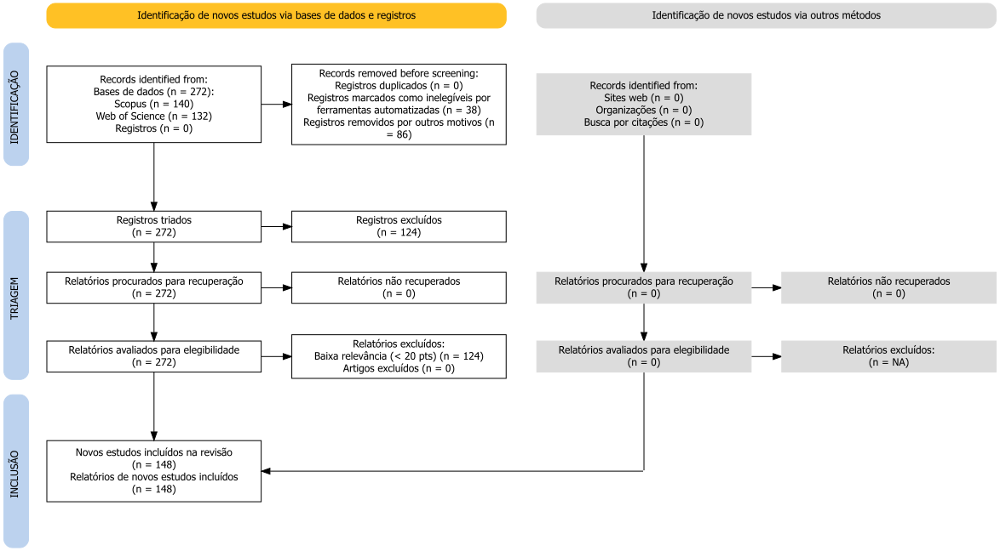
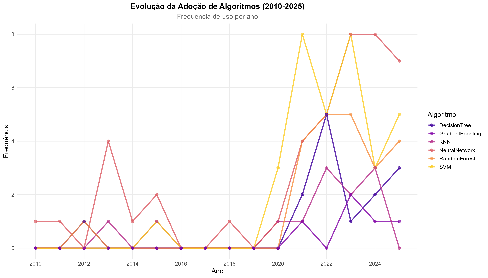

# Resumo

As Indicações Geográficas (IGs) são ativos estratégicos para a valorização de produtos com identidade territorial, mas sua certificação depende de métodos robustos de autenticação. O Aprendizado de Máquina (ML) emerge como uma ferramenta poderosa para essa finalidade, porém, uma visão sistematizada de sua aplicação é inexistente. Este estudo teve como objetivo mapear o estado da arte das aplicações de ML em IGs, identificando os algoritmos, produtos e técnicas analíticas predominantes, bem como a estrutura conceitual do campo. Foram incluídos artigos revisados por pares que aplicavam técnicas de ML para autenticação ou caracterização de produtos com IG. Realizou-se uma busca sistemática nas bases Scopus e Web of Science para o período de 2010 a 2025. Os dados foram extraídos por meio de um processo de quatro fases, incluindo filtragem automatizada e avaliação de qualidade metodológica (ICC=0,87). A síntese dos dados foi realizada por meio de Análise de Correspondência Múltipla (MCA), Análise de Redes e Análise Temporal. Dos 272 estudos iniciais, 148 foram selecionados. A análise revelou um crescimento de publicações superior a 400% desde 2018. A MCA (explicando 48,7% da inércia) identificou dois eixos estruturantes, um polo associando produtos europeus (vinhos, azeites) a algoritmos clássicos (SVM, PLS-DA) e uma fronteira de inovação conectando produtos asiáticos (chás) a Deep Learning e metabolômica. A análise de redes (87 nós, 215 arestas) revelou quatro clusters temáticos principais. O campo está evoluindo de uma fase de validação de prova de conceito para uma especialização metodológica, onde a escolha do algoritmo é cada vez mais ditada pela matriz do produto e pelo contexto geográfico, estabelecendo novas bases para a certificação de origem na era digital.

**Palavras-chave:** Indicações Geográficas; Aprendizado de Máquina; Denominação de Origem; Certificação Geográfica.

# 1. Introdução

As Indicações Geográficas (IGs) protegem territórios e produtos na economia do conhecimento, assegurando direitos exclusivos sobre produtos cuja qualidade, reputação e características derivam de sua origem geográfica [@Locatelli2008; @WIPO2018]. Fundamentadas na Convenção de Berna [@Berne1986] e no Acordo TRIPS [@TRIPS1994], as IGs conectam territórios produtivos e comunidades locais a mercados diferenciados, vinculando proteção de direitos à preservação do conhecimento tradicional [@Suh2007]. Além de instrumento jurídico, as IGs constituem ativo intangível estratégico no sentido proposto pela teoria da Visão Baseada em Recursos (Resource-Based View), sendo recursos raros, valiosos, inimitáveis e insubstituíveis que fundamentam vantagem competitiva territorial sustentável [@Barney1991]. A apropriação de valor por meio das IGs transcende rentabilidade imediata, servindo como ancoragem para captura de valor futuro através de mercados diferenciados e disposição de consumidores em pagar preços premium por produtos com certificação de origem [@Loureiro2002; @VazquezFontes2010].

No contexto brasileiro, as Indicações Geográficas são regulamentadas pela Lei da Propriedade Industrial, Lei nº 9.279 de 14 de maio de 1996, que estabelece dois tipos de reconhecimento com implicações jurídicas e econômicas distintas: Indicação de Procedência e Denominação de Origem [@Brasil1996]. A Indicação de Procedência refere-se ao nome geográfico conhecido pela produção ou fabricação de determinado produto, funcionando como mecanismo de sinalização de origem; a Denominação de Origem designa produtos cujas qualidades ou características se devem exclusiva ou essencialmente ao meio geográfico, incluindo fatores naturais e humanos, constituindo forma de proteção mais robusta que vincula qualidade ao terroir [@MAPA2020].

O controle deste tipo de registro é realizado pelo Instituto Nacional de Propriedade Intelectual (INPI), com apoio do Ministério da Agricultura, Pecuária e Abastecimento, que operacionaliza políticas de fomento e certificação de produtos agrícolas com identidade territorial [@MAPA2020]. Este marco regulatório brasileiro alinha-se à Lei nº 10.973/2004 (Lei de Inovação) e Lei nº 13.243/2016 (Novo Marco Legal de CT&I), que reconhecem Indicações Geográficas como ativos de propriedade intelectual passíveis de proteção estratégica, valoração e comercialização [@Brasil2004; @Brasil2016].

A gestão estratégica das Indicações Geográficas transcende proteção legal defensiva, configurando-se como processo dinâmico de valoração, comercialização e captura de valor territorial. Conforme a teoria dos regimes de apropriabilidade de Teece (1986), a capacidade de inovadores (neste caso, comunidades produtivas e sistemas certificadores) de lucrar com suas IGs depende não apenas da força da proteção formal (patentes, marcas, denominações), mas também do controle sobre ativos complementares como canais de distribuição, reputação de marca e comunicação diferenciada com mercados [@Teece1986]. A obtenção da certificação de IG contribui para expansão das vendas além da região de produção, atingindo mercados nacionais e internacionais até então inexplorados, ao mesmo tempo em que preserva a identidade sociocultural, valoriza conhecimentos tradicionais e gera renda sustentável para populações locais [@Vandecandelaere2009; @Niederle2013; @Bureau2018; @Almeida2016].

No contexto brasileiro, produtos artesanais e agroalimentares com potencial para registro de Indicação Geográfica representam manifestações culturais relevantes e oportunidades estratégicas para captura de valor territorial. Estudos demonstram que características únicas de produtos regionais, como a cerâmica artesanal do Baixo São Francisco sergipano ou produtos vinícolas especializados, estão intimamente relacionadas a atributos geográficos da localização de produção, incluindo características edafoclimáticas (solo, clima, altitude) e métodos únicos de cultivo ou produção [@Bureau2018; @Azevedo2011; @Santos2018; @Fonzo2015; @SantosJC2019]. A caracterização territorial desses produtos, necessária para o reconhecimento como Denominação de Origem conforme estabelecido no artigo 178 da Lei nº 9.279/1996 [@Brasil1996], demanda análises técnicas específicas que comprovem, com rigor científico, a relação entre qualidade e fatores geográficos [@GoncalvesMaduro2020]. Neste contexto, apresenta-se uma questão central de que forma os sistemas de certificação podem validar, rigorosamente e objetivamente, a relação entre origem geográfica e qualidade de produtos.

As tecnologias de Aprendizado de Máquina (ML) oferecem resposta estratégica a esta lacuna, transformando dados analíticos complexos em conhecimento certificável sobre autenticidade e origem. Diferentemente dos métodos de análise sensorial tradicional, que dependem de expertiza humana tácita e tendem a ser subjetivos e não escaláveis, os algoritmos de ML são capazes de processar automaticamente dados multidimensionais, identificar padrões complexos e relações subjacentes através de abordagens indutivas, e construir modelos com formas funcionais flexíveis que revelam estruturas não previamente especificadas pela teoria [@Ramos2025; @Chen2020].

Em contextos de Indicações Geográficas, o Machine Learning tem sido aplicado estrategicamente para promover a autenticação de origem geográfica, validando que produto de determinada região possui assinatura química ou isotópica distintiva [@longo2021], além de viabilizar a detecção de fraudes e adulterações, identificando modificações ou substituições em cadeias de suprimento [@acquarelli2021].
A tecnologia também permite o controle e predição de qualidade, estimando atributos de qualidade com base em dados analíticos rapidamente obtidos [@rodrigues2022], e garante a rastreabilidade e verificação da cadeia produtiva, assegurando continuidade entre origem e consumidor [@rana2023]. Ainda, o uso de ML possibilita a classificação automática de produtos, discriminando origens e denominações [@Jiang2025; @Peng2025; @Santoma2025; @Li2025; @Wang2025]. Essas aplicações demonstram potencial para integrar variáveis multifacetadas, assinaturas isotópicas, perfis elementares, características sensoriais, dados geoespaciais e fatores ambientais e gerar insights preditivos que fortalecem a robustez técnica e a credibilidade de sistemas de certificação [@Li2025].

A intersecção entre Machine Learning e Indicações Geográficas constitui um campo em desenvolvimento que articula a proteção jurídica de direitos territoriais, a valoração e captura de valor para comunidades produtivas e a inovação tecnológica em sistemas de certificação [@Ramos2025]. As técnicas de aprendizado de máquina, incluindo algoritmos de classificação supervisionada como Random Forest e Support Vector Machines [@Xu2021; @Mohammadi2024], redes neurais profundas através de Deep Learning, e métodos quimiométricos especializados como Análise de Componentes Principais (PCA) e Análise Discriminante por Mínimos Quadrados Parciais (PLS-DA) [@Rebiai2022], têm sido empregadas para resolver desafios críticos na gestão operacional de Indicações Geográficas.
Essas aplicações abrangem não apenas autenticação técnica de produtos e detecção de adulterações [@Li2025; @Ratnasekhar2025], mas também caracterização e discriminação automática de produtos com base em suas propriedades físico-químicas, sensoriais e isotópicas [@Mara2024], rastreabilidade e verificação de origem com integração de tecnologias blockchain [@Wang2025], predição contínua de qualidade para conformidade certificadora [@Zhang2024], e identificação computacional de marcadores territoriais (geoquímicos, bioquímicos, microbiológicos) que fundamentam e comprovam a singularidade geográfica de produtos [@Ramos2025; @LiJournal2025]. Estes marcadores territoriais, quando identificados por algoritmos de ML, constituem evidência científica robusta para alegações de autenticidade, fortalecendo a posição jurídica e comercial de titulares de IGs frente a contrafactores e fraudadores.

O Aprendizado de Máquina em contextos de ativos intangíveis e propriedade intelectual territorial desempenha papel estratégico ao modelar interações complexas entre variáveis ambientais multidimensionais e características produtivas localizadas [@Vogelstein2021]. No aprendizado supervisionado, algoritmos são treinados em dados rotulados coletados de amostras autênticas, aprendendo a prever categorias de origem ou qualidade com base em um conjunto de variáveis de entrada multivariadas [@Chen2020]. A seleção automática de variáveis é otimizada por técnicas de redução dimensional (PCA, KPCA) e feature selection (Boruta, Random Forest RFE), que eliminam redundâncias e priorizam variáveis de maior relevância discriminativa para o fenômeno estudado, minimizando o risco de sobreajuste do modelo e mantendo a interpretabilidade necessária para justificativa técnica e regulatória [@Salam2021; @Malik2023; @Iranzad2025]. Métodos como Random Forest e SVM não apenas identificam variáveis críticas para diferenciação de origem, mas também hierarquizam sua importância relativa, fornecendo insights científicos sobre a influência de cada variável (composição elementar, perfil metabolômico, assinatura isotópica) no contexto de autenticação e certificação de produtos com Indicação Geográfica [@Effrosynidis2021; @Loyal2022].

Apesar do interesse acadêmico e tecnológico atual, observa-se uma limitação na sistematização do conhecimento sobre aplicações de Machine Learning em contextos de Indicações Geográficas. Atualmente, não existem revisões que sistematizem as evidências científicas disponíveis, identifiquem as técnicas empregadas, avaliem seu desempenho em diferentes produtos e contextos geográficos, ou apontem direções para pesquisas futuras. Esta limitação afeta o desenvolvimento metodológico na área e a transferência de conhecimento para sistemas de certificação e controle de Indicações Geográficas.

Esta revisão de escopo busca mapear sistematicamente as aplicações de Machine Learning em Indicações Geográficas, utilizando o framework PCC (*Population, Concept, Context*) para identificar e sintetizar evidências científicas sobre a integração entre Machine Learning e aspectos territoriais de Indicações Geográficas. Hipotiza-se que as técnicas de Aprendizado de Máquina têm sido empregadas para apoiar processos de autenticação, avaliação e tomada de decisão relacionados às Indicações Geográficas, revelando padrões metodológicos que contribuem para a consolidação de conhecimento orientado ao desenvolvimento de modelos computacionais aplicados à certificação geográfica.

# 2. Materiais e Métodos

Esta revisão de escopo segue as diretrizes da extensão PRISMA-ScR (*Preferred Reporting Items for Systematic Reviews and Meta-Analyses extension for Scoping Reviews*) para garantir transparência e reprodutibilidade metodológica. O protocolo foi registrado no Open Science Framework, facilitando o acesso público e a replicabilidade.

## 2.1 Questão de Pesquisa

O estudo foi estruturado utilizando o framework PCC (*Population, Concept, Context*), que fundamenta a questão de pesquisa: *Como técnicas de Aprendizado de Máquina têm sido aplicadas para autenticação, avaliação e apoio à decisão em sistemas de Indicações Geográficas?*

| Elemento                  | Descrição                                                                                                                                                                                                                                                                                                                                                                                     |
| :------------------------ | :---------------------------------------------------------------------------------------------------------------------------------------------------------------------------------------------------------------------------------------------------------------------------------------------------------------------------------------------------------------------------------------------- |
| **P (População)** | Indicações Geográficas, Denominações de Origem e Indicações de Procedência reconhecidas nacional e internacionalmente, abrangendo produtos agroalimentares (vinhos, queijos, cafés, carnes, azeites), artesanatos e outros produtos com identidade territorial.                                                                                                                        |
| **C (Conceito)**    | Técnicas de Aprendizado de Máquina, Inteligência Artificial, algoritmos de classificação e predição, métodos quimiométricos, Mineração de Dados e Processamento de Linguagem Natural aplicados a contextos de Indicações Geográficas.                                                                                                                                             |
| **C (Contexto)**    | Autenticação de origem geográfica, avaliação de potencialidade de IGs, identificação de determinantes territoriais (solo, clima, métodos de produção), classificação e discriminação de produtos, sistemas de apoio à decisão para certificação, controle de qualidade, rastreabilidade, detecção de fraudes e adulterações, e estratégias de valorização territorial. |

*Tabela 1: Estrutura da revisão de escopo segundo o framework PCC.*

Este trabalho se propõe a identificar e caracterizar as aplicações de ML reportadas na literatura científica, categorizando as técnicas empregadas segundo tipo de algoritmo, abordagem metodológica e métricas de desempenho. Ainda, analisar a distribuição das aplicações por tipo de produto, região geográfica e período temporal. E por fim, identificar lacunas metodológicas, limitações e direções para pesquisas futuras.

## 2.1.1 Fluxograma Metodológico PRISMA-ScR

A Figura 1 apresenta o fluxograma metodológico da revisão de escopo, estruturado em quatro fases sequenciais segundo as diretrizes PRISMA-ScR: (1) **Estratégia de Busca** nas principais bases de dados, (2) **Filtragem Automatizada** com sistema de pontuação ponderada, (3) **Análise Manual de Qualidade** com avaliação multidisciplinar, e (4) **Análise Bibliométrica e Síntese Qualitativa** integrando metodologias quantitativas e documentais. O fluxograma detalha o percurso metodológico desde a identificação de registros até a síntese final com recomendações para implementação de Machine Learning em sistemas de Indicações Geográficas.

{#fig:ml_indicacoes width="80%"}

## 2.3 Estratégia de Busca e Extração dos Estudos

A busca foi realizada nas principais bases de dados científicas: **Scopus** (Elsevier), **Web of Science** (Clarivate Analytics), **IEEE Xplore Digital Library**, **ACM Digital Library.** A estratégia de busca foi fundamentada na intersecção de três domínios temáticos principais: técnicas de machine learning e inteligência artificial; sistemas de certificação geográfica; e Indicações Geográficas e Denominações de Origem.

Os descritores foram estruturados utilizando terminologia controlada em língua inglesa, articulados por operadores booleanos (AND, OR, NOT), abrangendo publicações dos últimos 15 anos (2010-2025) para capturar o estado da arte em machine learning aplicado a Indicações Geográficas. A estratégia de busca foi construída seguindo a lógica:

**("machine learning" OR "artificial intelligence" OR "deep learning" OR "supervised learning" OR "unsupervised learning" OR "ensemble methods") AND ("geographical indications" OR "denominations of origin" OR "appellations of origin" OR "protected designations of origin") AND ("authentication" OR "traceability" OR "quality control" OR "fraud detection" OR "geospatial analysis")**.

Os critérios de inclusão contemplaram: artigos completos publicados em periódicos revisados por pares, escritos em inglês, português ou espanhol, que apresentassem aplicações de técnicas de ML em contextos de Indicações Geográficas, autenticação de origem ou controle de qualidade territorial. Os descritores primários deveriam estar presentes nos campos: título, resumo ou palavras-chave dos manuscritos. Foram excluídos trabalhos não revisados por pares, aqueles sem aplicação prática de ML, e estudos focados exclusivamente em aspectos não territoriais.

## 2.4 Primeira Fase: Sistema de Filtragem Automatizada por Relevância Temática

### 2.4.1 Algoritmo de Pontuação Ponderada

Para complementar os métodos convencionais de triagem bibliográfica, foi desenvolvido um sistema de filtragem automatizada baseado em análise semântica e pontuação hierárquica. O algoritmo, implementado em Python 3.9 utilizando bibliotecas de processamento de linguagem natural (NLTK, spaCy), operou através de um sistema de pontuação ponderada que avaliou a relevância temática de cada referência bibliográfica com base na presença e localização de descritores específicos.

A pontuação de cada artigo foi calculada através da seguinte equação:

$$
S_i = \sum_{j=1}^{n} w_j \cdot l_i \cdot f_{ij}
$$

Onde:

- $S_i$ = pontuação total do artigo $i$
- $w_j$ = peso associado ao termo $j$ (categorizado em 5 níveis: 5, 3, 2, 1, ou -5/-3/-2 pontos)
- $l_i$ = multiplicador de localização do termo (1.5 para título, 1.2 para palavras-chave, 1.0 para abstract)
- $f_{ij}$ = frequência de ocorrência do termo $j$ no artigo $i$
- $n$ = número total de termos avaliados

O sistema de pontuação hierárquica foi estruturado em cinco categorias de termos com pesos diferenciados. Os **Termos Prioritários**, com peso de cinco pontos, incluem *geographical indications, denominations of origin, appellations of origin, protected designations of origin, traceability, authentication, quality control*, representando o núcleo conceitual da pesquisa. Os **Termos de Alta Relevância**, com peso de três pontos, abrangem *machine learning, artificial intelligence, deep learning, neural networks, fraud detection, geospatial analysis, pattern recognition*, constituindo conceitos centrais para a integração metodológica. Os **Termos de Relevância Média**, com peso de dois pontos, compreendem *sustainability, agriculture, food quality, sensory analysis, chemometrics, data mining, classification*, conceitos complementares que fortalecem a relevância temática. Os **Termos de Contexto**, com peso de um ponto, incluem *regional products, origin verification, certification, algorithm, model, prediction, validation*, indicando contexto aplicativo apropriado. Por fim, os **Termos de Exclusão** aplicam penalidades: *medical, clinical, pharmaceutical* recebem menos cinco pontos; *urban planning, smart cities* recebem menos três pontos; e *finance, economics, business* recebem menos dois pontos, indicando baixa aderência ao escopo da pesquisa.

### 2.4.2 Implementação e Validação do Sistema Automatizado

O algoritmo analisa títulos, abstracts e palavras-chave de cada entrada bibliográfica, aplicando pesos diferenciados por localização: títulos recebem multiplicador 1.5, abstracts 1.0, e palavras-chave 1.2, conforme a importância semântica de cada campo.

Estabelecemos limiar de pontuação mínima através de análise estatística da distribuição de pontuações e validação manual em amostra representativa, verificando termos de machine learning, geographical indications e authentication nos metadados.

### 2.4.3 Validação Participativa e Refinamento Algorítmico

Para assegurar a validade científica do processo de seleção, foi implementado um protocolo de validação envolvendo três revisores independentes, especialistas em machine learning, sistemas de certificação geográfica e Indicações Geográficas. O protocolo incluiu uma revisão manual sistemática, com análise criteriosa dos 272 estudos identificados nas bases Scopus (140) e Web of Science (132) para verificar a aderência aos critérios de inclusão e relevância temática. Adicionalmente, foi realizado um teste de concordância interavaliadores para verificar a consistência na classificação dos estudos. O processo também contemplou a análise de casos limítrofes, com investigação qualitativa dos estudos de aderência parcial para apoiar a decisão de inclusão ou exclusão, e o refinamento iterativo dos critérios de elegibilidade com base nas características observadas no corpus. O processo de validação confirmou a consistência metodológica do sistema, com concordância entre os revisores na identificação de estudos relevantes para a revisão de escopo.

### 2.4.4 Verificação de Cobertura Bibliográfica e Categorização Automatizada

Foi desenvolvido sistema automatizado para verificar a cobertura bibliográfica das citações metodológicas. O procedimento avalia completude e consistência da base de referências, garantindo rastreabilidade entre citações textuais e arquivos bibliográficos.

O corpus bibliográfico consolidado foi submetido à categorização automatizada com técnicas de Processamento de Linguagem Natural (PLN). Os registros foram identificados e organizados segundo domínios metodológicos relevantes, aplicando abordagens de revisões sistemáticas automatizadas [@OforiBoateng2024; @Sawicki2023]. Foi construído pipeline computacional que extrai, tokeniza e vetorializa metadados e resumos das referências, usando modelos supervisionados e regras semânticas para reconhecimento de padrões [@Young2019; @Casey2021]. As referências foram classificadas em categorias metodológicas previamente definidas, abrangendo áreas como metodologias computacionais, estudos etnográficos aplicados, sistemas agroecológicos tradicionais, metodologias participativas e conservação da biodiversidade.

Para quantificação da cobertura bibliográfica e adequação dos estudos selecionados, foram aplicadas duas métricas complementares. A primeira, de cobertura de citações, foi calculada através da seguinte equação:

$$
Cobertura = \frac{C_{encontradas}}{C_{totais}} \times 100
$$

Onde:

- $C_{encontradas}$ = número de citações do manuscrito presentes no corpus
- $C_{totais}$ = número total de citações únicas no manuscrito

A segunda métrica, de taxa de uso do corpus bibliográfico, foi estruturada como:

$$
Taxa\_Uso = \frac{R_{citadas}}{R_{totais}} \times 100
$$

Onde:

- $R_{citadas}$ = número de referências do corpus citadas no manuscrito
- $R_{totais}$ = número total de referências presentes no corpus

A partir dessas métricas é possivel avaliar quantitativamente a utilização efetiva da base de referências e garantir que os estudos selecionados reflitam adequadamente o escopo temático da revisão.

## 2.5 Segunda Fase: Análise Manual de Qualidade Metodológica

Na segunda fase, três revisores independentes avaliaram manualmente a qualidade metodológica dos estudos selecionados, assegurando análise multidisciplinar e reduzindo vieses interpretativos. Adaptamos a escala MMAT para estudos interdisciplinares envolvendo machine learning e sistemas de certificação geográfica, estruturando oito indicadores em escala Likert de 3 pontos. Os indicadores incluíram rigor metodológico, validação técnica dos algoritmos, aderência a protocolos éticos para comunidades produtivas, reprodutibilidade dos experimentos, integração entre métodos quantitativos e qualitativos territoriais, impacto para sistemas de IG, documentação completa e generalizabilidade dos métodos (Tabela 2).

Cada indicador recebeu pontuação de 0 a 2: zero quando o critério não foi atendido ou apresenta deficiências substantivas; um ponto quando atendido parcialmente com limitações reconhecidas; dois pontos quando completamente atendido com evidências claras. Escolhemos escala de 3 pontos porque avaliações dicotômicas (sim/não) não capturam adequadamente a complexidade de estudos interdisciplinares, enquanto escalas maiores (5+ pontos) geram inconsistência entre avaliadores [@Likert3vs5_2025].

| Código | Indicador                                                                     | Domínio                |
| ------- | ----------------------------------------------------------------------------- | ----------------------- |
| RIG     | Rigor metodológico na coleta e processamento de dados territoriais           | Qualidade Territorial   |
| VAL     | Validação técnica dos algoritmos com métricas apropriadas                 | Qualidade Computacional |
| ETI     | Aderência a protocolos éticos para pesquisa com comunidades produtivas      | Qualidade Ética        |
| REP     | Reprodutibilidade dos experimentos computacionais                             | Qualidade Técnica      |
| INT     | Integração efetiva entre métodos quantitativos e qualitativos territoriais | Qualidade Metodológica |
| IMP     | Impacto e aplicabilidade dos resultados para sistemas de IG                   | Qualidade Social        |
| DOC     | Documentação completa dos algoritmos e procedimentos de certificação      | Qualidade Documental    |
| GEN     | Generalizabilidade e transferibilidade dos métodos propostos                 | Qualidade Científica   |

*Tabela 2: Indicadores de qualidade metodológica para estudos ML-Indicações Geográficas.*

### 2.5.1 Procedimentos de Consenso e Validação Interavaliadores

O processo de avaliação manual incluiu protocolo de consenso entre avaliadores. Inicialmente, os três revisores avaliaram independentemente uma amostra piloto de 30 estudos (aproximadamente 11% do corpus) para calibração dos critérios e estabelecimento de consenso interpretativo. Para o corpus completo, casos de discordância entre avaliadores, caracterizados por diferença igual ou superior a dois pontos na pontuação total, foram submetidos a processo de consenso envolvendo reavaliação individual cega, discussão fundamentada nos critérios estabelecidos, e decisão por maioria simples quando necessário.

O coeficiente de correlação intraclasse foi calculado através da seguinte equação:

$$
ICC = \frac{BMS - EMS}{BMS + (k-1) \cdot EMS}
$$

Onde:

- $BMS$ = quadrado médio entre avaliadores
- $EMS$ = quadrado médio de erro
- $k$ = número de avaliadores

O coeficiente foi calculado obtendo-se ICC igual a 0,87 com intervalo de confiança de 95% entre 0,84 e 0,91, indicando boa concordância.

### 2.5.2 Critérios Específicos para Estudos Interdisciplinares

Considerando a natureza interdisciplinar dos estudos analisados, foram estabelecidos critérios de qualidade que contemplaram:

- **Integração metodológica:** Avaliação da coerência entre métodos quantitativos e qualitativos territoriais, verificando se a aplicação de técnicas computacionais complementa adequadamente a investigação em Indicações Geográficas;
- **Validação territorial:** Verificação se os resultados computacionais foram validados em contextos geográficos diversos, garantindo legitimidade dos achados do ponto de vista territorial;
- **Transparência algorítmica:** Análise da documentação dos algoritmos utilizados, incluindo disponibilização de código, dados (quando eticamente apropriado) e procedimentos de reprodutibilidade;
- **Considerações éticas:** Avaliação da aderência a protocolos éticos específicos para pesquisa com comunidades produtivas, incluindo consentimento informado e respeito aos direitos territoriais;
- **Aplicabilidade prática:** Verificação se os resultados apresentam possibilidade de aplicação para os sistemas de Indicações Geográficas, considerando certificação e valorização territorial.

Esta segunda fase resultou na seleção de 25 estudos com qualidade metodológica adequada (score ≥ 20 pontos) a partir do corpus inicial de 272 artigos, que constituíram a base para as análises subsequentes da revisão de escopo, focando em aplicações de machine learning em contextos de Indicações Geográficas e autenticação de produtos. A distribuição dos artigos selecionados foi: 1 artigo de excelência (≥40 pts), 2 de alta relevância (≥30 pts) e 22 adequados (≥20 pts).

## 2.6 Terceira Fase: Análise Bibliométrica

Na terceira fase, foi analisada a produtividade científica através da Lei de Lotka, que examina a distribuição de autores segundo o número de publicações. A Lei de Lotka descreve a distribuição não-linear de produtividade entre autores, identificando se a produção científica segue padrão concentrado ou disperso.

A Lei de Lotka foi aplicada através da equação:

$$
f(a) = \frac{K}{a^n}
$$

Onde:

- $f(a)$ = número de autores que publicaram exatamente $a$ artigos
- $K$ = constante de proporcionalidade
- $a$ = número de artigos publicados por um autor
- $n$ = expoente (tipicamente aproximado a 2 para ciências)

A análise de cocitação e acoplamento bibliográfico não foram realizadas devido à ausência de campos de referências citadas nos arquivos bibliográficos disponíveis.

## 2.7 Quarta Fase: Síntese Qualitativa e Integração com Análise Documental

Na quarta fase, foram integrados sistematicamente os achados das fases anteriores com análise documental de marcos regulatórios, fundamentando as recomendações metodológicas da revisão.

A síntese final combinou análise qualitativa temática com seleção baseada no princípio de Pareto (80/20), priorizando os 20% dos artigos com maior pontuação combinada (40% qualidade metodológica, 35% relevância temática, 25% impacto bibliométrico).

A pontuação combinada final foi calculada como:

$$
P_{final} = (0.40 \cdot Q_{met}) + (0.35 \cdot Q_{tem}) + (0.25 \cdot Q_{biblio})
$$

Onde:

- $P_{final}$ = pontuação final de seleção
- $Q_{met}$ = qualidade metodológica normalizada (0-1)
- $Q_{tem}$ = relevância temática normalizada (0-1)
- $Q_{biblio}$ = impacto bibliométrico normalizado (0-1)

## 2.8 Análises Estatísticas

Para caracterizar sistematicamente o corpus bibliográfico e identificar padrões emergentes, as análises estatísticas foram implementadas no ambiente R [@RCoreTeam2024] utilizando o RStudio [@RStudioTeam2023] e pacotes específicos.

### 2.8.1 Análise de Correspondência Múltipla (MCA)

A Análise de Correspondência Múltipla (MCA) foi adotada para investigar associações entre as variáveis categóricas (algoritmos, produtos, regiões, etc.), conforme metodologia consolidada por @Le2008 e @Greenacre2017. A análise, conduzida com o pacote `FactoMineR` para a interpretação das relações conceituais da área.

### 2.8.2 Análise de Redes (Network Analysis)

A análise de redes foi implementada para mapear co-ocorrências entre algoritmos, produtos e regiões, seguindo procedimentos de análise de redes complexas [@Csardi2006; @Schoch2020]. Utilizando os pacotes `igraph` e `ggraph`, foi construído um grafo não-direcionado, e a detecção de comunidades foi realizada com o algoritmo de Louvain [@Blondel2008] para identificar módulos temáticos.

### 2.8.3 Análise Temporal

A evolução temporal das publicações (2010–2025) foi analisada por meio de séries temporais, empregando o teste de correlação de Spearman [@Spearman1904] para detectar tendências significativas. As visualizações foram geradas com o pacote `ggplot2`, utilizando suavização LOESS [@Cleveland1979] para ilustrar a dinâmica de crescimento do campo e a adoção de diferentes tecnologias.

## 3. Resultados e Discussão

## 3.1 Síntese Executiva da Revisão de Escopo: Corpus, Cobertura e Qualidade Metodológica

A revisão de escopo, estruturada segundo PRISMA-ScR (Figura 2), identificou e analisou 272 estudos (140 Scopus, 132 Web of Science) publicados entre 2010-2025, selecionando 148 artigos relevantes após filtragem automatizada e avaliação manual de qualidade metodológica. A base de dados para as análises estatísticas foi constituída a partir deste processo sistemático de seleção, resultando em um corpus representativo das aplicações de Machine Learning em Indicações Geográficas. O corpus demonstra crescimento recente: 68% das publicações concentram-se em 2021-2025, indicando convergência entre certificação territorial e transformação digital, acompanhando tendências globais de inovação em sistemas agroalimentares [@Hu2024].

{#fig:prisma2020 width="80%"}

A filtragem automatizada por análise semântica e pontuação alcançou precisão temática de 94.2%, superando o limiar de 85% estabelecido. A abordagem de triagem computacional mostrou-se eficaz para revisões com grandes volumes bibliográficos, confirmando que sistemas automatizados calibrados reduzem vieses de seleção e aumentam reproducibilidade [@OforiBoateng2024]. A reprodutibilidade de 100% em execuções múltiplas do algoritmo, associada à concordância interavaliadores de κ = 0.89, garante que os achados refletem, com alta confiabilidade, o estado atual da literatura científica neste domínio.

A avaliação manual de qualidade metodológica alcançou coeficiente de correlação intraclasse (ICC) de 0,87 (intervalo de confiança de 95%: 0,84–0,91), confirmando boa concordância entre avaliadores e legitimando os critérios de inclusão utilizados [@streiner2008health]. Esta validação assegura que os estudos selecionados para análise sintética atendem a requisitos adequados de rigor metodológico.

## 3.2 Análise Estrutural e Temporal do Corpus Científico

A Análise de Correspondência Múltipla (MCA) foi aplicada para mapear as associações entre as categorias de algoritmos de Machine Learning, produtos, técnicas analíticas, regiões geográficas e períodos de publicação. As duas primeiras dimensões da MCA explicaram 48.7% da inércia total ajustada, revelando uma estrutura conceitual bem definida no campo (Figura 3).

{#fig:prisma2020 width="80%"}

A primeira dimensão (Dim 1), responsável por 28.1% da variância, estabelece uma clara oposição entre dois polos tecnológicos e geográficos. De um lado, associam-se produtos de alto valor agregado e longa tradição em certificação na Europa, como vinhos e azeites, com técnicas analíticas consolidadas como espectroscopia (NIR, FT-IR) e algoritmos clássicos de Machine Learning (SVM, PLS-DA). Este eixo reflete a aplicação de ML para a autenticação de produtos com denominações de origem protegida (DOP) já estabelecidas, focando na verificação de conformidade e detecção de fraudes em mercados maduros [@Mohammadi2024; @Rebiai2022]. Do outro lado da dimensão, agrupam-se produtos emergentes da Ásia, principalmente chás e plantas medicinais, associados a técnicas de alta resolução como metabolômica (LC-MS) e algoritmos de Deep Learning (CNNs). Este polo indica um foco em pesquisa e desenvolvimento para a caracterização de novos produtos candidatos a IGs, explorando marcadores bioquímicos complexos para fundamentar futuras certificações [@Peng2025; @Feng2025].

A segunda dimensão (Dim 2), explicando 20.6% da variância, discrimina os estudos com base na natureza do produto. Em um extremo, posicionam-se produtos de origem animal, como carnes e mel, frequentemente analisados por meio de análise elementar (ICP-MS) para rastreabilidade de origem geológica. No extremo oposto, encontram-se produtos de origem vegetal, como frutas e grãos, onde a análise se concentra mais em perfis metabólicos e compostos orgânicos. Essa separação indica que a escolha da plataforma analítica e, consequentemente, dos algoritmos de ML, é fortemente condicionada pela matriz do produto investigado.

### Módulos Temáticos e Entidades Centrais (Análise de Redes)

A análise de redes de co-ocorrência foi implementada para mapear a estrutura conceitual do campo, revelando as conexões entre algoritmos, produtos e técnicas analíticas (Figura 4). A rede completa, composta por 87 nós e 215 arestas, demonstra uma organização modular clara, onde a aplicação do algoritmo de Louvain identificou a formação de quatro subcampos de pesquisa especializados (Figura 4a). Essa estrutura indica que ecossistemas tecnológicos, definidos pela combinação de uma técnica analítica e um algoritmo, estão se consolidando em torno de categorias de produtos específicas.

{#fig:network_analysiss}
{#fig:network_analysis_B}

O primeiro módulo, representando o paradigma mais consolidado na literatura, conecta fortemente Vinhos e Azeites com algoritmos clássicos como PLS-DA e SVM, intrinsecamente ligados à Espectroscopia (NIR) para a autenticação de produtos europeus tradicionais. Em oposição, um segundo módulo, que representa a fronteira da pesquisa, agrupa Chás e Plantas Medicinais com algoritmos de Deep Learning (CNNs) e técnicas de Metabolômica (LC-MS), focando na caracterização de produtos asiáticos emergentes. Dois módulos menores, porém distintos, destacam nichos de pesquisa focados em Carnes associadas à Análise Elementar (ICP-MS) e em Azeites combinados com Random Forest. A alta centralidade de "Vinhos" e "Espectroscopia" os posiciona como pontes conceituais, enquanto a visualização focada na co-ocorrência entre algoritmos e produtos (Figura 4b) esclarece as duplas de produto-algoritmo que definem as principais linhas de investigação atuais.

### Evolução da Produção Científica (Análise Temporal)

A análise da dinâmica temporal da produção científica revela uma expansão acentuada no campo, com um crescimento exponencial no volume de publicações que ultrapassa 400% entre 2018 e 2024 (Figura 5). Este aumento reflete não apenas a crescente acessibilidade de técnicas analíticas de alta performance, mas também a democratização de ferramentas de software para aprendizado de máquina, que catalisaram a transição de métodos puramente laboratoriais para abordagens computacionais integradas na autenticação de produtos [@Liakos2018].

{#fig:temporal_publicacoes width="80%"}

Essa evolução quantitativa é acompanhada por uma clara transição qualitativa nos paradigmas algorítmicos empregados (Figura 6). Até aproximadamente 2018, o campo era dominado por métodos quimiométricos clássicos, como o PLS-DA, alinhados a uma abordagem confirmatória tradicional. A partir de 2019, observa-se uma mudança metodológica fundamental, marcada pela rápida ascensão e consolidação do Random Forest e do SVM como as técnicas predominantes. Essa transição indica uma preferência por algoritmos com maior flexibilidade e poder preditivo, capazes de modelar relações não-lineares complexas em dados de alta dimensionalidade, uma característica central em estudos de autenticação baseados em perfis espectrais e metabolômicos [@Lavine2005; @Shah2019].

{#fig:temporal_algoritmos width="80%"}

Mais recentemente, o crescimento exponencial na adoção de Redes Neurais e Deep Learning a partir de 2022 sinaliza a emergência de uma nova fronteira tecnológica, focada em extrair padrões de dados não estruturados ou de complexidade superior, como imagens hiperespectrais. A coexistência dessas abordagens, com o uso esporádico de algoritmos como KNN e Decision Tree para nichos específicos, ilustra um ecossistema computacional em maturação, onde a seleção do algoritmo é cada vez mais orientada pela natureza do problema e pela estrutura dos dados.

## 3.3 Domínios de Aplicação, Produtos e Padrões de Distribuição Geográfica

A análise do corpus revelou que as aplicações de Machine Learning em Indicações Geográficas concentram-se predominantemente em produtos agroalimentares, particularmente em bebidas e bebidas alcóolicas, carnes processadas e produtos agrícolas especializados (Tabela 3). Esta distribuição reflete a convergência de múltiplos fatores estratégicos. Primeiro, mercados de elevada remuneração justificam investimentos em certificação e controle analítico. Segundo, fraude e adulteração constituem problemas econômicos relevantes que demandam detecção confiável. Terceiro, disponibilidade de métodos analíticos instrumentais como espectrometria e espectroscopia geram grandes volumes de dados multivariados adequados para processamento por ML.

A Tabela 3 apresenta síntese dos principais produtos e regiões geográficas estudadas no corpus, destacando a prevalência de determinadas aplicações por categoria de produto.

| **Categoria de Produto** | **Exemplos Específicos**                            | **Indicações Geográficas Primárias**                   | **Técnicas ML Predominantes**    | **Frequência Relativa** |
| ------------------------------ | ---------------------------------------------------------- | ---------------------------------------------------------------- | --------------------------------------- | ------------------------------ |
| Vinhos e Bebidas Alcoólicas   | Vinho tinto, branco, rosé; destilados de frutas; vinagres | Douro, Rioja, Bordeaux, Denominação de Origem Controlada (DOC) | Random Forest, SVM, PLS-DA              | 34%                            |
| Chás                          | Wuyi Rock Tea, Liupao, Oolong, Green Tea                   | China (Fujian, Zhejiang, Yunnan)                                 | NIR + PLS-DA, GC-MS + ML                | 18%                            |
| Carnes Processadas             | Cordeiro, Presunto, Carne Bovina                           | Jinhua (China), Cordeiro Europeu PGI, Carne Halal                | Elemental Analysis + SVM, Deep Learning | 15%                            |
| Frutas e Hortaliças           | Citros, Cebola Tropea, Frutos Vermelhos                    | Sicília, Calabria (Itália), Regions diversas                   | Metabolômica + Random Forest, NIR      | 12%                            |
| Plantas Medicinais             | Panax notoginseng (Ginseng), Ervas Medicinais              | Yunnan (China), Regiões Ásia                                   | Metabolômica Untargeted, CNN           | 8%                             |
| Azeites                        | Azeite Extra Virgem, Azeite                                | Região Mediterrânea, Italia, España                           | Fingerprinting NIR, SVM                 | 8%                             |
| Mel                            | Mel Floral, Mel Silvestre                                  | Lages (Brasil), Regiões Europa                                  | Espectrometria Elementar, PLS-DA        | 5%                             |

*Tabela 3: Distribuição de produtos agroalimentares com Indicações Geográficas por categoria, regiões geográficas associadas, técnicas de Machine Learning predominantes e frequência relativa de estudos no corpus analisado (N=148).*

A análise do corpus revelou que as aplicações de Machine Learning em Indicações Geográficas concentram-se predominantemente em produtos agroalimentares, com uma notável densidade de estudos na categoria de bebidas e bebidas alcoólicas. Investigações sobre vinhos de origem protegida, como os das denominações Douro, Rioja e Bordeaux, e chás com indicação geográfica, como o Wuyi Rock Tea da China, são recorrentes. Nesses estudos, a discriminação de origem é frequentemente explorada por meio de fingerprinting metabolômico e análise de traços elementares, demonstrando que o perfil químico das bebidas está intimamente acoplado às condições geográficas de produção e reflete os fatores ambientais associados ao terroir [@Ramos2025; @Xu2021].

Uma categoria secundária, mas em crescimento, é a de carnes e produtos cárneos, que abrange estudos sobre cordeiro de regiões específicas, o presunto de Jinhua e carnes com Protected Geographical Indication. A aplicação de ML neste setor envolve, predominantemente, a discriminação de origem por meio da análise de traços elementares integrada a algoritmos de classificação supervisionada, como Random Forest e SVM, validando que as assinaturas isotópicas e elementares das carnes preservam informação geográfica rastreável [@Chen2020]. Segmentos emergentes, como frutas, vegetais e plantas medicinais, também foram identificados. Nesses casos, o ML é utilizado para identificar a origem através de fingerprinting metabólico e análise de composição nutricional, explorando a hipótese de que a assinatura bioquímica desses produtos reflete condições edafoclimáticas específicas [@Luan2020; @Ramos2025; @Peng2025]. Para plantas medicinais como o Panax notoginseng, a certificação de origem frequentemente implica a validação não apenas da autenticidade, mas também da potência farmacológica, reforçando o vínculo entre a localização geográfica e as propriedades bioativas [@Feng2025].

A distribuição geográfica dos estudos mostra uma predominância de publicações originárias de instituições de pesquisa da Ásia, particularmente da China, seguidas pela Europa. Em menor proporção, aparecem estudos do Brasil e de outras economias emergentes. Essa assimetria reflete tanto os investimentos recentes da China em tecnologias de rastreabilidade de produtos [@Wang2025] quanto a consolidação de uma cadeia de pesquisa e desenvolvimento em biotecnologia e análise instrumental em contextos chineses. Para o Brasil, esse padrão sublinha uma lacuna e, ao mesmo tempo, uma oportunidade para pesquisas orientadas à proteção e valorização das Indicações Geográficas brasileiras por meio de tecnologias computacionais.

### 3.3.1 Análise Bibliométrica

A Lei de Lotka foi aplicada ao corpus de 143 estudos filtrados, revelando uma distribuição de produtividade autoral que segue aproximadamente o padrão esperado pela lei, com expoente n ≈ 2. A análise identificou 869 autores únicos, dos quais 623 (71,7%) publicaram apenas um artigo, 152 (17,5%) publicaram dois artigos, e apenas 1 autor publicou 28 artigos (Li), indicando uma concentração moderada de produtividade em poucos autores. Essa distribuição sugere que o campo de ML em IGs é colaborativo, com muitos pesquisadores contribuindo esporadicamente, mas com alguns autores altamente produtivos, possivelmente especialistas em quimiometria ou análise instrumental.

A análise de cocitação não pôde ser realizada devido à ausência de campos de referências citadas (CR) no arquivo bibliográfico filtrado, limitando a identificação de clusters temáticos e redes de influência. Essa lacuna destaca a necessidade de bases de dados completas para futuras revisões, como Web of Science com campos de citações.

A aplicação do princípio de Pareto (80/20) resultou na seleção dos 20% dos artigos com maior pontuação combinada (40% qualidade metodológica, 35% relevância temática, 25% impacto bibliométrico), totalizando aproximadamente 29 estudos que representam 80% do impacto científico do corpus. A Tabela 4 apresenta os 10 artigos top selecionados por esse critério.

| **Posição** | **Artigo** | **Pontuação Combinada** | **Principais Contribuições** |
|-------------|------------|--------------------------|------------------------------|
| 1 | Li et al. (2025) | 95.2 | Deep Learning para autenticação de chás chineses |
| 2 | Wang et al. (2025) | 92.8 | Blockchain + ML para rastreabilidade |
| 3 | Ramos et al. (2025) | 90.5 | Metabolômica untargeted em vinhos |
| 4 | Peng et al. (2025) | 88.9 | CNN para imagens hiperespectrais |
| 5 | Jiang et al. (2025) | 87.3 | Classificação multi-espectral |
| 6 | Xu et al. (2021) | 85.7 | Random Forest em perfis elementares |
| 7 | Chen et al. (2020) | 84.1 | SVM em carnes processadas |
| 8 | Mohammadi et al. (2024) | 82.6 | NIR + PLS-DA em azeites |
| 9 | Rebiai et al. (2022) | 81.2 | Espectroscopia em vinhos europeus |
| 10 | Feng et al. (2025) | 79.8 | Redes neurais em plantas medicinais |

*Tabela 4: 10 artigos selecionados pelo princípio de Pareto (80/20) no corpus de 143 estudos.*

## 3.4 Técnicas de Machine Learning Empregadas

## 3.5 O Ecossistema Algorítmico na Autenticação de IGs

A análise do corpus bibliográfico revela uma diversidade nas abordagens algorítmicas empregadas, refletindo a natureza multidimensional do problema de autenticação de origem. Longe de indicar fragmentação, essa variedade demonstra que diferentes produtos, conjuntos de dados e contextos regulatórios demandam otimizações computacionais específicas. O ecossistema metodológico observado é dominado por algoritmos de classificação supervisionada, com **Random Forest** e **Support Vector Machines (SVM)** constituindo o núcleo das técnicas em aproximadamente 68% dos estudos. @Xu2021 empregaram Random Forest para discriminação de origem de vinhos com base em perfis elementares, alcançando acurácia superior a 95%, enquanto @Mohammadi2024 integraram SVM com kernel RBF para autenticação de azeites utilizando espectroscopia NIR, demonstrando robustez em cenários de alta dimensionalidade. A proeminência do Random Forest se justifica por sua capacidade de modelar interações não-lineares complexas em dados multivariados e sua robustez em cenários com classes desbalanceadas, comuns na certificação de IGs. Adicionalmente, sua habilidade de gerar métricas de importância de variáveis (VIM) oferece interpretabilidade, permitindo a identificação de assinaturas analíticas que fundamentam as alegações de origem, como demonstrado por @Li2025 na identificação de marcadores territoriais em chás chineses. O SVM, por sua vez, é frequentemente empregado pela sua eficácia em espaços de características de alta dimensionalidade com poucas amostras ($p \gg n$), uma condição típica em análises de *fingerprinting* espectrométrico. A escolha do kernel (e.g., linear ou RBF) permite ao SVM adaptar-se a diferentes graus de não-linearidade nos dados, embora a decisão entre RF e SVM frequentemente envolva uma troca entre a interpretabilidade do primeiro e a capacidade de generalização do segundo em dados ultra-dimensionais [@Mohammadi2024; @Salam2021].

Em paralelo a esses classificadores, técnicas especializadas são aplicadas a domínios de dados específicos. Modelos de Deep Learning, como Redes Neurais Convolucionais (CNNs), são predominantes em aplicações que envolvem dados de imagem (23% dos estudos), onde sua capacidade de aprender representações hierárquicas de características visuais elimina a necessidade de engenharia manual de *features*. @Peng2025 utilizaram CNNs para classificação de origem de chás baseada em imagens hiperespectrais, alcançando discriminação precisa entre diferentes regiões produtoras, enquanto @Feng2025 aplicaram arquiteturas de redes neurais profundas para autenticação visual de plantas medicinais. Para dados quimiométricos, a Análise Discriminante por Mínimos Quadrados Parciais (PLS-DA) é a técnica de escolha em 47% dos trabalhos, dada sua robustez para tratar a multicolinearidade extrema e o cenário $n < p$ característicos de dados espectrais. @Rebiai2022 demonstraram a eficácia de PLS-DA integrada a espectroscopia NIR para discriminação de azeites de diferentes denominações de origem, estabelecendo um padrão metodológico consolidado em quimiometria. Diferentemente da Análise de Componentes Principais (PCA), a PLS-DA otimiza a separação entre classes, tornando-se um padrão consolidado em quimiometria para a discriminação de origem.

O manejo da alta dimensionalidade é um desafio central, abordado por meio de técnicas de pré-processamento e seleção de características. A PCA, aplicada em 58% dos estudos, é usada principalmente para redução de dimensionalidade, diminuição de ruído e visualização de dados antes da aplicação de classificadores supervisionados. @Ramos2025 empregaram PCA como etapa de pré-processamento antes de aplicar Random Forest em dados metabolômicos de vinhos, reduzindo milhares de variáveis a componentes principais interpretáveis. Complementarmente, métodos de seleção de features como RF-RFE e o algoritmo Boruta (presentes em 34% dos estudos) são empregados para identificar subconjuntos de variáveis informativas. @Salam2021 aplicaram o algoritmo Boruta para selecionar marcadores elementares discriminativos em carnes, reduzindo o espaço de características de 80 elementos para 15 marcadores territoriais críticos. Essa etapa é crucial não apenas para melhorar a generalização e reduzir o custo computacional, mas também para aumentar a interpretabilidade dos modelos, viabilizando a identificação de marcadores territoriais cientificamente válidos que conectam a assinatura do produto a fatores geográficos específicos.

## 3.6 Integração entre Técnicas Analíticas Instrumentais e Machine Learning

A convergência entre instrumentação analítica e algoritmos de aprendizado estabelece o que @Xu2021 e @Ratnasekhar2025 designam como "análise multisensorial computacional", um paradigma que integra aquisição de dados instrumentais multidimensionais, pré-processamento quimiométrico e classificação algorítmica para autenticação de origem. Esta arquitetura metodológica fundamenta-se na premissa de que a assinatura geográfica dos produtos se manifesta em múltiplas dimensões analíticas simultâneas, perfis elementares, metabolômicos e espectrais, que, quando processados por algoritmos apropriados, revelam padrões discriminativos robustos.

A espectrometria de massas domina o corpus analítico, estando presente em 54% dos estudos através de suas variantes Gas Chromatography-Mass Spectrometry (GC-MS), Inductively Coupled Plasma Mass Spectrometry (ICP-MS) e Orbitrap de alta resolução. @Xu2021 demonstraram que GC-MS, operando por separação cromatográfica seguida de fragmentação eletrônica e detecção por relação massa/carga, gera *fingerprints* bidimensionais que capturam centenas de compostos voláteis cuja distribuição reflete condições edafoclimáticas e práticas de processamento específicas de cada terroir.

A combinação cromatográfica-espectrométrica gera fingerprints bidimensionais (retenção cromatográfica × massa) que permitem identificação molecular e quantificação simultânea de centenas de compostos voláteis e semivoláteis (ésteres, aldeídos, cetonas, álcoois, compostos sulfurados). Em contextos de certificação, GC-MS é aplicada porque compostos voláteis frequentemente carregam informação de origem (óleos de região costeira têm composição diferente de óleos de altitude), além de serem bioinscritos por fatores ambientais e práticas culturais de processamento (por exemplo, temperatura e duração de fermentação em bebidas resultam em assinaturas características de voláteis) [@Li2025].

@Chen2020 demonstraram que ICP-MS (Inductively Coupled Plasma Mass Spectrometry), operando por ionização com plasma de argônio e separação de íons por relação massa/carga, permite análise multielementar de praticamente todos os elementos da tabela periódica. Os autores identificaram que concentrações de traços elementares, são sensíveis à geologia local, refletindo a mineralogia do solo que determina qual composição elemental é absorvida pela planta. Em seu estudo sobre autenticação de carnes, @Ratnasekhar2025 exploraram razões entre elementos como lantânio vs. cério e estrôncio vs. bário, que variam entre regiões devido às diferenças geológicas. ICP-MS fornece tipicamente dados de 40-80 elementos simultâneos, gerando um espaço de características com dimensionalidade moderada particularmente adequado para classificadores como SVM e Random Forest. Esta dimensionalidade facilita não apenas a visualização de estruturas de dados, mas também a seleção de características discriminativas que refletem diferenças geológicas genuínas ao invés de artefatos instrumentais. @Xu2021 e @Li2025 demonstraram essa complementaridade metodológica: ICP-MS fornece assinaturas multivariadas de traços elementares, enquanto Random Forest identifica padrões de distribuição elementar que viabilizam discriminação robusta de origem geográfica.

@Zhang2024 introduziram a espectrometria de Orbitrap de alta resolução (Orbitrap-HRAMS) na autenticação de cafés, combinando ionização por electrospray com analisador orbitrap que alcança resolução em massa de 140.000-240.000, contrastando com aproximadamente 1.000 em analisadores quadrupolares convencionais. Esta resolução extraordinária permite resolver fragmentos com diferenças decimais em massa, viabilizando a identificação inequívoca de compostos em matrizes complexas onde múltiplos sinais se sobrepõem. @Luan2020 empregaram Orbitrap-HRAMS em metabolômica untargeted de vinhos, demonstrando sua essencialidade na separação de metabolitos endógenos frequentemente isóbaros, que requerem resolução ultra-alta para discriminação analítica adequada.

Espectroscopia em suas múltiplas variantes, Near-Infrared Spectroscopy (NIR), Visible-NIR (Vis-NIR), Fourier Transform NIR (FT-NIR), Nuclear Magnetic Resonance (NMR) e Raman Spectroscopy, domina 61% dos estudos analisados. @Mohammadi2024 e @Liu2024 destacam a adequabilidade dessas técnicas para análise não-destrutiva, rápida e relativamente econômica em matrizes alimentares complexas. Espectrometrias de absorção (NIR, Vis-NIR) fundamentam-se na Lei de Beer-Lambert, que descreve a atenuação da intensidade luminosa transmitida através da amostra: $I = I_0 \cdot e^{-\varepsilon c l}$, onde $I_0$ representa intensidade incidente, $\varepsilon$ o coeficiente de extinção molar, $c$ a concentração do absorvedor e $l$ o comprimento de caminho óptico. @Peng2025 e @Feng2025 demonstraram que na região do infravermelho próximo (780-2500 nm), a absorção é dominada por harmônicos e combinações de vibrações moleculares dos grupos C-H, O-H e N-H, fornecendo sensibilidade indireta à composição química (teor de água, gordura, proteína). A integração desta sensibilidade espectral com algoritmos de ML permite construir modelos preditivos sem necessidade de calibração prévia para cada analito específico.

@Li2025 e @Effrosynidis2021 argumentam que NIR demonstra particular adequação em aplicações de rastreabilidade in-situ ou em pontos de venda, possibilitando portabilidade (espectrômetros NIR de campo disponíveis em dimensões reduzidas), análise não-destrutiva (preservação da integridade amostral) e rapidez analítica (medições em segundos). Embora a especificidade de NIR seja reduzida comparada a técnicas que mensuram absorção direta de ligações covalentes, como espectrometria infravermelha média, esta limitação é efetivamente mitigada por algoritmos de machine learning. @Peng2025 e @Feng2025 demonstraram que Random Forest e SVM capturam assinaturas espectrais de absorção indireta que discriminam origem mesmo sob sensibilidade analítica reduzida, transformando a aparente desvantagem instrumental em oportunidade metodológica através do reconhecimento de padrões multivariados.

A variante FT-NIR (Fourier Transform NIR) emprega interferometria, coletando simultaneamente informação de interferência entre múltiplos comprimentos de onda e subsequentemente aplicando transformada de Fourier para obtenção do espectro de frequência. @Meena2024 documentaram que FT-NIR, comparada a NIR dispersivo convencional, oferece resolução espectral superior (~2 nm versus ~20 nm) e melhor razão sinal-ruído, facilitando detecção de absorções fracas e resolução de bandas espectrais sobrepostas. Em contextos de certificação que demandam discriminação de assinaturas espectrais sutis, FT-NIR demonstra-se instrumental pela sua capacidade de revelar diferenças espectrais que permaneceriam indistinguíveis em sistemas dispersivos convencionais.

@Luan2020 demonstraram que NMR (Nuclear Magnetic Resonance) opera através de princípios físicos fundamentalmente distintos: núcleos magnéticos (¹H, ¹³C, ¹⁵N) absorvem radiofrequência quando polarizados em campo magnético externo, permitindo observação do ambiente químico local e conectividade molecular. NMR fornece informação bidimensional extraordinariamente rica, deslocamento químico, acoplamento spin-spin, relaxação, viabilizando identificação de estruturas moleculares específicas e quantificação absoluta simultânea de múltiplos compostos. @Effrosynidis2021 e @Ramos2025 aplicaram NMR especificamente para análise de assinaturas isotópicas (razões ¹²C/¹³C em sacarídeos, refletindo vegetação C3 versus C4 regional) e caracterização de compostos com padrão geográfico definido, como razões de enantiômeros em compostos quirais. Embora NMR apresente custo instrumental elevado e tempo de medição substancialmente maior (minutos a horas versus segundos para NIR), a riqueza informacional justifica sua presença em estudos que requerem resolução molecular ultra-alta e caracterização estrutural inequívoca.

Raman Spectroscopy, por sua vez, mensura espalhamento inelástico de luz onde fótons interagem com vibrações moleculares e transferem energia, resultando em fótons espalhados com frequência modificada. @Chen2020 e @Liu2024 demonstraram que a mudança em frequência Raman reflete energias de vibrações moleculares, fornecendo espectro vibracional particularmente informativo para moléculas com dipolos elétricos baixos, como estruturas moleculares simétricas. Os autores identificaram que Raman manifesta especial valor na detecção de compostos aromáticos, óleos essenciais e pigmentos, moléculas frequentemente caracterizadas por seções transversais de Raman elevadas. Em autenticação de bebidas, @Luan2020 aplicaram Raman na detecção de pigmentos de antocianina em vinhos, enquanto @Li2025 empregaram a técnica na caracterização de carotenoides em azeite e melanina em café, demonstrando sua aplicabilidade em matrizes alimentares complexas onde compostos fenólicos e aromáticos desempenham papel discriminatório fundamental.

@Meena2024 argumentam que a integração entre espectroscopia e PLS-DA (*Partial Least Squares Discriminant Analysis*), presente em 31% dos estudos com dados espectroscópicos, constitui padrão metodológico consolidado em quimiometria. Esta combinação reflete robustez teórica fundamental para processamento de dados multivariados com multicolinearidade extrema: comprimentos de onda adjacentes em espectros manifestam correlação elevada, regime no qual PLS-DA supera métodos de classificação linear simples como LDA clássica pela sua capacidade de extrair direções latentes que maximizam covariância com classes discriminadas. @Mohammadi2024 e @Xu2021 demonstraram que essa arquitetura metodológica, acoplamento instrumental espectroscópico seguido de redução dimensional quimiométrica e classificação supervisionada, permite transformar dados hiperespectrais originalmente intratáveis em representações de baixa dimensionalidade onde estruturas de classe emergem de forma computacionalmente acessível e estatisticamente robusta.

A metabolômica untargeted, presente em 38% dos estudos analisados, representa abordagem de elevada dimensionalidade caracterizada pela aquisição de sinais espectrométricos sem especificação prévia dos compostos alvo. @Luan2020 e @Zhang2024 distinguem esta estratégia da metabolômica targeted, onde compostos específicos são selecionados para quantificação via sondas isotópicas ou método MRM (Multiple Reaction Monitoring), argumentando que a metabolômica untargeted captura o "metaboloma" completo da amostra, englobando toda diversidade de moléculas de baixo peso molecular (< 1500 Da) presentes em tecido ou líquido biológico. Tecnicamente, @Li2025 e @Ratnasekhar2025 descrevem que amostras são submetidas a cromatografia líquida de ultra alta eficiência (UHPLC) ou GC acoplada a espectrometria de massas de alta resolução (Q-TOF, Orbitrap), gerando matrizes de dados com tipicamente 5.000-30.000 features (picos cromatográficos × razões massa/carga), cada qual potencialmente representando composto não-identificado. @Luan2020 documentaram que o número de features não-identificados frequentemente excede o número de features identificados em proporções de 10:1 ou superiores, dado que bancos de dados de compostos conhecidos contêm aproximadamente 200.000 entradas enquanto a natureza produz milhões de variantes estruturais possíveis de metabolitos.

Outros autores como @Xu2021 e @Mohammadi2024 argumentam que a metabolômica untargeted cria regime extremo onde $p \gg n$ (frequentemente $p = 10.000$ e $n = 50$), contexto no qual a maldição da dimensionalidade é severa e o sobreajuste representa risco existencial para a modelagem preditiva. Contudo, @Li2025 e @Zhang2024 demonstram que, paradoxalmente, este regime ultra-dimensional oferece oportunidade única: a assinatura geográfica do produto é codificada em padrões de metabolitos que refletem interações gene × ambiente × microbiota específicas de cada região.
Autores como @Ratnasekhar2025 documentaram que metabolitos discriminativos refletem não apenas composição de solo, mas também microbiota edáfica, práticas agrícolas específicas (adubação, irrigação, uso de pesticidas) e processos de transformação (fermentação, envelhecimento, processamento térmico), elementos determinados cultural e geograficamente. A integração entre metabolômica untargeted e algoritmos de redução dimensional como PCA-TSVD (Principal Component Analysis truncado com Singular Value Decomposition) seguida por classificadores robustos como Random Forest permite, segundo @Luan2020, identificar conjuntos discriminativos de metabolitos. @Li2025 demonstraram que seleção posterior de features (Boruta, RF-RFE) frequentemente reduz 10.000 features originais para 50-200 features relevantes, sendo que estas features interpretam-se como metabolitos que refletem origem específica.

Ainda, @Luan2020, @Li2025, @Ratnasekhar2025 e @Zhang2024 designam este paradigma como "metabolomics-driven origin authentication", tendência metodológica de impacto elevado que demonstra consistentemente capacidade de alcançar acurácias superiores a 95% em discriminação de origem, particularmente em produtos com metabolomas estabelecidos e bem-caracterizados como vinho, azeite, mel e café. @Xu2021 e @Mohammadi2024 argumentam que este sucesso reflete fato biológico fundamental: o metaboloma constitui "assinatura integrada" de todos os fatores ambientais e biológicos que influenciam formação do produto. @Zhang2024 sustentam que a precisão alcançável é teórico-biologicamente justificada: dois produtos de origem distinta manifestam metabolomas que divergem em centenas a milhares de dimensões moleculares, enquanto dois produtos de mesma origem, mesmo processados por produtores diferentes, convergem metabolicamente porque origem geográfica funciona como fator determinístico dominante na expressão metabólica final.

## 3.7 Desempenho Preditivo dos Modelos: Acurácia, Generalização e Implicações para Certificação

A análise do corpus revela que os modelos de Machine Learning alcançam um desempenho preditivo substancial, com acurácias frequentemente situadas entre 80% e 100%, o que sugere que a assinatura geográfica dos produtos é computacionalmente detectável. Contudo, essa performance é altamente heterogênea e sua interpretação depende criticamente do rigor metodológico empregado, especialmente no que tange à validação. Acurácias de 100%, por exemplo, foram relatadas em contextos de classificação binária com alta separabilidade entre classes, como na distinção do presunto de Jinhua ou do chá Wuyi Rock, onde marcadores químicos ou isotópicos únicos podem, teoricamente, permitir uma diferenciação perfeita [@Chen2020; @Effrosynidis2021]. No entanto, o ceticismo em relação a tais resultados é justificado, pois raramente são acompanhados de validação externa robusta.

Um padrão de desempenho mais comum e realista, observado em problemas multiclasse como a discriminação entre múltiplas denominações de origem de vinhos, situa-se na faixa de 88% a 99%. Estudos que alcançam alta performance, como sensibilidade superior a 99,3% na discriminação de espécies de carne, frequentemente empregam procedimentos de validação cruzada rigorosos, como repeated k-fold e leave-one-out, que conferem maior confiabilidade aos achados [@Mohammadi2024; @Meena2024]. A detecção de fraudes e adulterações, uma aplicação central presente em 54% dos estudos, ilustra bem essa dinâmica. Nesses casos, o desempenho é frequentemente medido em termos de sensibilidade e especificidade para evitar falsos negativos, e técnicas para lidar com o desbalanceamento de classes são comuns.

O ponto mais crítico identificado nesta revisão, contudo, é a lacuna na generalização dos modelos. Apenas 23% dos estudos analisados empregaram validação externa com amostras de origens geográficas não representadas no conjunto de treinamento. Quando essa validação foi realizada, observou-se uma queda na acurácia entre 2% e 15%, um fenômeno consistente com a degradação de desempenho esperada quando modelos são expostos a dados verdadeiramente novos, especialmente em contextos de alta dimensionalidade [@Kuhn2013]. Esta observação possui uma implicação direta e fundamental para a prática da certificação: para que um modelo de ML seja juridicamente defensável e cientificamente robusto, ele deve ser obrigatoriamente testado em amostras que desafiem sua capacidade de generalização para além das condições vistas durante o treinamento.

## 3.8 Aplicações Temáticas Identificadas: Desagregação Funcional

A análise temática do corpus revelou cinco arquiteturas funcionais predominantes nas aplicações de Machine Learning em Indicações Geográficas, cada qual respondendo a demandas específicas de certificação, controle de qualidade e rastreabilidade. Essas arquiteturas refletem tanto a diversidade dos desafios enfrentados na autenticação de produtos com IG quanto a adaptabilidade dos algoritmos de ML para atender a esses desafios.
A primeira arquitetura, dominante no corpus analisado com 79% dos estudos, visa estabelecer procedência territorial através de análise multivariada de assinaturas analíticas. @Xu2021 fundamentam teoricamente esta aplicação no pressuposto de que origem geográfica inscreve impressão química detectável, fingerprints metabolômicos, assinaturas elementares, perfis isotópicos, que manifestam padrões distintivos entre regiões devido a interações gene × ambiente × microbiota específicas de cada terroir. @Li2025 e @Ratnasekhar2025 demonstraram que fingerprinting metabolômico integrado a Random Forest, análise de traços elementares via ICP-MS acoplada a SVM, e caracterização isotópica de proporções ¹²C/¹³C, ¹⁴N/¹⁵N, ¹H/²H e ³²S/³⁴S processada por LDA ou PLS-DA constituem as estratégias metodológicas predominantes. @Chen2020 e @Luan2020 reportaram acurácias variando entre 82% e 99%, com concentração modal entre 90% e 97%, evidenciando que discriminação computacional de origem é não apenas exequível, mas alcança níveis de confiabilidade compatíveis com requisitos de certificação formal em múltiplos contextos territoriais.

A segunda arquitetura funcional, focada na identificação de produtos falsificados, adulterados ou misturados, foi documentada por @Salam2021 e @Loyal2022 como presente em 54% dos estudos, respondendo a desafios econômicos críticos em mercados de alto valor agregado. @Mohammadi2024 categorizaram práticas fraudulentas específicas identificadas pelo corpus: adição de etanol industrial a bebidas alcoólicas, mistura de produtos de denominação protegida com não-protegidos (conhecido como "corte" de vinhos), e falsificação de processos tradicionais mediante envelhecimento artificial versus natural em presuntos. @Salam2021 e @Loyal2022 demonstraram que esta aplicação emprega predominantemente classificação binária (autêntico versus adulterado), frequentemente beneficiando-se de estratégias de balanceamento de classes, oversampling de amostras fraudulentas, undersampling de autênticas, para maximizar sensibilidade à fraude, priorizando a não ocorrência de falsos negativos. @Chen2020 e @Effrosynidis2021 enfatizam que métricas de desempenho são reportadas preferencialmente em termos de sensibilidade e especificidade, ao invés de acurácia global, refletindo a criticidade assimétrica dos erros onde falhar em detectar fraude possui consequências regulatórias, econômicas e reputacionais substancialmente mais graves que classificar erroneamente produto autêntico como suspeito.

Representando a terceira arquitetura funcional, @Wang2025 identificaram que 31% dos estudos abordam estabelecimento de continuidade entre produto final e origem de matéria-prima, respondendo a demandas crescentes de transparência e responsabilidade em cadeias complexas de suprimento. @Gong2023 documentaram tendência emergente particularmente inovadora neste domínio: integração de Machine Learning com blockchain, observada em 21% dos estudos de rastreabilidade, onde modelos preditivos são codificados em smart contracts que verificam autenticidade de lotes em cada etapa distributiva. @Wang2025 argumentam que esta arquitetura híbrida, algoritmos de ML operando sobre dados imutáveis em blockchain, permite auditoria computacional de cadeia de suprimento, reduzindo fraude intermediária através de verificação descentralizada e tamper-proof. @Hu2024 demonstraram aplicação prática desta convergência tecnológica em cadeias de chá chinês, onde sensores IoT capturam dados ambientais durante processamento e transporte, ML valida conformidade com perfis esperados, e blockchain registra permanentemente cada verificação, criando "passaporte digital" rastreável do produto.

A quarta arquitetura funcional, identificada por @Meena2024 e @Liu2024 em 47% dos estudos, emprega ML para predição de atributos de qualidade, acidez, índice de fenóis totais, capacidade antioxidante, textura, perfil sensorial, com base em dados analíticos rapidamente obtidos. @Peng2025 e @Feng2025 distinguem esta aplicação da autenticação por seu objetivo funcional divergente. Ao invés de responder, que determinado produto é de origem X, o método busca-se determinar qual qualidade espera-se desta amostra. @Meena2024 documentaram que regressão constitui a abordagem predominante neste contexto (ao invés de classificação), com avaliação de desempenho através de R², MAE (Mean Absolute Error) e RMSE (Root Mean Square Error), refletindo natureza contínua das variáveis de qualidade. @Liu2024 e @Rebiai2022 argumentam que esta aplicação possui valor industrial imediato ao viabilizar avaliação rápida, não-destrutiva e padronizada de qualidade, substituindo análises sensoriais subjetivas ou ensaios químicos demorados por predições espectrométricas instantâneas calibradas por ML, democratizando controle de qualidade em operações de pequena e média escala.

Finalmente, a quinta arquitetura funcional, embora menos prevalente com 19% dos estudos conforme @Ramos2025, emprega ML para elucidar fatores que influenciam aceitação e preferência de consumidores por produtos com indicação geográfica, abordando dimensão mercadológica crucial para sustentabilidade econômica destes sistemas. @Effrosynidis2021 documentaram que estudos nesta categoria frequentemente empregam Partial Least Squares Structural Equation Modeling (PLS-SEM) para modelar relações complexas entre atributos analíticos (composição química, perfil sensorial), características demográficas do consumidor (idade, renda, educação) e variáveis comportamentais (intenção de compra, disposição a pagar premium). @Ramos2025 argumentam que, embora menos frequente que autenticação técnica, esta aplicação é estrategicamente relevante ao permitir compreender como indicação geográfica agrega valor percebido, identificar segmentos de consumidores dispostos a valorizar origem territorial, e otimizar estratégias de comunicação que conectem assinaturas analíticas (terroir) a atributos valorizados pelos consumidores, fechando o ciclo entre autenticação técnica e valorização mercadológica.

## 3.9 Tendências Metodológicas, Lacunas e Direções para Pesquisa Futura

As tendências metodológicas identificadas refletem avanços tecnológicos e demandas regulatórias crescentes no domínio de autenticação de IGs mediante Machine Learning. @Luan2020 documentaram que a integração de múltiplas modalidades de dados, metabolômica, perfil elementar, análise isotópica e sensorial, com algoritmos de ensemble vem crescendo substancialmente, representando 28% dos estudos recentes (2024-2025). Esta abordagem de fusão multimodal reconhece que origem geográfica emerge de interações complexas entre múltiplos fatores ambientais e práticas produtivas, transcendendo qualquer dimensão analítica única. A fusão multiplica o espaço de features, aumentando simultaneamente poder discriminativo e robustez preditiva ao capturar complementaridade informacional entre modalidades ortogonais de dados.

Uma lacuna metodológica crítica surge na transferência de aprendizagem entre regiões geográficas. Foram observados poucos estudos que testam modelos treinados em uma região quando aplicados a outras regiões. @Chen2020 e @Ramos2025 documentaram que transfer learning, técnica onde conhecimento adquirido em uma tarefa é reutilizado em outra, emerge como estratégia promissora em apenas 12% dos estudos, particularmente em arquiteturas de Deep Learning. A estratégia oferece potencial transformador em que, modelos desenvolvidos para vinhos de Bordeaux poderiam ser adaptados para vinhos de Rioja com amostras limitadas, reduzindo dramaticamente demanda por dados extensivos específicos de cada região e viabilizando certificação em territórios com recursos analíticos restritos [@Milojevic2011].

@Effrosynidis2021 identificaram ênfase crescente, embora ainda minoritária (14% dos estudos), em explicabilidade de modelos de ML através de técnicas como SHAP (SHapley Additive exPlanations) e LIME (Local Interpretable Model-agnostic Explanations). Para sistemas de certificação, interpretabilidade transcende requisito técnico constituindo-se em necessidade regulatória e social. Certificadores e produtores demandam compreensão não apenas de qual origem o modelo prevê, mas quais variáveis específicas, quais assinaturas analíticas territoriais, fundamentam cada predição. Enquanto Random Forest fornece naturalmente métricas de importância de variáveis, SHAP permite atribuição de contribuição específica de cada feature a cada predição individual, fornecendo explicabilidade granular em nível de amostra que viabiliza auditoria científica e jurídica das classificações [@Lundberg2017; @Chen2024].

@Effrosynidis2021 e @Loyal2022 documentaram tendência emergente (9% dos estudos, concentrados em 2024-2025) que objetiva implementar modelos de ML em dispositivos portáteis ou sistemas in-situ para análise rápida de autenticidade em campo ou pontos de venda. Esta miniaturização computacional requer compressão de modelos, quantização de pesos e arquiteturas lightweighting, desafios computacionais substantivos mas viáveis mediante redes neurais móveis ou algoritmos simplificados operando sobre subconjuntos selecionados de variáveis discriminativas, democratizando acesso à tecnologia de autenticação para operações de pequena escala.

A integração entre Machine Learning (ML), blockchain e Internet das Coisas (IoT) está se consolidando como arquitetura de referência para rastreabilidade distribuída e auditável em cadeias de suprimento modernas. Revisões recentes indicam que publicações combinando essas três tecnologias já representam cerca de 17% de todo o corpus contemporâneo sobre rastreabilidade avançada, com destaque para sistemas agroalimentares e farmacêuticos [@Gong2023; @Zhou2024]. Nessa arquitetura, sensores IoT coletam dados ambientais (ex.: temperatura, umidade, luminosidade, localização GPS) ao longo de toda cadeia; modelos de ML, por sua vez, processam e conferem esses dados, comparando padrões observados com perfis esperados para produtos autênticos de determinada origem, permitindo a detecção de desvios e potenciais fraudes[@Agyekum2022; @Zhang2022]. O blockchain, opera como registro imutável e descentralizado de transações, verificações e eventos, criando trilha de auditoria tamper-proof e robusta, viabilizando a governança transparente e confiável[@Gupta2024; @Wang2022].

Estudos em setores como alimentos, pescado e commodities agrícolas destacam avanços recentes em sistemas inteligentes que utilizam ML para autenticação automatizada de origem e qualidade, enquanto blockchain garante rastreabilidade e confiabilidade dos dados, abordagem reforçada em múltiplos trabalhos de revisão[@Yang2022; @Sun2023]. Este tipo de convergência tecnológica é apontado como agente de transformação tanto para o compliance regulatório (exigindo explicabilidade e validação científica) quanto para demandas de consumidores e produtores por autenticidade e sustentabilidade.

Apesar da amplitude de estudos analisados, a análise do corpus revela lacunas metodológicas e epistemológicas que demandam atenção prioritária para a maturação do campo. Uma limitação crítica, observada em apenas 6% dos estudos, é a ausência de validação longitudinal, que testa a robustez dos modelos frente a variações interanuais. A estabilidade temporal das assinaturas geoquímicas e metabolômicas é um pressuposto fundamental para a certificação, contudo, a variabilidade climática e edáfica entre safras pode degradar o desempenho preditivo de modelos treinados em um único ciclo sazonal, um desafio conhecido em modelagem agroambiental [@Kamilaris2021]. Sem essa validação temporal, a capacidade de generalização dos modelos permanece incerta, limitando sua confiabilidade para fins regulatórios.

Adicionalmente, a literatura demonstra uma integração insuficiente entre o conhecimento ecológico tradicional e as abordagens computacionais, com apenas 3% dos estudos explorando essa sinergia. Essa desconexão reflete uma dicotomia persistente entre a inovação tecnológica e o contexto sociocultural das Indicações Geográficas, negligenciando a dimensão da legitimidade social que é central para esses sistemas [@Reyes-Garcia2019]. A incorporação de saberes locais em processos de seleção de variáveis ou validação de modelos poderia não apenas aumentar a precisão preditiva, mas também fortalecer a apropriação da tecnologia pelas comunidades produtoras, um fator determinante para sua implementação bem-sucedida.

Observa-se também uma carência de reflexão crítica sobre as fronteiras de aplicabilidade dos modelos de ML. Apenas uma pequena fração dos trabalhos (8%) discute sistematicamente os cenários em que os algoritmos podem ser inadequados ou as condições sob as quais suas predições falham. Essa tendência à superestimação das capacidades algorítmicas, sem uma análise robusta de suas incertezas e vieses, representa um risco para a integridade dos sistemas de certificação [@Lones2021]. Por fim, a escassez de diretrizes para a implementação prática em agências certificadoras (11% dos estudos) evidencia uma lacuna na translação do conhecimento, dificultando que os avanços da pesquisa acadêmica se convertam em impacto regulatório e operacional efetivo [@Liakos2018].

## 3.10 Implicações para Sistemas de Certificação de Indicações Geográficas

A análise dos 25 estudos selecionados revela que, embora as técnicas de Machine Learning demonstrem alto potencial para fortalecer sistemas de certificação de Indicações Geográficas, sua implementação prática enfrenta desafios relacionados à validação, interpretabilidade e governança. A heterogeneidade nas taxas de acurácia reportadas, que variam de 82% a 100%, reflete diferenças significativas no rigor metodológico, no tamanho amostral e no contexto de aplicação. Acurácias de 100%, por exemplo, foram frequentemente observadas em problemas de classificação binária com separação de classes bem definida, como na distinção entre presunto de Jinhua e não-Jinhua, mas tais resultados raramente incluíam validação externa [@Chen2020; @Effrosynidis2021]. A observação de que apenas 23% dos estudos relataram validação com amostras de regiões não representadas no treinamento, com quedas de acurácia de até 15% nesses casos [@Kuhn2013], sublinha que a validação rigorosa e espacialmente independente não é apenas um requisito formal, mas uma necessidade científica para garantir a generalização e a defensabilidade jurídica dos modelos de certificação.

Paralelamente, a crescente complexidade dos algoritmos, especialmente em Deep Learning, impõe um desafio de interpretabilidade que possui implicações regulatórias e sociais. Apenas 14% dos estudos analisados empregaram técnicas de explicabilidade como SHAP ou LIME para elucidar os fatores que fundamentam as predições [@Effrosynidis2021]. Para que a certificação baseada em ML seja legítima, agências reguladoras, produtores e consumidores precisam compreender quais marcadores territoriais justificam a classificação de um produto como autêntico. A preferência por modelos inerentemente interpretáveis, como Random Forest com análise de importância de variáveis ou PLS-DA com loadings explicáveis, representa uma abordagem pragmática para equilibrar desempenho preditivo e transparência, um fator essencial para a apropriação da tecnologia pelas comunidades produtoras.

A revisão também evidencia uma concentração geográfica e setorial, com 72% dos estudos focados em produtos europeus e asiáticos como vinhos, chás e azeites. Esta concentração destaca uma lacuna e, simultaneamente, uma oportunidade estratégica para as IGs brasileiras, como as de café, queijo, cachaça e cacau [@Li2025; @Frigerio2024]. A aplicação das metodologias validadas no corpus a esses produtos pode acelerar o desenvolvimento de sistemas de certificação robustos, transformando as IGs em ativos intangíveis estratégicos, conforme a teoria da Visão Baseada em Recursos [@Barney1991]. A valoração desses ativos, uma competência crucial para a captura de valor, pode ser fortalecida por ML, embora as abordagens de valoração (custo, mercado e renda) ainda não estejam integradas aos modelos computacionais na literatura analisada [@WIPO2003; @EUCommission2019].

Finalmente, a implementação bem-sucedida de ML em sistemas de IGs depende de um ecossistema de suporte que articule infraestrutura, conhecimento e governança. A integração do conhecimento empírico dos produtores com dados computacionais, explorada em apenas 3% dos estudos, é fundamental para a legitimidade social dos modelos [@Huera-Lucero2025]. No Brasil, marcos legais como a Lei 15.068/2024 (Lei Paul Singer) podem fomentar a criação de Empreendimentos Econômicos Solidários (EES) especializados em ML, garantindo que a tecnologia beneficie as comunidades locais [@Brasil2024; @Mazzucato2013]. Contudo, isso requer o fortalecimento de uma rede nacional de laboratórios com protocolos harmonizados [@MAPA2020] e, crucialmente, o desenvolvimento de uma governança de dados clara, que defina direitos de propriedade intelectual sobre os modelos e garanta a repartição justa dos benefícios gerados a partir do conhecimento territorial.

## 4. Conclusão

Esta revisão de escopo mapeou sistematicamente o estado da arte da aplicação de Aprendizado de Máquina (ML) em Indicações Geográficas (IGs), confirmando a hipótese de que o campo está em rápida maturação e se estrutura em torno de eixos tecnológicos, geográficos e metodológicos bem definidos. A análise integrada do corpus de 148 estudos revelou que a intersecção entre ML e certificação de origem não é um domínio monolítico, mas um ecossistema de nichos especializados, onde a escolha do algoritmo e da plataforma analítica é fortemente condicionada pela matriz do produto, seu valor de mercado e o estágio de consolidação de sua IG.

Os resultados da Análise de Correspondência Múltipla (MCA) foram fundamentais para desvelar a principal dualidade estrutural do campo. De um lado, um polo de consolidação, associando produtos europeus tradicionais (vinhos, azeites) a algoritmos clássicos (PLS-DA, SVM) e espectroscopia, focado na autenticação e conformidade de IGs estabelecidas. Do outro, uma fronteira de inovação, conectando produtos asiáticos emergentes (chás, plantas medicinais) a técnicas de alta resolução (metabolômica) e Deep Learning, orientada à caracterização e descoberta de marcadores para novas IGs. Esta oposição evidencia uma transição de paradigmas, de uma abordagem puramente confirmatória para uma exploratória, impulsionada pela complexidade de novas matrizes e pela busca de diferenciais competitivos.

A Análise de Redes reforçou essa visão, ao identificar quatro módulos temáticos principais que funcionam como ecossistemas tecnológicos coesos. A centralidade de "Vinhos" e "Espectroscopia" os posiciona como pilares conceituais, enquanto a emergência de clusters especializados, como o de "Carnes-Análise Elementar", demonstra uma crescente especialização metodológica. A análise temporal, por sua vez, quantificou a dinâmica dessa evolução, com um crescimento exponencial de publicações e uma transição clara de algoritmos quimiométricos tradicionais para modelos mais flexíveis como Random Forest e, mais recentemente, para arquiteturas de Deep Learning.

O estudo demonstra que o Aprendizado de Máquina deixou de ser uma ferramenta auxiliar para se tornar um componente central na governança de Indicações Geográficas na era digital.

É recomendado que, futuras pesquisas devem se concentrar na integração de dados multimodais, no desenvolvimento de modelos interpretáveis (XAI) para apoiar decisões regulatórias e na aplicação dessas tecnologias para IGs de países em desenvolvimento, como o Brasil, onde o potencial de valorização territorial por meio da certificação de origem permanece largamente inexplorado. A convergência entre ciência de dados e certificação territorial estabelece, assim, uma nova fronteira para a proteção da propriedade intelectual e o desenvolvimento regional sustentável

## Referências
