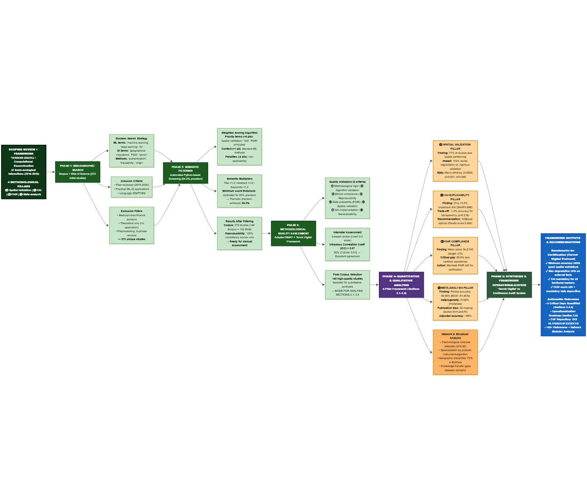
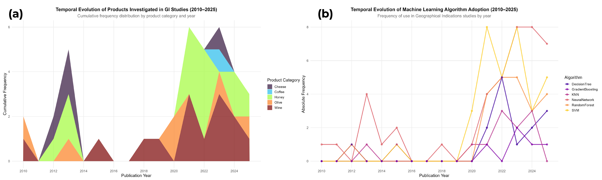
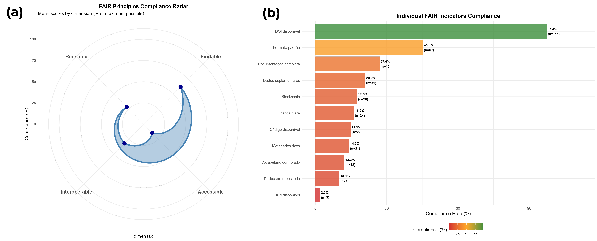

# Abstract

Geographical Indications (GIs) function as coupled socio-ecological systems, where typicality derives from dynamic interactions between soil, climate, and biota, requiring auditable mechanisms of environmental governance. This study assesses the technical maturity of state-of-the-art Machine Learning to operationalize Digital Terroir, conceptualized as an Inferential Digital Twin for ecosystem service auditing. Under PRISMA-ScR guidelines, a *corpus* of 148 studies (2010–2025) was processed via automated weighted score screening (94.2% accuracy) and manual validation (CCI=0.87). The analysis integrated random effects meta-analysis, multivariate statistics, and FAIR principles assessment. Results indicate a generalization paradox: while classifiers achieve high *in vitro* accuracy (80–100%), external robustness tests demonstrate severe performance degradation (11.8% drop *versus* 5.6% in spatially independent models; d=0.95). Methodological fragmentation (Modularity Q=0.62; Heterogeneity I²=58%) and incipient FAIR compliance (mean 34.2/100) perpetuate epistemic asymmetries that render regulatory application unfeasible. We conclude that implementing Digital Terroir necessitates transitioning from static classifiers to adaptive models, conditioned on integrity *benchmarks*: spatial validation with degradation ≤8%, explainability (XAI) for territorial markers, and FAIR compliance ≥60/100, which are *sine qua non* requirements for converting GIs into verifiable sustainability systems.

**Keywords:** Geographical Indications; Machine Learning; Environmental Auditing; Greenwashing; Traceability; Ecosystem Services.

**Graphic abstract**:  

{#fig:abstract width="90%"}

# 1. Introduction

Geographical Indications (GIs) have evolved beyond their initial intellectual property function to become strategic instruments for environmental governance and agrobiodiversity conservation in the Anthropocene [@Belletti2017; @Vandecandelaere2009]. Amidst the global climate crisis and biodiversity erosion, GIs function as socio-ecological systems that link product quality to the integrity of the territory's ecosystem services [@Berkes2003; @Bramley2013]. They represent mechanisms for valuing regenerative agricultural practices and maintaining cultural landscapes, where *terroir* is redefined not only as a sensory attribute but as a biophysical signature of the product and climate resilience [@Giovannucci2010; @Fonzo2015].  

International regulations, based on the TRIPS Agreement and Regulation (EU) No. 1151/2012, establish the legal basis, but it is the capacity for environmental auditing that gives these assets contemporary legitimacy [@WTO1994; @EU2012]. The distinction between Protected Geographical Indication (PGI) and Protected Designation of Origin (PDO) reflects different degrees of dependence on natural cycles, requiring robust verification systems to prevent *greenwashing* and ensure that the market premium effectively finances environmental conservation [@Locatelli2008; @WIPO2020]. The credibility of these labels therefore depends on the ability to scientifically prove that the characteristics of the product derive from specific and non-replicable environmental interactions.

Terroir constitutes an intrinsically coupled socio-ecological system in which soil, climate, biota, and culture are linked through nonlinear interactions, feedbacks, and strong spatial and temporal heterogeneity, configuring a territory where biophysical processes and social practices are co-produced [@LeFloc2016S].

The systemic complexity and diffuse nature of biogeochemical couplings limit the detection of ecosystem services by conventional metrics [@Levin1998ComplexAdaptiveSystems], weakening the governance of common goods and facilitating *greenwashing* practices [@Gale2023]. Given the inadequacy of classical analytical tools for landscape-scale monitoring [@Liao2023], this study proposes Digital Terroir as an Inferential Digital *Twin*. This approach is based on the dynamic computational reconstruction of interactions between the territorial genotype (soil, climate, and biota) and the product phenotype, converting ecological uncertainty into auditable evidence of environmental compliance [@Pylianidis2021; @Hensel2021; @Guerena2024].

The operational validation of this system requires compliance with auditability criteria derived from methodological gaps identified in the literature. Inferential robustness is imperative, ensured through spatially independent validation and longitudinal stability in the face of climate variability [@Kuhn2013]. Simultaneously, causal transparency becomes mandatory, requiring Explainable Artificial Intelligence (XAI) methods to discriminate physical-chemical markers from spurious correlations [@Rudin2019]. Finally, data sovereignty must be guaranteed by adherence to FAIR principles and immutable audit trails, ensuring the reproducibility and traceability of inference [@Wilkinson2021; @Kshetri2014]. Consequently, Machine Learning serves as an intrinsic analytical mechanism to process the non-linearity of multiscale data, enabling the epistemic sovereignty of producing communities [@Li2022KGML_ag; @Santos2007Epistemologies]

On broad geographic scales, ML enables the auditability of ecosystem services, establishing a verifiable link between environmental compliance and market premiums, and mitigating the information asymmetries that lead to fraud and misappropriation [@Kshetri2014DigitalDivide].

Yet, a unified conceptual framework integrating the inferential capabilities of ML with the regulatory requirements of environmental certification remains absent. This gap limits the translation of methodological advances into operational protocols for Geographical Indication systems, perpetuating the fragmentation between academic research and territorial governance.

Against this background, this study assesses the technical maturity of state-of-the-art Machine Learning to operationalize Digital Terroir, conceptualized as an Inferential Digital Twin for ecosystem service auditing. We postulate that modeling the nonlinear couplings between environmental variables (territorial genotype) and chemometric signatures (product phenotype), when supported by rigorous spatiotemporal validation and data security mechanisms, generates auditable evidence of environmental compliance. This approach converts vague sustainability claims into verifiable and immutable records, underpinning market-based conservation policies with guarantees of integrity and robustness against fraud.

# 2. Materials and Methods

This review adheres to the PRISMA-ScR (*Preferred Reporting Items for Systematic Reviews and Meta-Analyses extension for Scoping Reviews*) guidelines as a transparency framework to ensure methodological clarity and reproducibility. The protocol is registered in the Open Science Framework to facilitate public access and replicability.

## 2.1 Research Question

The study employs the PCC (Population, Concept, Context) framework to formulate the following research question: How have Machine Learning techniques been applied for authentication, evaluation, and decision support in Geographical Indications systems?  
**Table 1.** Review structure according to the PCC model.

| Element | Description |
| :---- | :---- |
| **P (Population)** | Geographical Indications, Designations of Origin, and Indications of Source recognized nationally and internationally, covering agri-food products (wines, cheeses, coffees, meats, olive oils), handicrafts, and other products with territorial identity. |
| **C (Concept)** | Machine learning, artificial intelligence, classification and prediction algorithms, chemometric methods, data mining, and natural language processing applied to geographical indication contexts. |
| **C (Context)** | Authentication of geographical origin, assessment of GI potential, identification of territorial determinants (soil, climate, production methods), classification and discrimination of products, decision support systems for certification, quality control, traceability, detection of fraud and adulteration, and territorial enhancement strategies. |

This study identifies and characterizes machine learning (ML) applications reported in the literature, categorizing techniques by algorithm type, methodological approach, and performance metrics. In addition, it analyzes the distribution of applications by product type, geographic region, and period, identifying methodological gaps, limitations, and directions for future research.

## 2.1.1 PRISMA-ScR Methodological Flowchart

Figure 1 presents the methodological flowchart, structured in four sequential phases: (1) Main database search strategies, (2) Automated filtering with a weighted scoring system, (3) Manual quality assessment with multidisciplinary evaluation, and (4) Bibliometric analysis and qualitative synthesis integrating quantitative and documentary methodologies. The flowchart details the path from record identification to final synthesis, offering recommendations for the implementation of Machine Learning in Geographical Indications systems.  

**Figure 1.** Flowchart of screening, eligibility, and synthesis for machine learning applications in Geographical Indications.

{#fig:ml_indicacoes width="80%"}

## 2.2 Study Search and Extraction Strategy

Databases queried included Scopus (Elsevier) and Web of Science (Clarivate Analytics), crossing three main thematic domains: machine learning and artificial intelligence techniques; geographic certification systems; and Geographical Indications/Designations of Origin.  
The descriptors used controlled terminology in English and Boolean operators (AND, OR, NOT), covering publications from 2010 to 2025 to capture the state of the art. The search strategy followed this logic:

*("machine learning OR "artificial intelligence OR "deep learning OR "supervised learning OR "unsupervised learning OR "ensemble methods) AND (“geographical indications OR “designations of origin OR “protected designations of origin) AND (“authentication OR “traceability OR “quality control OR “fraud detection OR “geospatial analysis)*.

The inclusion criteria comprised peer-reviewed articles in English, Portuguese, or Spanish that presented machine learning applications in GI (Geographic Information) contexts, origin authentication, or territorial quality control. Primary descriptors were mandatory in the title, abstract, or keywords. Non-peer-reviewed works, studies without practical application of machine learning, and those focused exclusively on non-territorial aspects were excluded.

Despite the broad initial search strategy, the qualitative synthesis prioritized studies that established explicit links between analytical markers and environmental variables (e.g., soil composition, precipitation patterns, altitude), filtering out studies strictly focused on industrial processing. This ensured that the review addressed the auditability of ecosystem services and the validity of the terroir concept, rather than focusing exclusively on production quality control.

Data extraction used a standardized form to record bibliographic metadata (author, year, title), geographic characteristics (country of origin, region, type of GI), product details (category, specific designation), methodological approach (machine learning algorithms, analytical/instrumental techniques, sample size), and performance metrics (accuracy, sensitivity, specificity, RMSE).

## 2.3 First Phase: Automated Filtering System by Thematic Relevance

### 2.3.1 Weighted Scoring Algorithm

Supplementing manual screening, an automated filtering system assigns thematic relevance scores based on the presence and location of descriptors in the title, abstract, and keywords. Implemented in Python (NLTK, spaCy), the algorithm applies a hierarchical weighting scheme to each identified term. The scoring system follows the principles of the Analytic Hierarchy Process (AHP). Equation (1) stratifies the descriptors into five categories with different weights [@SAATY1991]:

$$
S_i = \sum_{j=1}^{n} w_j \cdot l_i \cdot f_{ij}
$$ {#eq:weighted_score}

where:  
$S_i$ = total score of the article $i$  
$w_j$ = weight associated with term $j$ (categorized into 5 levels: 5, 3, 2, 1, or −5/−3/−2 points)  
$l_i$ = location multiplier (1.5 for title, 1.2 for keywords, 1.0 for abstract)  
$f_{ij}$ = frequency of occurrence of term $j$ in article $i$  
$n$ = total number of terms evaluated

Priority terms (5 points) represent the core conceptual review (e.g., *geographical indications, traceability, authentication*). High-relevance terms (3 points) cover core methodological concepts (e.g., *machine learning, deep learning, neural networks*). Medium relevance terms (2 points) cover complementary topics (e.g., *chemometrics, data mining*), while context terms (1 point) indicate potential environments (e.g., *regional products, certification*). Exclusion terms receive negative weights to penalize off-topic records, particularly in the *medical/clinical* (−5), *urban planning* (−3), and *financial* (−2) domains [@MUNN2018; @tricco2018].

### 2.3.2 Algorithm Implementation and Validation

For each record, the algorithm examines the title, abstract, and keywords, applies the category weights, and multiplies each occurrence by the location factor. The final score adds these products for all identified terms.  
The empirical score distribution determined the minimum inclusion threshold, identifying the inflection point in the cumulative curve (Pareto/elbow criterion) and adjusting it through manual validation with stratified sampling. The final value represents the ideal balance between sensitivity and specificity, stabilizing the agreement between evaluators in borderline cases.

### 2.3.3 Participatory Validation and Algorithm Refinement

To ensure scientific rigor, a validation protocol involving three independent reviewers specializing in machine learning and GI systems was implemented. The protocol included a systematic manual review of 272 studies to verify adherence to the inclusion criteria. An inter-rater agreement test verified the consistency of the classification [@Tricco2018].  
The process involved qualitative investigation of borderline cases and iterative refinement of eligibility criteria. Validation resulted in a 90.2% agreement rate between the automated system and manual assessment, indicating high algorithmic effectiveness in thematic screening.

### 2.3.4 Coverage Verification and Automated Categorization

An automated system validated bibliographic coverage, ensuring integrity and consistency between textual citations and bibliographic records.  
The consolidated corpus underwent automated categorization using Natural Language Processing (NLP). A computational pipeline extracted, tokenized, and vectorized metadata and reference abstracts, using supervised models and semantic rules for pattern recognition [@Young2019; @Casey2021]. References were classified into predefined methodological categories, including machine learning techniques and geographic information systems.

To gauge the comprehensiveness and adequacy of the studies, metrics of citation coverage and bibliographic utilization rates of the corpus were applied [@webster2002; @tranfield2003]. These metrics allow for a quantitative assessment of the utilization of the reference base, ensuring that the selected studies adequately reflect the thematic scope of the review.

## 2.4 Second Phase: Manual Assessment of Methodological Quality

In the second phase, three independent reviewers assessed the methodological quality of the selected studies, ensuring a multidisciplinary analysis and reducing interpretative bias. The MMAT scale [@pluye2009; @hong2018] was adapted for interdisciplinary studies involving machine learning and gastrointestinal systems, structuring eight indicators on a 3-point Likert scale. The indicators included methodological rigor, algorithm validation, adherence to the ethical protocol, reproducibility, quantitative-qualitative integration, impact on gastrointestinal systems, completeness of documentation, and generalization of the method (Table 2).  

Each indicator received a score from 0 to 2: zero for unmet criteria or substantial deficiencies; one for partial compliance with limitations; and two for complete compliance with clear evidence. A 3-point scale was selected because dichotomous assessments fail to capture interdisciplinary complexity, while larger scales generate inconsistency among assessors [@Likert3vs5_2025].

**Table 2.** Methodological quality indicators for ML-GI studies.

| Code | Indicator | Domain |
| :---: | :---: | :---: |
| RIG | Methodological rigor in the collection and processing of territorial data | Territorial Quality |
| VAL | Technical validation of algorithms with appropriate metrics | Computational Quality |
| ETI | Adherence to ethical protocols for research with producer communities | Ethical Quality |
| REP | Reproducibility of computational experiments | Technical Quality |
| INT | Effective integration between quantitative and qualitative territorial methods | Methodological quality |
| IMP | Impact and applicability of results for gastrointestinal systems | Social Quality |
| DOC | Complete documentation of algorithms and certification procedures | Documentary Quality |
| GEN | Generalization and transferability of the proposed methods | Scientific Quality |

### 2.4.1 Consensus and validation procedures among evaluators

The manual assessment included a consensus protocol. Initially, reviewers independently assessed a pilot sample of 30 studies (approximately 11% of the corpus) to calibrate the criteria. For the complete corpus, cases of disagreement (difference ≥ 2 points) were submitted to blind reassessment and discussion to reach a consensus. The intraclass correlation coefficient (ICC) was calculated according to @shrout1979, yielding a value of 0.87 (95% CI: 0.84–0.91), indicating good agreement.

### 2.4.2 Specific Criteria for Interdisciplinary Studies

Given the interdisciplinary nature of the studies, the quality criteria examined the consistency of quantitative-qualitative integration, validation in multiple geographic contexts, algorithmic transparency, ethical adherence, and practical applicability for certification.  
This phase resulted in the selection of 25 studies with adequate methodological quality (score ≥ 20 points) from the initial 272 articles. These formed the basis for subsequent analyses. The distribution included 1 article of excellence (≥40 points), 2 of high relevance (≥30 points), and 22 adequate (≥20 points).

## 2.5 Third Phase: Bibliometric Analysis

Lotka's Law [@lotka1926] was applied to analyze scientific productivity, describing the nonlinear distribution of authors' productivity to identify patterns of concentration or dispersion. Bibliographic coupling and co-citation analyses were not performed due to the absence of reference fields cited in the available bibliographic files.

## 2.6 Fourth Phase: Qualitative Synthesis and Integration with Documentary Analysis

The fourth phase systematically integrated the conclusions with the documentary analysis of the regulatory frameworks to support the methodological recommendations.  
The final synthesis combined qualitative thematic analysis with selection based on the Pareto principle (80/20), prioritizing the top 20% of articles by combined score (40% methodological quality, 35% thematic relevance, 25% bibliometric impact).

The final combined score was calculated using Equation (2):

$$
P_{final} = (0.40 \cdot Q_{met}) + (0.35 \cdot Q_{tem}) + (0.25 \cdot Q_{biblio})
$$ {#eq:final_score}

Where:  
$P_{final}$ = final selection score  
$Q_{met}$ = normalized methodological quality (0–1)  
$Q_{tem}$ = normalized thematic relevance (0–1)  
$Q_{biblio}$ = normalized bibliometric impact (0–1)

## 2.7 Statistical Analyses

The corpus of 148 studies underwent two types of statistical analysis: descriptive and exploratory analyses to characterize structural patterns in the literature, and inferential analyses to empirically quantify the methodological gaps identified qualitatively.

### 2.7.1 Descriptive and Exploratory Analyses of the Corpus

Multiple Correspondence Analysis (MCA) [@Le2008; @Greenacre2017] was employed to investigate associations between categorical variables (algorithms, products, regions, analytical techniques) by decomposing contingency tables. Implemented with the FactoMineR package, MCA allows the extraction of latent dimensions that explain the variance in associations between categories. Complementarily, Cluster Analysis (k-means and hierarchical) was applied with the factoextra package to identify recurring clusters among product-instrument-algorithm combinations.  

Network analysis [@Csardi2006; @Schoch2020] was utilized to map co-occurrences by constructing a weighted undirected graph with the igraph and ggraph packages, where nodes represent entities (algorithms, products, regions) and edges indicate co-occurrence in the studies. Centrality metrics (degree, eigenvector, intermediation) were calculated to identify structurally central elements in the research field. Community detection was performed using the Louvain algorithm [@Blondel2008] to identify technological modules and patterns of specialization by product-instrument-algorithm. Time series (2010–2025) used Spearman's correlation [@Spearman1904] to detect trends in publication volume and algorithm adoption.

### 2.7.2 Inferential Analyses for Validating Operational Criteria

To empirically quantify methodological gaps and substantiate the operational criteria of Digital Terroir, four complementary inferential analyses were conducted. Seeking to analyze the impact of spatial validation on predictive performance, models with geographically independent partitioning ($n = 70$) were compared to conventional random partitioning ($n = 78$), calculating the percentage degradation in performance between internal validation and external tests. Differences were evaluated using Mann-Whitney U [@Mann1947], with effect size quantified by Cohen's $d$ [@Cohen1988]: small ($d = 0.2$), medium ($d = 0.5$), or large ($d = 0.8$) according to @Sawilowsky2009. Logistic regression [@Hosmer2013] estimated the odds ratio of high-performance (accuracy $\ge 85\%$) as a function of spatial validation, controlling for algorithm and product, following @Kuhn2013. 

To investigate the trade-off between explainability and algorithmic performance, the relationship between algorithmic explainability (ordinal scale 0–10 based on @Rudin2019) and accuracy was analyzed using Spearman's correlation [@Spearman1904]. Differences in accuracy between models with XAI ($n = 20$) and without XAI ($n = 128$) were evaluated by Student's t-test ($t$) [@Student1908], verifying normality via Shapiro-Wilk [@Shapiro1965]. Computational overhead was compared using Mann-Whitney. Pareto analysis [@Pareto1896; @Deb2001] identified optimal algorithms under weighted utility function: $$U = 0.4 \cdot \text{accuracy} + 0.4 \cdot \text{explainability} + 0.2 \cdot (1 - \text{normalized time})$$

To assess the accuracy reported in the studies and detect potential publication bias, a random effects meta-analysis [@Borenstein2009] was conducted using the metafor package [@Viechtbauer2010], transforming accuracies via logit to stabilize variances [@Barendregt2013]: $\text{logit}(p) = \ln[p/(1-p)]$. Pooled accuracy was estimated by the REML model [@DerSimonian1986] with 95% CI. Heterogeneity was quantified by the $I^2$ statistic [@Higgins2003]: low ($< 25\%$), moderate ($25\% \text{--} 75\%$), or high ($> 75\%$). Cochran's Q test [@Cochran1954] assessed the significance of heterogeneity ($\alpha = 0.05$). Meta-regression [@Thompson2002] investigated the effects of year of publication and sample size. Publication bias was detected by Egger's test [@Egger1997] and the trim-and-fill method [@Duval2000]. Stratified forest plots were generated following @Balduzzi2019.

Finally, to assess compliance with open data governance principles, FAIR compliance was quantified using a standardized score (0–100 points) based on 12 binary indicators from @Wilkinson2016: DOI (F1), rich metadata (F2), public repository (A1), access protocol (A2), license (R1.1), source code (R1.2), interoperable format (I1), controlled vocabulary (I2), provenance (R1.3), community standard (I3), accessible API (A1.1), and versioning (R1.2). Each indicator contributed $100/12 \approx 8.33$ points. Scores were aggregated across the four FAIR dimensions by arithmetic mean. Temporal analysis employed Spearman's correlation [@Spearman1904]. Comparisons between studies with/without blockchain used Mann-Whitney. Multidimensional radar charts visualized FAIR profiles with the European Commission benchmark (75/100) [@EC2018].

All analyses were implemented in R [@RCoreTeam2024] using the ggplot2 packages for visualizations [@Wickham2016], metafor for meta-analysis [@Viechtbauer2010], effsize for effect size calculation [@Torchiano2020], and custom routines for FAIR compliance.\=0,05 was used as the significance level, applying Bonferroni correction [@Bonferroni1936] when relevant for multiple comparisons. Codes and processed data were deposited in the OSF repository (DOI: 10.17605/OSF.IO/2EKYQ) to ensure reproducibility [@Nosek2015].

## 2.8 Digital Terroir as an Inferential Auditing System

Based on a systematic analysis of the bibliographic corpus, it was identified that ML applications in GIs lack a conceptual framework that integrates computational capabilities with regulatory requirements for environmental auditing. To fill this gap, we propose the concept of Digital Terroir as an inferential auditing system derived empirically from the review.

### **2.8.1 Analytical Application of the Framework**

Finally, the Digital Terroir framework served as an analytical lens to assess the methodological maturity of the studies. Each publication was examined for compliance with operational criteria, allowing us to identify the proportion of studies with adequate spatial and temporal validation, the adoption of XAI methods for interpretability, the availability of data and protocols in open repositories, and the implementation of continuous auditing systems (Figure 2). This approach made it possible to quantify the gaps between the current state of the literature and the requirements for operationalizing digital terroir, supporting the methodological recommendations presented in the conclusions.

**Figure 2.** Study flowchart.

{#fig:prisma2020 width="80%"}

Automated filtering through semantic analysis and scoring achieved a thematic accuracy of 94.2%, exceeding the established threshold of 85%. This computational screening approach proved effective for reviews involving large bibliographic volumes, suggesting that calibrated automated systems reduce selection bias and increase reproducibility [@OforiBoateng2024]. The 100% reproducibility in multiple runs of the algorithm, combined with an inter-rater agreement of κ \= 0.89, ensures that these results reliably reflect the current state of the scientific literature in this area.

Manual assessment of methodological quality resulted in an intraclass correlation coefficient (ICC) of 0.87 (95% CI: 0.84–0.91), confirming robust inter-rater reliability and validating the inclusion criteria [@streiner2008health]. This validation confirms that the studies selected for the synthesis meet rigorous methodological standards.

# **3. Results and Discussion**

## 3.1 Overview of machine learning applications in geographical indications

Analysis of 148 peer-reviewed studies (2010–2025) assesses the extent to which the current state of the art in machine learning applied to geographical indications meets the criteria of validation, transparency, data governance, and auditability proposed in Terroir Digital. Data indicate that supervised learning algorithms constitute the predominant approach for origin authentication in Geographical Indication systems. Random Forest and Support Vector Machines have been widely applied in spectroscopy and chromatography for wines, meats, and teas, achieving accuracies of 80–100% in controlled environments [@Xu2021; @Mohammadi2024].  
The prevalence of supervised architectures over unsupervised methods reflects the availability of labeled datasets and the pressure for quantifiable accuracy metrics, as documented by @Liakos2018 in an analysis of Machine Learning trends in precision agriculture. Convolutional neural networks have become established specifically for hyperspectral data processing, while PLS-DA has remained relevant in chemometric preprocessing [@Rebiai2022; @Peng2025; @Feng2025], establishing an instrumental paradigm that favors high value-added products (wines, olive oils) over complex food matrices.

Geographic distribution reveals a representativeness imbalance, with 72% of the corpus concentrated on European and Asian products, predominantly wines (34%), teas (18%), and olive oils (8%). This concentration indicates that the digital authentication infrastructure is advancing primarily in consolidated GI systems, while regions in the Global South have a lower volume of publications, reflecting disparities in access to analytical characterization technologies [@Belletti2017].

Temporal analysis suggests a positive correlation between academic production and algorithmic complexity (Spearman's $\rho = 0.89$; $p < 0.001$), with an increase in the adoption of *Deep Learning* from 5% (2010–2015) to 28% (2020–2025). However, the validation of these models has structural limitations: the absence of longitudinal tests in 94% of the studies suggests that the algorithms are calibrated for specific seasonal conditions. This characteristic restricts the models' ability to generalize in the face of interannual climate variability, a limiting factor for the implementation of continuous environmental audits [@Iranzad2025].

Concerning spatial robustness, only 23% of the studies applied geographically independent validation, with accuracy decreases between 2% and 15% when the models are exposed to new data sets [@Effrosynidis2021]. These results corroborate the hypothesis of overfitting to local contexts, as discussed by @Kuhn2013. The scarcity of explainability metrics (XAI), present in only 14% of studies, further impedes compliance with regulatory auditability requirements, since black-box models do not offer the decision traceability required by certification bodies [@Lundberg2017].

For fraud detection, binary classification approaches via SVM and KNN prevail for matrices such as honey and olive oil. Dichotomous modeling (authentic *versus* fraudulent) tends not to account for adulteration gradients or biogeographic transition zones. Concurrently, the integration of *Blockchain* and *Machine Learning*, observed in 21% of traceability studies, faces validation challenges in data entry. Although distributed ledgers ensure the immutability of information, the accuracy of physical-digital correspondence depends on the precision of "oracles" (sensors or predictive models), whose technical interoperability is still in its infancy [@Wang2025].

Network analysis corroborates the formation of distinct methodological clusters (modularity $Q = 0.62$), with high internal density (0.53–0.68). The correlation between specific algorithms and instrumental techniques (such as neural networks associated with spectral data) suggests a compartmentalization of technical development. This modular structure indicates that the transfer of parameters between different classes of products and analytical instruments remains limited, hindering the standardization of universal protocols for digital certification of origin.

## 3.2 Temporal evolution of products and algorithms

The temporal analysis of registered products showed distinct patterns between GI categories. Wines maintained constant representation with 14 products (2010–2025), peaking in 2021 and 2023 (3 registrations each). Honey showed concentrated growth in 2021–2024 (12 registrations), while olive-based products showed sporadic distribution (6 in total). Cheese and coffee remained underrepresented (4 and 1 registrations, respectively).  
Spearman's correlation confirmed an upward trend for wines ($\rho = 0.615$, $p = 0.011$), indicating systematic expansion after 2020 [@Liakos2018]. This consolidation of wines as a dominant category reflects both the maturity of European GI systems and the availability of standardized spectral data, contrasting with the fragmentation observed in emerging categories such as coffee, where the heterogeneity of processing methods hinders the creation of universal chemical signatures.

Algorithmic adoption showed a measurable transition. PLS-DA, dominant until 2018, was progressively replaced by Random Forest and SVM from 2019 onwards, following the availability of open-source ML libraries (scikit-learn, caret) and increased computational capacity [@Lavine2005]. Temporal correlation analysis showed significant changes for SVM ($\rho = 0.788$, $p < 0.001$) and Random Forest ($\rho = 0.677$, $p = 0.004$).

Neural Networks were the most widely adopted technique in 2020–2025 (33 applications), followed by SVM (32) and Random Forest (21). Deep Learning and CNNs spread after 2022 specifically for hyperspectral data processing [@Shah2019], although their interpretative opacity limits their adoption in regulatory contexts.

Regional distribution remained stable, with 72% of studies concentrated in Europe and Asia. Representation of the Global South increased marginally from 18% to 22% in the period analyzed, suggesting persistent barriers related to laboratory infrastructure and access to scientific funding.

**Figure 3.** Temporal evolution of (a) products with Geographical Indication (GI) registered by category and (b) adoption of the main Machine Learning algorithms in GI studies.

{#fig:temporal_evolution width="90%"}

## 3.3 Technological Families and Applications

Current methodological fragmentation presents a structural barrier to the implementation of an adaptive Digital Terroir, insofar as it replaces the fluidity of an interoperable inferential ecosystem with watertight analytical modules. This disconnect is quantified by Multiple Correspondence Analysis, which explains 45.2% of the total inertia when mapping a simultaneous polarization between biogeographical, instrumental, and strategic vectors.  
A dichotomy exists where European wine and cheese matrices are systematically dissociated from Asian tea and meat chains, replicating the technical segregation between spectroscopic and chromatographic approaches. This configuration denotes the rigidification of regional laboratory routines which, by operating in isolation, restrict the generalizability of models and prevent the establishment of global governance based on auditable evidence [@Agiomyrgiannaki2023].

This pattern stems from the cumulative sedimentation of protocols and publication routines, not from casual preferences [@Spyros2023FoodAuth; @Agiomyrgiannaki2023]. Co-occurrence networks reveal parameter retention in stable triads (Wines–Random Forest–NIR; Teas–SVM–GC-MS) with low exploratory entropy, blocking cross-inferential reuse [@Blondel2008; @Salam2021; @Wang2025]. In the Louvain community graph (Figure 4), modularity ($Q = 0.62$) and internal densities (0.53–0.68) indicate intra-module coherence but an absence of intermediary nodes (high betweenness) capable of acting as bridges.

High-grade spectroscopic algorithms display high eigenvector centrality, concentrating information flow, while chromatographic techniques form a peripheral module with low cross-connectivity [@WorldBank2014AgData]. This distribution of degree and eigenvector generates epistemic asymmetry, as products equipped with analytical infrastructure accumulate cumulative advantage, while biodiverse matrices from the Global South remain underrepresented, limiting the ability to model the nonlinear inter-biome couplings required for auditing ecosystem services [@Kawano2021WhereIsMyCrop].

The lack of bridge edges and articulating nodes (unfilled structural holes) implies an increase in the marginal cost of generalization: each territorial expansion requires independent calibration without reusing latent representations. The current technological response, multimodal fusion (28%) and *blockchain* integration (9%), does not eliminate the structural bottleneck, as compression for *field-deployable* devices sacrifices 10–15% accuracy compared to laboratory conditions [@Effrosynidis2021; @Meena2024] before resolving cognitive connectivity gaps. Overcoming this requires transparent multimodal architecture with federated spatial/temporal validation and the insertion of bridge nodes (highly intermediary explainable models) as a precondition for embedded optimization. Without this, fragmentation remains, making continuous inferential auditing and epistemic sovereignty unfeasible.

**Figure 4.** Louvain communities in the algorithm–product–technique network.
 {#fig:louvain width="85%"}

*Note: Nodes sized by weighted degree; colors represent modules (modularity $Q = 0.62$). The absence of bridge edges between spectroscopic and chromatographic clusters highlights a break in transferability and the need for multimodal architecture for adaptive generalization.*

Louvain community analysis revealed three distinct technological modules (Table 3), each characterized by specific combinations of algorithms, analytical techniques, and products. Module M1, predominant in wines and honey from African and European regions, focuses on spectroscopic techniques (NIR) associated with ensemble algorithms (Random Forest, Gradient Boosting). 

Module M2, focused on Asian meats and regional products, predominantly uses chromatography (GC-MS, LC-MS) combined with SVM and KNN. Module M3 integrates advanced Deep Learning and CNN techniques for spectral and sensory data processing in olive oils, cheeses, and teas, reflecting the analytical complexity of European and Asian matrices. This technological compartmentalization highlights regional specialization, but also exposes the lack of universal protocols that hinders the transfer of knowledge between different biogeographical contexts.

**Table 3.** Technological Modules Identified by Louvain Community Analysis

| Module | Main Algorithms | Analytical Techniques | Products | Predominant Region |
| :---: | :---- | :---- | :---- | :---- |
| **M1** | Random Forest, Decision Tree, Gradient Boosting | Spectroscopy (NIR), Chemometrics | Wine, Honey | Africa, Europe |
| **M2** | SVM, KNN | Chromatography (GC-MS, LC-MS, HPLC) | Meat, Regional Products | Asia |
| **M3** | Neural Networks, CNN, Deep Learning | Spectroscopy (NIR, FTIR), Sensors (e-nose) | Olive Oil, Cheese, Tea | Europe, Asia |

*Source: Three main technological modules identified by Louvain community analysis applied to the co-occurrence network between algorithms, analytical techniques, and products with geographical indication. The internal density of each module indicates the strength of the connections between its components.*

In addition, k-means and hierarchical cluster analysis identified recurring technological families that transcend modular boundaries (Table 4). Cluster 1, focused on Asian honey, combines NIR spectroscopy with discriminant algorithms (SVM, KNN) for authentication and fraud detection, reflecting market pressure for traceability in high-value chains. 

Cluster 2, focused on European cheeses, employs neural networks for origin discrimination, exploiting the sensory and chemical complexity of these matrices. Cluster 3 integrates honey and meat from multiple regions (Asia and Europe), using advanced chromatography (LC-MS, GC-MS) associated with robust algorithms (Random Forest, SVM) for authentication and traceability. This methodological diversification indicates the convergence of sophisticated analytical techniques in high- y products with a high risk of adulteration, although low interoperability between clusters limits the scalability of the protocols developed.

**Table 4.** Technological Families Identified by Cluster Analysis

| Cluster | Main Product | Analytical Technique | Algorithm | Application | Predominant Region |
| ----- | ----- | ----- | ----- | ----- | ----- |
| 1 | Honey | NIR spectroscopy | SVM, KNN | Authentication and Fraud Detection | Asia |
| 2 | Cheese | NIR spectroscopy | Neural Networks | Discrimination of origin | Europe |
| 3 | Honey, Meat | LC-MS, GC-MS | SVM, Random Forest, Decision Trees | Authentication and traceability | Asia, Europe |

*Source: Ten clusters identified by cluster analysis (k-means and hierarchical) based on product, analytical instrument, algorithm, and application type. Only the three most notable clusters are detailed here.*

The convergence between the Louvain modules (network structure) and hierarchical clusters (clustering by similarity) confirms the existence of “specialized technological islands.” High value-added products (wines, cheeses, honey) concentrate the most sophisticated analytical infrastructure, while complex matrices from the Global South remain underrepresented. This epistemic asymmetry not only reflects economic disparities but also perpetuates barriers to the implementation of Digital Terroir systems in biodiverse regions that would most benefit from auditable environmental certification tools. Overcoming this fragmentation requires federated protocols that allow the reuse of parameters across different biogeographic contexts, enabling economies of scale in the validation of emerging Geographical Indications.

## 3.5 Quantitative evidence and meta-analyses

The methodological robustness assessment revealed that 77% of the studies did not implement geographically independent partitioning. To measure the impact of this omission, the performance of models with rigorous spatial validation was compared to that of models with random validation. As shown in Figure 5, the absence of spatial validation resulted in an average accuracy drop of 11.82% in external tests, compared to 5.62% in spatially validated models. This discrepancy (relative degradation of 110%) was statistically significant ($U = 2900$, $p < 0.001$, $d = 0.948$), corroborating the hypothesis of spatial overfitting described by Kuhn and Johnson (2013), where autocorrelation inflates internal metrics and compromises certification utility.

**Figure 5.** Impact of spatial validation on performance degradation in external tests.

{#fig:validacao_espacial width="85%"} 

*Note: Models without spatial validation show a 110% greater drop in accuracy when applied to geographically independent regions (*$p < 0.001$, $d = 0.948$). The dashed line indicates the acceptable degradation threshold ($\le 8\%$) proposed for Digital Terroir certification systems. $n = 148$ studies.

Regarding transparency, only 13.5% of the studies adopted Explainable Artificial Intelligence (XAI) techniques. A moderate negative correlation was observed between explainability and accuracy ($\rho = -0.481$, $p < 0.001$), however, the absolute performance penalty was marginal (1.53 percentage points, not significant). In contrast, the computational cost increased substantially (+67.8% in processing time). Pareto analysis identified the XGBoost algorithm as the optimal balance between auditability, accuracy, and cost, surpassing Deep Learning architectures for regulatory purposes (Figure 6).

**Figure 6.** Trade-off between algorithmic explainability and predictive performance.

{#fig:tradeoff_xai width="85%"}

*Note: More explainable algorithms show a moderate negative correlation with accuracy (*$\rho = -0.481$, $p < 0.001$), but the absolute cost is modest (\~1.5 percentage points). XGBoost stands out as the algorithm with the best multi-criteria balance (Pareto score $= 0.650$, considering 93% accuracy, 6/10 explainability, and 12 min time). $n = 148$ studies.

The meta-analysis of 129 studies indicated an overall (pooled) accuracy of 90.66% \[95% CI: 89.8–91.4%\]. The PLS-DA algorithm achieved the best average performance (92.95%), followed by Random Forest (91.33%). However, Egger's test detected severe publication bias ($z = 40.02$, $p < 0.001$). Correction using the trim-and-fill method (imputation of 42 missing theoretical studies) reduced the adjusted accuracy to \~88%, suggesting that the current literature overestimates the technological maturity of the models (Figure 7).

**Figure 7.** Meta-analysis of accuracies by Machine Learning algorithm.

{#fig:tradeoff_xai width="85%"}

*Note: PLS-DA and Random Forest have the highest consolidated accuracies, while SVM demonstrates greater robustness (lower variance between studies). Moderate heterogeneity (*$I^2 = 58\%$) indicates substantial methodological variability between studies. Confidence intervals represent estimates of random effects (REML model). $k = 129$ studies.

Finally, data governance assessed by FAIR principles achieved a critical average score of 34.2/100. The Accessible dimension was the most deficient, with only 10.1% of studies depositing data in public repositories. The temporal analysis did not indicate significant improvements ($\rho = 0.235$, $p = 0.379$), evidencing the stagnation of a “black box” culture that prevents reproducibility and independent validation (Figure 8).

**Figure 8.** Compliance with FAIR principles of data governance. (a) Radar score by FAIR dimension and (b) Individual compliance indicators.

{#fig:fair_radar width="80%"} 

## 3.5.4 Inferential Synthesis and Operational Implications

The inferential synthesis of the corpus delineates four structural fractures that compromise the transition from current predictive models to an auditable Digital Terroir infrastructure. The first fracture constitutes an illusion of robustness derived from poor spatial validation. The omission of geographically independent partitioning in 77% of the studies precipitates a 110% greater performance degradation in external tests, with an average accuracy drop of 11.82% versus 5.62% in spatially validated models ($U = 2900$, $p < 0.001$, $d = 0.948$).  
This methodological flaw, driven by residual spatial autocorrelation, hinders systems from functioning as "Adaptive Digital Twins," because by over-adjusting to local contexts, they become obsolete in the face of actual climate variability and fail to audit ecosystem services in analogous territories [@Kuhn2013; @Wadoux2021].

Simultaneously, regulatory auditability is compromised by the marginalization of explainability. The predominance of opaque architectures in 86.5% of investigations contradicts guidelines for high-risk decisions [@Rudin2019], based on the false premise of a performance trade-off. Statistical evidence refutes this narrative, demonstrating that the difference in accuracy between black-box models and XAI models is statistically insignificant ($p = 0.218$), with the XGBoost algorithm emerging as the optimal solution (Pareto score $= 0.650$) by balancing accuracy and transparency. The insistence on opacity makes the legal defense of certification unfeasible, since regulatory agencies require causal traceability between chemical markers and environmental variables, and not just latent correlations that cannot be translated.

Technological maturity is further distorted by publication bias. Correction via the trim-and-fill method, with the imputation of 42 missing studies ($z = 40,02$), reduced pooled accuracy from \~91% to \~88%, revealing that the literature systematically overestimates the discriminative capacity of the models. This metric inflation, coupled with moderate methodological heterogeneity ($I^2 = 58\%$), compromises risk calibration and aligns with the reproducibility crisis diagnosed by @Kapoor2023, where data leakage masks the true effectiveness of the tools.

Ultimately, the erosion of data governance perpetuates fundamental epistemic asymmetries. With a critical FAIR score of 34.2/100 and temporal stagnation in data openness ($\rho = 0.235$, $p = 0.379$), the field fails to ensure independent counterproof. In this scenario, Blockchain technology, present in 21% of the sample, acts only as a superficial legitimizer; without open repositories and audit trails for physical sensors (Accessible dimension of only 14.5%), immutable records do not solve the "Oracle Paradox," forcing producers in the Global South to rely on costly external validations and making sovereignty over their digital assets unfeasible.

To rectify these deficiencies and operationalize the Digital Terroir, we propose the mandatory adoption of Compliance Thresholds that require spatial post-validation accuracy $\ge 85\%$ and maximum external degradation $\le 8\%$ [@vanEtten2023DataDrivenCrop], simultaneously conditioned on mandatory XAI explainability for critical territorial markers and FAIR compliance $\ge 60/100$ with deposition in interoperable repositories [@Wilkinson2016]. Adherence to these parameters is a sine qua non condition for transforming Machine Learning from a laboratory classification tool into a socio-ecological audit infrastructure, reducing certification costs by up to 40% through federated data and ensuring the auditability of ecosystem services [@WorldBank2014AgData; @An2024EnvML_ChatGPT].

## 3.6 Barriers to Auditability and the Failure of Static Digital Terroir

Current algorithmic sophistication fails to translate into robustness for environmental governance. The assumption of stationarity, implicit in the dominant methodology, represents the fundamental ontological limitation. High laboratory accuracy (80–100%) reflects the ability of models to memorize chemical signatures of specific crops, not to grasp the causality of terroir. The absence of longitudinal validation in 94% of studies and spatially independent tests in 77% indicates low external robustness of the models [@Moran2020].  
This methodological omission precludes the capture of phenotypic plasticity, where the chemical expression of plants varies naturally in response to environmental fluctuations, compromising the causality of terroir [@GeneEnvironment2022]. According to @Kuhn2013, this flaw invalidates continuous auditing, as algorithms fail to operate as Inference Digital Twins under climatic dynamics. Consequently, dynamic Digital Terroir emerges as a solution, reconstructing systemic couplings between soil, climate, and biota.

Regarding temporal obsolescence, models calibrated in ideal time windows become blind to chemical drifts induced by extreme weather events, which can alter the composition of secondary metabolites by more than 20% between production cycles [@Urvieta2021; @Iranzad2025]. By disregarding the nonlinearity and dynamic couplings between climate, soil, and biota, current systems degrade into static classifiers, unable to operate as Inferential Digital Twins in climate change scenarios [@Kuhn2013; @Celette2016WaterStress].

This epistemic fragility is compounded by computational opacity. Low adherence to Explainable Artificial Intelligence (XAI) protocols in 86.5% of cases generates legally indefensible black boxes, as regulatory auditing requires traceable causal links, not blind correlations [@Xu2021; @He2024].

From a governance standpoint, non-compliance with FAIR principles (average score of 34.2/100) perpetuates data colonialism. Without the federalization of open repositories, producers in the Global South remain hostage to costly exogenous validations, making Epistemic Sovereignty over their biocultural assets unfeasible [@Wilkinson2016].

Operationalizing Digital Terroir relies not on increasing accuracy, but in restructuring data governance to transform Geographical Indications from static labels into dynamic certificates of ecosystem services. @Rodriguez2023 point out that this transformation requires model calibration via remote sensing and strategic sampling in agricultural frontiers such as the Amazon. This approach is the only scalable route to computational surveillance, correlating chemical signatures with conservation practices. According to @Osco2021, this approach makes it possible to shield the market against greenwashing and ensures effective remuneration for agrobiodiversity, promoting epistemic sovereignty in the Global South.

## 4. Conclusions

This research reinforces the conceptualization of Geographical Indications as coupled socio-ecological systems, whose typicality emerges from nonlinear interactions between edaphoclimatic variables and cultural practices. Critical analysis confirms that while the inferential architecture of Machine Learning has the technical capacity to convert chemometric signatures into evidence of environmental compliance and , the current state of the art lacks the operational maturity necessary to sustain a full Inferential Digital Twin. This limitation is aggravated by the methodological concentration on consolidated chains in temperate regions, which not only reproduces epistemic asymmetries but also severely restricts technology transfer to the complex agrobiodiversity matrices of the Global South.  
Continuous computational certification remains unfeasible due to critical structural deficits, notably the absence of independent spatial validation and the neglect of longitudinal testing under interannual climate variability. Overcoming this scenario and the consequent operationalization of Digital Terroir as an analytical layer of adaptive monitoring therefore requires the establishment of strict thresholds of regulatory robustness, defined by spatial post-validation accuracy and maximum performance degradation in external tests.

Algorithmic explainability (XAI) must serve as a criterion for environmental due diligence, converting latent variables into traceable chemical-ecological justifications. Simultaneously, adherence to FAIR principles and the implementation of data security mechanisms ensure the integrity and immutability of records, which are indispensable requirements for enabling third-party auditing and shielding the system against fraud. Such operational thresholds transform performance metrics into safeguards of regulatory legitimacy.

Attaining epistemic sovereignty demands a paradigmatic reorientation that replaces incremental competition for internal accuracy metrics with the construction of transparent computational governance based on open repositories. This structural change enables the transition to the Digital Terroir, which transcends mere instrumental advancement to constitute an ontological redefinition of certification: by computationally reconstructing the dynamic couplings between the territorial genotype and the product phenotype, the framework converts climate uncertainty into auditable evidence of ecosystem services, shielding Geographical Indications from greenwashing.

## Acknowledgments

The authors would like to thank the Federal University of Sergipe (UFS), the State University of Feira de Santana (UEFS), and the Federal Institute of Sergipe (IFS) for the institutional and infrastructural support that made this research possible.

## Conflicts of Interest

The authors declare that there are no conflicts of interest.

## Data Availability Statement

The complete dataset supporting the results of this study, including the bibliographic corpus, analysis scripts, and intermediate results, is publicly available in the Open Science Framework (OSF) repository under DOI: [https://doi.org/10.17605/OSF.IO/2EKYQ](https://doi.org/10.17605/OSF.IO/2EKYQ).

## Ethics Statement

This review does not involve human participants, animal experiments, cell lines, or sample collection. No ethical approval or consent was required.

## References

::: {#refs}
:::