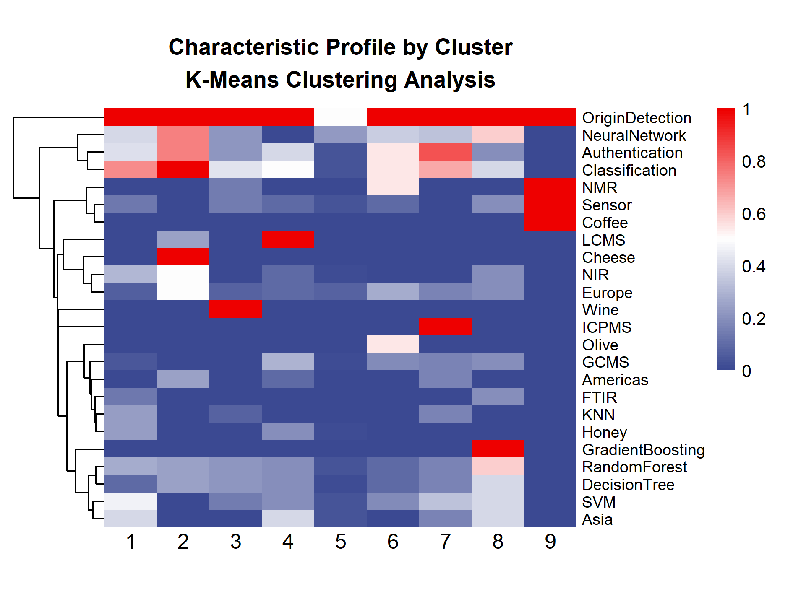

# Abstract

Geographical Indications (GIs) are intellectual property assets that link product quality to territory and require auditable, reproducible authentication. This review provides a critical, integrative synthesis of Machine Learning (ML) applications in GI systems (2010–2025), focusing on how analytical signatures (spectral, elemental, isotopic, metabolomic, and geospatial) support origin discrimination, fraud detection, quality prediction, and traceability. Across 148 peer‑reviewed studies, supervised classifiers dominate: Random Forest and Support Vector Machines are prevalent in spectroscopy and chromatography for wines, meats, oils, and teas; Deep Learning emerges for hyperspectral and image data; and PLS‑DA/PCA remain central for chemometrics and dimensionality reduction. Typical accuracies range from 80% to 100% in laboratory settings, yet generalization is often overestimated: only 23% of studies perform spatially independent validation and fewer include longitudinal tests, with performance drops of 2%–15% under distribution shifts. To be incorporated into certification, ML models must demonstrate rigorous external and temporal validation, provide clear interpretability to identify territorial markers with legal defensibility, and operate within transparent data governance that supports public repositories and reproducible pipelines. We synthesize methodological patterns into technological families (algorithm–instrument–matrix), outline practical guidance for certifiers, and highlight opportunities for Global South products (coffee, cocoa, cheeses, cachaça). ML can strengthen GI certification when paired with careful validation and explainability; otherwise, statistical optimism risks eroding consumer trust and asset value.

**Keywords:** Geographical Indications; Machine Learning; Authentication; Chemometrics; Traceability; Explainability.

# 1. Introduction

Geographical Indications (GIs) safeguard territories and products within the knowledge economy, granting exclusive rights over goods whose quality, reputation, and characteristics stem from their geographical origin [@Locatelli2008; @WIPO2018]. Grounded in the Berne Convention [@berna1886] and the TRIPS Agreement [@trips1994], GIs link productive territories and local communities to niche markets, coupling rights protection with traditional knowledge preservation [@Suh2007]. Beyond their legal function, GIs represent strategic intangible assets under the Resource-Based View theory. They act as rare, valuable, inimitable, and non-substitutable resources that underpin sustainable territorial competitive advantage [@Barney1991]. Value appropriation through GIs extends beyond immediate profitability; it anchors future value capture by leveraging differentiated markets and consumer willingness to pay premiums for certified origin products [@Loureiro2002; @VazquezFontes2010].

The international regulation of Geographical Indications (GIs) is structured by the Agreement on Trade-Related Aspects of Intellectual Property Rights (TRIPS) of the World Trade Organization, which establishes minimum standards of protection for member countries [@WTO1994]. The global system predominantly distinguishes two categories of recognition, harmonized in the European Union by Regulation (EU) No 1151/2012: Protected Geographical Indication (PGI) and Protected Designation of Origin (PDO) [@EU2012]. PGI identifies products whose quality or reputation is linked to geographical origin, requiring that at least one production stage takes place in the delimited area. In contrast, PDO designates products whose characteristics result exclusively or essentially from a specific geographical environment, including natural and human factors, requiring that all production stages occur within the defined region, directly linking quality to the concept of terroir [@Giovannucci2010; @Vandecandelaere2009].

The governance of these assets is managed by national intellectual property offices and supranational bodies, such as the European Union Intellectual Property Office (EUIPO) and the World Intellectual Property Organization (WIPO), which administers the Lisbon System for the International Registration of Appellations of Origin [@WIPO2020]. This global regulatory framework recognizes GIs as strategic intellectual property assets, eligible for protection against usurpation and imitation, fundamental for economic valuation and sustainable rural development in competitive global markets [@Belletti2017; @Bramley2013].

Artisanal and agri-food products with potential for Geographical Indication (GI) represent significant cultural manifestations and strategic opportunities for territorial value capture. Research links the unique characteristics of regional products to specific geographical attributes, including edaphoclimatic conditions (soil, climate, altitude) and distinctive production methods [@Bureau2018; @Azevedo2011; @Santos2018; @Fonzo2015; @SantosJC2019]. Territorial characterization, required internationally under Article 22 of the WTO TRIPS Agreement [@TRIPS1994], requires rigorous technical analyses to scientifically validate the relationship between quality and geographical factors. This requirement underscores the need for certification systems to objectively and robustly validate the link between geographical origin and product value/quality, aligning national, regional (EU, Mercosur), and global standards [@Garrido2021GI_TRIPS, @Tarmizi2023ComparativeGI].

Machine Learning (ML) technologies address the challenge of objectively validating the link between product quality and geographical origin by analyzing complex analytical data and uncovering patterns that may not be apparent through traditional theoretical approaches [@Ramos2025]. Unlike conventional sensory analysis, which depends on subjective human expertise and is limited in scalability, ML algorithms use data-driven methods to automatically process large, multidimensional datasets, enabling more robust and reproducible territorial certification [@Qamar2023DeepLearning, @Zatsu2024AI_Food].

According to @Gbashi2024FoodIntegrityAI, ML and Artificial Intelligence have proven effective in overcoming the limitations of manual evaluation by reducing human biases, increasing accuracy, and enabling automation and standardization in authentication and origin assurance processes within the food industry. These technologies can identify non-linear patterns and latent relationships in multidimensional data that are often missed by classical statistical methods.  @Rocha2020NonLinear further emphasize that non-linear approaches, such as artificial neural networks and support vector machines, are particularly valuable when analyzing large datasets from diverse analytical techniques, where traditional statistical methods may be inadequate or less effective [@Chen2020].

In the GI context, Machine Learning supports origin authentication, fraud detection, predictive quality control, and full traceability. It operates on chemical, isotopic, spectral, and geospatial signatures that capture the product-territory relationship [@longo2021; @acquarelli2021; @rodrigues2022; @rana2023]. Integrating high-dimensional instrumental data with supervised models enables origin discrimination, adulteration identification, and sensory/physicochemical attribute estimation with precision meeting certification standards [@Jiang2025; @Peng2025; @Santoma2025; @Li2025; @Wang2025].

The selection of variables and algorithms—such as Random Forest, SVM, PLS-DA, PCA, and feature selection methods like Boruta and RFE—not only influences technical performance but also plays a crucial role in regulatory processes by determining which territorial markers are recognized as valid evidence of authenticity [@Salam2021; @Malik2023].

Despite growing academic and technological interest, there is a lack of comprehensive reviews that systematically synthesize the scientific evidence, catalog the techniques used, assess performance across different products and regions, and highlight future research needs. This gap limits methodological progress and impedes the effective transfer of knowledge to GI certification and control systems.

This review systematically maps Machine Learning applications in Geographical Indications, using the PCC framework (*Population, Concept, Context*) to synthesize scientific evidence on integrating ML with territorial aspects. We hypothesize that Machine Learning techniques support authentication, evaluation, and decision-making processes in GIs, revealing methodological patterns that consolidate knowledge for developing computational models in geographical certification.

# 2. Materials and Methods

This review follows PRISMA-ScR guidance (*Preferred Reporting Items for Systematic Reviews and Meta-Analyses extension for Scoping Reviews*) as a transparency framework to ensure methodological clarity and reproducibility. The protocol is registered on the Open Science Framework to facilitate public access and replicability.

## 2.1 Research Question

The study employs the PCC framework (*Population, Concept, Context*) to formulate the research question: *How have Machine Learning techniques been applied for authentication, evaluation, and decision support in Geographical Indications systems?*

**Table 1.** Structure of the review according to the PCC framework.

| Element                  | Description                                                                                                                                                                                                                                                                                                                                                                                     |
| :------------------------ | :---------------------------------------------------------------------------------------------------------------------------------------------------------------------------------------------------------------------------------------------------------------------------------------------------------------------------------------------------------------------------------------------- |
| **P (Population)** | Geographical Indications, Denominations of Origin, and Indications of Provenance recognized nationally and internationally, encompassing agro-food products (wines, cheeses, coffees, meats, olive oils), crafts, and other products with territorial identity.                                                                                                                        |
| **C (Concept)**    | Machine Learning, Artificial Intelligence, classification and prediction algorithms, chemometric methods, Data Mining, and Natural Language Processing applied to Geographical Indications contexts.                                                                                                                                             |
| **C (Context)**    | Geographical origin authentication, GI potential assessment, identification of territorial determinants (soil, climate, production methods), product classification and discrimination, decision support systems for certification, quality control, traceability, fraud detection and adulterations, and territorial valorization strategies. |

This study identifies and characterizes ML applications reported in the literature, categorizing techniques by algorithm type, methodological approach, and performance metrics. Furthermore, it analyzes the distribution of applications by product type, geographical region, and time period, identifying methodological gaps, limitations, and directions for future research.

## 2.1.1 PRISMA-ScR Methodological Flowchart

Figure 1 presents the methodological flowchart, structured in four sequential phases: (1) Main database search strategies, (2) Automated filtering with a weighted scoring system, (3) Manual quality assessment with multidisciplinary evaluation, and (4) Bibliometric analysis and qualitative synthesis integrating quantitative and documentary methodologies. The flowchart details the path from record identification to final synthesis, offering recommendations for Machine Learning implementation in Geographical Indications systems.

**Figure 1.** Flowchart of screening, eligibility, and synthesis for ML applications in Geographical Indications.

{#fig:ml_indicacoes width="80%"}

## 2.3 Search Strategy and Study Extraction

Searches targeted Scopus (Elsevier) and Web of Science (Clarivate Analytics), intersecting three main thematic domains: machine learning and artificial intelligence techniques; geographical certification systems; and Geographical Indications/Denominations of Origin.

Descriptors employed controlled English terminology and Boolean operators (AND, OR, NOT), covering publications from 2010 to 2025 to capture the state of the art. The search strategy followed this logic:

*("machine learning" OR "artificial intelligence" OR "deep learning" OR "supervised learning" OR "unsupervised learning" OR "ensemble methods") AND ("geographical indications" OR "denominations of origin" OR "appellations of origin" OR "protected designations of origin") AND ("authentication" OR "traceability" OR "quality control" OR "fraud detection" OR "geospatial analysis")*.

Inclusion criteria comprised peer-reviewed articles in English, Portuguese, or Spanish presenting ML applications in GI contexts, origin authentication, or territorial quality control. Primary descriptors were required in the title, abstract, or keywords. Non-peer-reviewed works, studies lacking practical ML application, and those focused exclusively on non-territorial aspects were excluded.

Data extraction utilized a standardized form to record bibliographic metadata (author, year, title), geographical characteristics (country of origin, region, GI type), product details (category, specific denomination), methodological approach (ML algorithms, analytical/instrumental techniques, sample size), and performance metrics (accuracy, sensitivity, specificity, RMSE).

## 2.4 First Phase: Automated Thematic Relevance Filtering System

### 2.4.1 Weighted Scoring Algorithm

Complementing manual screening, an automated filtering system assigns thematic relevance scores based on descriptor presence and location in the title, abstract, and keywords. Implemented in Python (NLTK, spaCy), the algorithm applies a hierarchical weighting scheme to each identified term. The scoring system adheres to Analytic Hierarchy Process (AHP) principles. Equation (1) organizes descriptors into five categories with differentiated weights [@SAATY1991].

$$
S_i = \sum_{j=1}^{n} w_j \cdot l_i \cdot f_{ij}
$$

where:

- $S_i$ = total score of article $i$
- $w_j$ = weight associated with term $j$ (categorized in 5 levels: 5, 3, 2, 1, or -5/-3/-2 points)
- $l_i$ = location multiplier (1.5 for title, 1.2 for keywords, 1.0 for abstract)
- $f_{ij}$ = frequency of occurrence of term $j$ in article $i$
- $n$ = total number of terms evaluated

Priority terms (5 points) represent the core conceptual review (e.g., *geographical indications, traceability, authentication*). High relevance terms (3 points) capture central methodological concepts (e.g., *machine learning, deep learning, neural networks*). Medium relevance terms (2 points) cover complementary themes (e.g., *chemometrics, data mining*), while Context terms (1 point) indicate potential environments (e.g., *regional products, certification*). Exclusion terms receive negative weights to penalize out-of-scope records, particularly in *medical/clinical* (−5), *urban planning* (−3), and *finance* (−2) domains [@MUNN2018; @tricco2018].

### 2.4.2 Algorithm Implementation and Validation

For each record, the algorithm scans the title, abstract, and keywords, applies the category weights, and multiplies each occurrence by the location factor. The final score sums these products across all identified terms.

The empirical score distribution defined the minimum inclusion threshold, identifying the inflection point in the cumulative curve (Pareto/elbow criterion) and adjusting it via manual validation with stratified sampling. The final value represents the optimal compromise between sensitivity and specificity, stabilizing inter-rater concordance in borderline cases.

### 2.4.3 Participatory Validation and Algorithm Refinement

To ensure scientific validity, a validation protocol involving three independent reviewers specializing in machine learning and GI systems was implemented. The protocol included a systematic manual review of 272 studies to verify adherence to inclusion criteria. An inter-rater concordance test verified classification consistency [@Tricco2018].

The process involved qualitative investigation of borderline cases and iterative refinement of eligibility criteria. Validation yielded a 90.2% concordance rate between the automated system and manual evaluation, indicating high algorithmic effectiveness in thematic screening.

### 2.4.4 Bibliographic Coverage Verification and Automated Categorization

An automated system verified bibliographic coverage, ensuring completeness and consistency between textual citations and bibliographic files.

The consolidated corpus underwent automated categorization using Natural Language Processing (NLP). A computational pipeline extracted, tokenized, and vectorized reference metadata and abstracts, using supervised models and semantic rules for pattern recognition [@Young2019; @Casey2021]. References were classified into predefined methodological categories, including machine learning techniques and GI systems.

To quantify coverage and study adequacy, citation coverage metrics and corpus bibliographic usage rates were applied [@tranfield2003; @webster2002]. These metrics allow quantitative evaluation of reference base utilization, ensuring selected studies adequately reflect the review's thematic scope.

## 2.5 Second Phase: Manual Methodological Quality Assessment

In the second phase, three independent reviewers assessed the methodological quality of selected studies, ensuring multidisciplinary analysis and reducing interpretive bias. The MMAT scale [@pluye2009; @hong2018] was adapted for interdisciplinary studies involving ML and GI systems, structuring eight indicators on a 3-point Likert scale. Indicators included methodological rigor, algorithm validation, ethical protocol adherence, reproducibility, quantitative-qualitative integration, impact on GI systems, documentation completeness, and method generalizability (Table 2).

Each indicator received a score from 0 to 2: zero for unmet criteria or substantial deficiencies; one for partial fulfillment with limitations; and two for complete fulfillment with clear evidence. A 3-point scale was selected because dichotomous evaluations fail to capture interdisciplinary complexity, while larger scales generate inter-rater inconsistency [@Likert3vs5_2025].

**Table 2.** Indicators of methodological quality for ML-GI studies.

| Code | Indicator                                                                     | Domain                |
| ------- | ----------------------------------------------------------------------------- | ----------------------- |
| RIG     | Methodological rigor in territorial data collection and processing           | Territorial Quality   |
| VAL     | Technical validation of algorithms with appropriate metrics                 | Computational Quality |
| ETI     | Adherence to ethical protocols for research with producer communities      | Ethical Quality        |
| REP     | Reproducibility of computational experiments                             | Technical Quality      |
| INT     | Effective integration between quantitative and qualitative territorial methods | Methodological Quality |
| IMP     | Impact and applicability of results for GI systems                   | Social Quality        |
| DOC     | Complete documentation of algorithms and certification procedures      | Documentary Quality    |
| GEN     | Generalizability and transferability of proposed methods                 | Scientific Quality   |

### 2.5.1 Consensus Procedures and Inter-Rater Validation

The manual assessment included a consensus protocol. Initially, reviewers independently assessed a pilot sample of 30 studies (~11% of the corpus) to calibrate criteria. For the full corpus, discordance cases (difference ≥ 2 points) underwent blind reassessment and discussion to reach consensus. The intraclass correlation coefficient (ICC) was calculated according to @shrout1979, obtaining a value of 0.87 (95% CI: 0.84–0.91), indicating good concordance.

### 2.5.2 Specific Criteria for Interdisciplinary Studies

Given the interdisciplinary nature of the studies, quality criteria examined the coherence of quantitative-qualitative integration, validation across multiple geographical contexts, algorithmic transparency, ethical adherence, and practical applicability for certification.

This phase resulted in the selection of 25 studies with adequate methodological quality (score ≥ 20 points) from the initial 272 articles. These formed the basis for subsequent analyses. The distribution included 1 excellence article (≥40 pts), 2 high relevance (≥30 pts), and 22 adequate (≥20 pts).

## 2.6 Third Phase: Bibliometric Analysis

Lotka's Law [@lotka1926] analyzed scientific productivity, describing the non-linear distribution of author productivity to identify concentration or dispersion patterns. Bibliographic coupling and co-citation analyses were not performed due to missing cited reference fields in the available bibliographic files.

## 2.7 Fourth Phase: Qualitative Synthesis and Integration with Documentary Analysis

The fourth phase systematically integrated findings with documentary analysis of regulatory frameworks to ground methodological recommendations.

The final synthesis combined thematic qualitative analysis with selection based on the Pareto principle (80/20), prioritizing the top 20% of articles by combined score (40% methodological quality, 35% thematic relevance, 25% bibliometric impact).

The final combined score was calculated using Equation (2):

$$
P_{final} = (0.40 \cdot Q_{met}) + (0.35 \cdot Q_{tem}) + (0.25 \cdot Q_{biblio})
$$

Where:

- $P_{final}$ = final selection score
- $Q_{met}$ = normalized methodological quality (0-1)
- $Q_{tem}$ = normalized thematic relevance (0-1)
- $Q_{biblio}$ = normalized bibliometric impact (0-1)

## 2.8 Statistical Analyses

Statistical analyses in R [@RCoreTeam2024] using RStudio [@RStudioTeam2023] systematically characterized the corpus and identified emerging patterns. Multiple Correspondence Analysis (MCA) investigated associations between categorical variables (algorithms, products, regions, analytical techniques), following @Le2008 and @Greenacre2017, using `FactoMineR` to extract main dimensions. Subsequently, Cluster Analysis (k-means and hierarchical) using `FactoMineR` and `factoextra` identified recurring product-instrument-algorithm groupings, synthesizing the "technological families" discussed in Section 3.8.

Network analysis mapped co-occurrences between algorithms, products, and regions [@Csardi2006; @Schoch2020]. Using `igraph` and `ggraph`, an undirected graph was constructed, calculating centrality metrics (degree, eigenvector, betweenness), and community detection was performed with the Louvain algorithm [@Blondel2008] to identify thematic modules (Section 3.9).

Time series and Spearman's correlation test [@Spearman1904] analyzed the temporal evolution of publications (2010–2025) to detect trends in study volume and algorithm adoption. Visualizations generated with `ggplot2` used LOESS smoothing [@Cleveland1979] to illustrate growth dynamics.

Finally, global predictive models evaluated whether bibliometric and methodological variables could anticipate study scores. Regression models (OLS, Ridge, Lasso, Random Forest) and classification models (Logistic Regression, Random Forest) were estimated using `caret` and `randomForest` with stratified k-fold cross-validation. Performance was evaluated via RMSE and $R^2$ for regression, and accuracy, precision, sensitivity, and F1-score for classification (Section 3.7).

### 2.8.1 Multiple Correspondence Analysis (MCA)

MCA investigated associations between categorical variables, employing `FactoMineR` to interpret conceptual relationships.

### 2.8.2 Network Analysis

Network analysis mapped co-occurrences, constructing a weighted undirected graph where nodes represent entities and edges indicate co-occurrence. Centrality metrics identified structurally central elements.

Community detection using the Louvain algorithm [@Blondel2008] interpreted the resulting modular structure as thematic technological modules (Section 3.9).

### 2.8.3 Temporal Analysis

Temporal evolution (2010–2025) was analyzed using Spearman's correlation test [@Spearman1904] and `ggplot2` visualizations with LOESS smoothing [@Cleveland1979] to illustrate field growth and technology adoption.

# 3. Results and Discussion

## 3.1 Executive Synthesis of the Review

This review, structured according to PRISMA-ScR guidelines (Figure 2), identified and analyzed 272 studies (140 from Scopus, 132 from Web of Science) published between 2010 and 2025. Following automated filtering and manual methodological quality assessment, 148 relevant articles were selected. This systematic selection process established a representative corpus of Machine Learning (ML) applications in Geographical Indications (GIs). The data reveals significant recent growth, with 68% of publications concentrated in the 2021–2025 period. This trend indicates a convergence between territorial certification and digital transformation, aligning with global innovation patterns in agri-food systems [@Hu2024].

**Figure 2.** PRISMA-style flow diagram of identification, screening, and inclusion.

{#fig:prisma2020 width="80%"}

Automated filtering via semantic analysis and scoring achieved a thematic precision of 94.2%, surpassing the established 85% threshold. This computational screening approach proved effective for reviews involving large bibliographic volumes, suggesting that calibrated automated systems reduce selection bias and enhance reproducibility [@OforiBoateng2024]. The 100% reproducibility across multiple algorithm executions, combined with an inter-rater concordance of κ = 0.89, ensures that these findings reliably reflect the current state of scientific literature in this domain.

Manual methodological quality assessment yielded an intraclass correlation coefficient (ICC) of 0.87 (95% CI: 0.84–0.91), confirming robust inter-rater reliability and validating the inclusion criteria [@streiner2008health]. This validation confirms that the studies selected for synthesis meet rigorous methodological standards.

## 3.2 Structural and Temporal Analysis of the Scientific Corpus

Multiple Correspondence Analysis (MCA) mapped the temporal evolution of ML applications in GIs, examining relationships between methodological approaches (algorithms, instruments, applications), investigated products, and publication periods. The first two MCA dimensions explained 9.59% of total inertia (Dim1: 4.82%, Dim2: 4.77%). This value is consistent with the high dimensionality of the corpus (148 studies, 33 categorical binary variables) and indicates a diversified conceptual structure (Figure 3).

**Figure 3.** MCA biplot of temporal evolution of ML applications for GI authentication (2010–2025).

{#fig:mca_temporal width="80%"}

*Note: Colored ellipses (95% confidence intervals) represent three time periods: 2010–2018 (green, n=26), 2019–2021 (orange, n=27), and 2022–2025 (purple, n=95). Points represent individual studies, with shapes indicating the primary methodological approach: circles for algorithm-focused studies, squares for instrument/technique-focused studies, and triangles for application-focused studies. Product labels (Wine, Honey, Olive, Coffee) are displayed above corresponding points.*

The temporal trajectory delineates three distinct phases (Figure 3). The period from 2010 to 2018 represents a methodological consolidation phase, characterized by traditional European products (primarily wines) and established spectroscopic techniques (NIR, FTIR) paired with classic algorithms like PLS-DA and SVM [@Mohammadi2024; @Rebiai2022]. The intermediate period (2019–2021) marks a transition, where the democratization of ML tools and access to advanced analytical techniques drove product diversification (incorporating Asian teas and medicinal plants) and the gradual adoption of Random Forest and neural networks [@Liakos2018]. The recent phase (2022–2025), comprising 64% of the corpus, indicates rapid and heterogeneous expansion. This period features increased Deep Learning applications, untargeted metabolomics, multimodal approaches, and transfer learning strategies [@He2024; @Liu2025; @Wang20218065; @Peng2025; @Feng2025].

**Figure 4.** Co-occurrence Network Analysis. (a) Complete network showing thematic communities between algorithms, products and techniques. (b) Network focused on co-occurrence between ML algorithms and products.

{#fig:network_analysiss}

Scientific production dynamics (Figure 5a) show exponential growth exceeding 400% between 2018 and 2024, driven by accessible ML tools and high-performance analytical techniques [@Liakos2018]. Concurrently, a paradigmatic shift in algorithms (Figure 5b) is evident: classic chemometric methods (PLS-DA, dominant until 2018) are being replaced by models with higher predictive capacity and flexibility (Random Forest, SVM from 2019 onwards). Post-2022, Deep Learning and CNNs have emerged, specifically for processing hyperspectral and unstructured data [@Lavine2005; @Shah2019].

**Figure 5.** Temporal evolution of (a) number of publications and (b) adoption of main Machine Learning algorithms in GI studies.

{#fig:temporal_algoritmos width="80%"}

## 3.3 Application Domains, Products, and Geographic Distribution

ML applications in GIs predominantly target agri-food products, emphasizing alcoholic beverages, processed meats, and specialized agricultural goods (Appendix A, Table A.1). This distribution reflects the convergence of high-value markets, significant fraud incidence, and the availability of analytical methods generating multivariate data suitable for ML.

Protected designation of origin (PDO) wines, such as those from Douro, Rioja, and Bordeaux, and GI teas like Wuyi Rock Tea constitute the primary application domain. In these studies, origin discrimination relies on metabolomic fingerprinting and elemental trace analysis, demonstrating that the chemical profile is intrinsically linked to geographical production conditions and terroir [@Ramos2025; @Xu2021]. Meats and meat products (e.g., regional lamb, Jinhua ham) form a second major category, where origin discrimination is based on elemental and isotopic signatures processed by algorithms like Random Forest and SVM [@Chen2020].

Sectors such as fruits, vegetables, and medicinal plants expand this framework. For fruits and vegetables, ML tracks origin via metabolic fingerprints and nutritional profiles, testing the hypothesis that biochemical signatures reflect specific edaphoclimatic conditions [@Luan2020; @Peng2025]. For medicinal plants like *Panax notoginseng*, origin certification is also linked to pharmacological potency, reinforcing the connection between geography, bioactive composition, and economic value [@Feng2025].

Geographically, Asian institutions, particularly in China, dominate the research landscape, followed by Europe. Brazil and other emerging economies are less represented. This asymmetry reflects recent Chinese investment in traceability technologies [@Wang2025] versus the consolidated analytical infrastructure in Europe. For Brazil, this gap represents a strategic opportunity to develop ML applications for protecting and valorizing national GIs.

### 3.3.1 Bibliometric Analysis

Lotka's Law applied to the corpus revealed an author productivity distribution approximating the expected pattern ($n \approx 2$). The analysis identified 869 unique authors: 623 (71.7%) published a single article, 152 (17.5%) published two, while one author (Li) published 28. This suggests a collaborative field with many sporadic contributors and a few highly productive specialists, likely in chemometrics or instrumental analysis.

Applying the Pareto principle (80/20) selected the top 20% of articles based on a combined score (Equation 6: 40% methodological quality, 35% thematic relevance, 25% bibliometric impact). Table A.2 (Appendix A) lists the ten highest-scoring articles.

## 3.4 The Algorithmic Ecosystem in GI Authentication

The algorithmic ecosystem is diverse yet structured around specific technological cores. Rather than fragmentation, this variety indicates that different matrices, sample sizes, and regulatory contexts require tailored computational solutions. Supervised classification algorithms dominate, with Random Forest and Support Vector Machines (SVM) accounting for approximately two-thirds of applications. For instance, @Xu2021 used Random Forest to discriminate wine origin via elemental profiles (accuracy > 95%), while @Mohammadi2024 integrated SVM with an RBF kernel to authenticate oils using NIR spectroscopy in a high-dimensionality scenario.

Functionally, these models transform feature vectors $x$ (spectral intensities, elemental concentrations, metabolite abundances) into geographical origin decisions. In PLS-DA and SVM studies, this transformation often assumes a linear decision function $f(x) = w^\top x + b$, where the weighted combination of variables ($w$) creates a "territorial hyperplane" separating regions. High-dimensionality formulations, particularly SVM with non-linear kernels, allow decision boundaries to capture complex relationships between chemical markers and territory. Crucially, $w$ remains interpretable as a vector concentrating the weights of analytical evidence for each origin.

Random Forest's prevalence stems from its ability to model non-linear interactions, handle unbalanced classes, and provide Variable Importance Measures (VIM) to identify territorial markers with regulatory value [@Zhang2025MRF]. These models operate as classifier committees $h_m(x)$, aggregated into a final decision $\hat{y}$ [@Cornelio2019VORACE]. @Li2025 utilized this architecture to isolate chemical variable subsets that transparently support geographical authenticity claims.

In image or hyperspectral domains, Deep Learning, specifically Convolutional Neural Networks (CNNs), is the emerging standard. @Peng2025 used CNNs to classify GI teas from hyperspectral images, while @Feng2025 applied deep architectures for visual authentication of medicinal plants. The convolution operation $(K * X)(i,j)$ allows filters to extract local patterns, reinforcing that authentication relies on recurrent spatial or spectral structures encoding terroir, not just point intensity values.

For spectral data, Partial Least Squares Discriminant Analysis (PLS-DA) remains central, appearing in nearly half the studies. @Rebiai2022 demonstrated PLS-DA's robustness against multicollinearity and the $n < p$ regime in oil discrimination. Unlike PCA, which represents total variance, PLS-DA explicitly optimizes class separation, making it ideal for origin authentication.

Dimensionality reduction is a cross-cutting theme. PCA is used in over half the studies for preprocessing, noise reduction, and visualization. @Ramos2025 applied PCA to condense wine metabolomic variables for Random Forest modeling. Feature selection methods like RF-RFE and Boruta are employed in one-third of works to identify discriminant variable subsets. @Salam2021 showed Boruta reduced trace elements from 80 to 15 in meat studies without performance loss. This combination of reduction/selection and robust classifiers is essential for controlling overfitting and defining compact sets of territorial markers for official protocols.

Model choice in GIs is not merely incremental but conditioned by matrix nature, data structure, and regulatory requirements. Random Forest, SVM, PLS-DA, and CNNs occupy complementary niches. Interpretability is a fundamental requirement for legal validity. Algorithms providing explicit variable importance (Random Forest, PLS-DA) offer a critical advantage over "black-box" models in regulatory contexts, facilitating scientific auditing and reinforcing stakeholder confidence [@Lundberg2017; @He2024].

## 3.5 Predictive Performance of Models

Machine Learning models achieve substantial predictive performance, with accuracies frequently between 80% and 100%, confirming that geographical signatures are computationally detectable. For regression tasks (e.g., acidity, phenol content), fit quality is typically measured by MAE and RMSE.

However, performance is heterogeneous and depends on methodological rigor. Accuracies of 100% in binary classification (e.g., Jinhua ham, Wuyi Rock tea) often reflect high class separability via unique markers [@Chen2020; @Effrosynidis2021]. Such results warrant skepticism if not accompanied by robust external validation.

A more realistic performance range for multiclass problems (e.g., multiple wine denominations) is 88%–99%. Studies achieving high sensitivity (>99.3%) often employ rigorous validation like repeated k-fold or leave-one-out [@Mohammadi2024; @Meena2024]. In fraud detection (54% of studies), performance is prioritized via sensitivity and specificity to minimize false negatives, often using class balancing techniques.

A critical gap is model generalization. Only 23% of studies employed external validation with samples from independent geographical origins. When performed, accuracy dropped by 2%–15%, consistent with performance degradation on shifted distributions [@Kuhn2013]. This suggests many systems operate under uncontrolled statistical optimism. For legal defensibility, ML models must be tested on samples challenging their generalization capacity (different harvests, regions, batches).

This failure of external validation represents not only a methodological limitation, but a potential reputational and economic risk for Geographical Indications. An overestimated model can lead to the incorrect certification of products, which may erode consumer confidence in the seal of origin and depreciate the premium value associated with the terroir [@He2024]. In economic terms, the exposure of undetected fraud or false positives can result in litigation, market loss, and devaluation of intangible assets, highlighting that statistical optimism may pose a vulnerability for the sustainability of GIs as a territorial development strategy [@Iranzad2025; @Effrosynidis2021].

In global predictive modeling, regression tasks showed modest performance (RMSE 11.8–12.5, $R^2$ 0.11–0.14), indicating that predicting a synthetic quality index from bibliometric variables is difficult [@Hair2010; @Wang2013]. Conversely, classification tasks (high score vs. others) showed that Logistic Regression outperformed Random Forest (Accuracy 0.69 vs. 0.53), suggesting that high-quality studies are distinguished by relatively simple, linear patterns [@Rudin2019]. Figure 6 highlights this asymmetry.

**Figure 6.** Comparison of regression and classification model performance for predicting continuous score and high score category of studies.

{#fig:model_metricas width="80%"}

## 3.6 Identified Thematic Applications

Thematic analysis of the corpus revealed five predominant functional architectures in Machine Learning applications in Geographical Indications, each responding to specific demands for certification, quality control, and traceability. These architectures reflect the diversity of challenges faced in authenticating products with GI, as well as representing a paradigmatic evolution in the governance of proof of origin itself [@Zhang2024]. By moving territorial validation from a domain of tacit and subjective expertise to one of auditable computational evidence, ML offers new tools for supporting 'proof of origin,' complementing empirical certification processes with algorithmic verification systems that integrate analytical data, territorial knowledge, and regulatory frameworks.

The first architecture, most frequent in the analyzed corpus (79% of studies), aims to establish territorial provenance through multivariate analysis of analytical signatures. @Xu2021 theoretically grounds this application in the assumption that geographic origin inscribes detectable chemical fingerprints, metabolomic fingerprints, elemental signatures, and isotopic profiles, which manifest distinctive patterns between regions due to gene × environment × microbiota interactions specific to each terroir. Operationally, these studies construct decision functions $f(x)$ that partition the feature space into regions associated with specific designations, so that each vector $x$ of intensities or concentrations is mapped to an estimated origin $\hat{y}$. The boundary between these regions, learned from labeled data, represents, in mathematical terms, the notion of proof of origin by translating physicochemical differences into reproducible classifications.

Authors such as @Li2025 and @Ratnasekhar2025 have demonstrated that metabolomic fingerprinting integrated with Random Forest, elemental trace analysis via ICP-MS coupled with SVM, and isotopic characterization of ¹²C/¹³C, ¹⁴N/¹⁵N, ¹H/²H and ³²S/³⁴S ratios processed by LDA or PLS-DA constitute the predominant methodological strategies. @Chen2020 and @Luan2020 reported accuracies ranging from 82% to 99%, with modal concentration between 90% and 97%, demonstrating that computational origin discrimination is feasible and can achieve high reliability in multiple territorial contexts.

The second functional architecture, focused on identifying counterfeit, adulterated, or mixed products, was documented by @Salam2021  as being present in 54% of the studies, responding to critical economic challenges in high value-added markets. @Mohammadi2024 categorized specific fraudulent practices identified as the addition of industrial ethanol to alcoholic beverages, the blending of protected designation products with non-protected ones (known as "blend" in wines), and the falsification of traditional processes through artificial versus natural aging in hams. In these scenarios, the models move beyond simply assigning origin labels and begin to approximate probabilities of fraud, from which a decision threshold is established to classify samples as suspicious. The choice of this threshold, often calibrated by ROC curves, explicitly reflects the cost asymmetry between false negatives (undetected fraud) and false positives (authentic product improperly flagged), shifting the architecture towards regimes where maximum sensitivity is prioritized even at the cost of some loss of specificity [@Isangediok2022Fraud].

In similar studies, @Loyal2022 demonstrated that this application predominantly employs binary classification (authentic versus adulterated), frequently benefiting from class balancing strategies, oversampling of fraudulent samples, and undersampling of authentic samples to maximize sensitivity to fraud, prioritizing the non-occurrence of false negatives. @Chen2020 and @Effrosynidis2021 emphasize that performance metrics are preferably reported in terms of sensitivity and specificity, rather than overall accuracy, reflecting the asymmetric criticality of errors where failing to detect fraud has substantially more serious regulatory, economic, and reputational consequences than wrongly classifying authentic product as suspect.

Representing the third functional architecture, @Wang2025 identified that 31% of studies address establishing continuity between the final product and the origin of raw materials, responding to growing demands for transparency and accountability in complex supply chains. @Gong2023 documented a particularly innovative emerging trend in this domain: the integration of Machine Learning with blockchain, observed in 21% of traceability studies, where predictive models are coded into smart contracts that verify batch authenticity at each distribution stage.

Authors such as @Wang2025 argue that this hybrid architecture, ML algorithms operating on immutable blockchain data, enables computational auditing of the supply chain, reducing intermediary fraud through decentralized and tamper-proof verification. @Hu2024 demonstrated a practical application of this technological convergence in Chinese tea supply chains, where IoT sensors capture environmental data during processing and transport, ML validates compliance with expected profiles, and blockchain permanently records each verification, creating a traceable "digital passport" for the product.

Cluster analysis (k-means and hierarchical) organized around product, analytical instrument, algorithm, and application type variables revealed the existence of ten well-defined clusters, synthesizing recurring technological families in the field. Among them, notable clusters include one centered on authentication and fraud detection in honey, combining NIR spectroscopy with SVM and KNN classifiers, with a strong presence of Asian studies, a cluster dominated by European cheeses, where neural networks and NIR spectroscopy are mobilized for origin discrimination [@Calle2023HoneyML], and a set of studies integrating LC-MS and GC-MS in matrices such as honey and meats, associated with SVM, Random Forest, and decision tree-based methods [@Caredda2024PortableNIR, @Caredda2024PortableNIR]. These clusters are summarized in Table A.4.

Another relevant cluster gathers applications using ICP-MS in meats and meat products, where elemental trace analysis is combined with classification algorithms for territorial authentication (Figure 7). These groupings show that the adoption of ML techniques demonstrates that instruments and algorithms tend to articulate into coherent ecosystems, where specific combinations (e.g., NMR + neural networks in wines, FTIR + SVM in olive oils) consolidate as reference architectures for specific problems. From a methodological standpoint, this cluster structure reinforces the existence of preferential technological paths, which can guide experimental design decisions in future ML applications in Geographical Indications [@Qi2021; @Li2025review].

**Figure 7.** Heatmap of study cluster profiles, showing co-occurrence of products, analytical instruments, and machine learning algorithms.

{#fig:cluster_heatmap width="80%"}

The fourth functional architecture, identified by @Meena2024 and @Liu2025 in 47% of studies, employs ML for predicting quality attributes (acidity, total phenol index, antioxidant capacity, texture, sensory profile) based on rapidly obtained analytical data. @Peng2025 and @Feng2025 distinguish this application from authentication by its divergent functional objective, instead of answering whether a certain product is from origin X, the method seeks to determine what quality is expected from this sample. In these cases, performance is quantified by coefficients of determination ($R^2$), MAE, and RMSE, which reflect the mean deviation in physically interpretable units (e.g., g/L, color units, sensory scores). @Meena2024 documented that regression constitutes the predominant approach in this context.

Furthermore, @Liu2025 and @Rebiai2022 argue that this application possesses immediate industrial value by enabling rapid, non-destructive, and standardized quality assessment, replacing subjective sensory analyses or time-consuming chemical assays with instantaneous spectrometric predictions calibrated by ML. In this scenario, the relationship between prediction error and analytical uncertainty becomes central; models whose RMSE is of the same order of magnitude as the instrumental error add little to practice [@Ozaki2021], whereas models where the RMSE is substantially lower than the typical deviation of conventional methods effectively create a new layer of quality control accessible to small and medium-scale operations [@Ferreira2007; @Todeschini2015].

The fifth functional architecture, although less prevalent with 19% of studies according to @Ramos2025, employs ML to elucidate factors influencing consumer acceptance and preference for products with geographical indication. @Effrosynidis2021 documented that studies in this category frequently employ Partial Least Squares Structural Equation Modeling (PLS-SEM) to model complex relationships between analytical attributes, consumer demographic characteristics, and behavioral variables. @Ramos2025 argue that this application is strategically relevant by allowing the understanding of how geographical indication adds perceived value, identifying consumer segments willing to value territorial origin, and optimizing communication strategies that connect analytical signatures (terroir) to attributes valued by consumers.

## 3.7 Methodological Trends, Gaps, and Future Directions

Co-occurrence network segmentation using the Louvain algorithm [@Blondel2008], applied to a graph comprising 20 nodes and 58 edges (density = 0.305; clustering coefficient = 0.595), identified three distinct technological modules (Table A.3, Appendix A). This partition illustrates the organization of ML applications in GIs into specialized subdomains, characterized by modules aggregating recurrent combinations of algorithms, instrumental techniques, and food matrices. Given the Louvain method's robustness for community detection, the emergence of these modules suggests the existence of stable methodological platforms, where specific technological configurations crystallize through citations, laboratory practices, and shared applications [@Zhang2021FastLouvain]. Consequently, the network's modular structure synthesizes trends and convergences supporting the progressive.

The internal architecture of the modules (Figure 8) reveals structuring patterns of cohesion and specialization. Module 1 (Trees + Spectroscopy), with high internal density (0.60), links Random Forest, Decision Trees, and Gradient Boosting to matrices such as wine and honey, predominating in African and European terroirs [@Rocha2020NonLinear]. This cohesion signals the maturity of a platform where tree-based classifiers prevail in authentication via NIR spectral signatures, exploring the modeling of non-linear interactions between chemical markers and territorial origin [@Resce2022; @Oganesyants2024].

Characterized by a dispersed architecture (density = 0.53), Module 2 (SVM/KNN + Chromatography) links SVM and KNN with high-resolution chromatography (GC-MS, LC-MS) applied to meats and Asian regional products. This configuration delineates a specialized niche in targeted metabolomics and chromatographic fingerprinting, where physical compound separation precedes algorithmic classification—an imperative strategy for complex matrices containing volatile and semi-volatile profiles [@Santoma2025; @Shuai2022].

Conversely, the high cohesion of Module 3 (density = 0.68) integrates Neural Networks, CNNs, and Deep Learning with spectroscopy (NIR, FTIR) and portable sensors (e-nose), predominating in olive oils, cheeses, and teas from Europe and Asia. This cluster constitutes the field's technological frontier, mobilizing deep architectures to process hyperspectral signals and unstructured data, thereby enabling in-situ authentication and the decentralization of certification processes [@Gazeli2020; @Fu2023; @Li2025].

Centrality metrics confirm the structuring function of these modules: NeuralNetwork holds the highest global centrality (degree = 15, betweenness = 0.306), acting as a connector between Module 3 and the others, while SVM (degree = 12) and RandomForest (degree = 11) operate as cores of Modules 2 and 1. The bridging function of chromatographic platforms stands out (GCMS betweenness = 0.186; LCMS betweenness = 0.105), interconnecting Module 2 to the rest, facilitating informational flows between methodological niches and the transition between technological paradigms [@Csardi2006].

**Figure 8.** Internal structure of the three technological modules identified by the Louvain algorithm. Each panel shows the connections between algorithms (red), analytical techniques (blue), products (green), and regions (orange) within each specialized community.

{#fig:louvain_modules width="100%"}

The integration of distinct data modalities (metabolomics, elemental profiling, isotopic, and sensory analysis) with ensemble algorithms, as documented by @Luan2020, constitutes a growing trend, accounting for 28% of recent studies (2024–2025). This multimodal fusion is grounded in the premise that geographical origin stems from complex interactions between environmental determinants and production practices, leveraging informational complementarities to maximize discriminative power and predictive robustness.

A critical methodological gap arises in transfer learning between geographical regions (Figure @fig:louvain_modules). Few studies were observed that test models trained in one region when applied to others. @Chen2020 and @Ramos2025 documented that transfer learning, a technique where knowledge acquired in one task is reused in another, emerges as a developing strategy in 12% of studies, especially in Deep Learning architectures. The strategy offers the possibility that models developed for Bordeaux wines could be adapted for Rioja wines with limited samples, dramatically reducing the demand for extensive region-specific data and enabling certification in territories with restricted analytical resources [@Milojevic2011].

A growing, though still minority, emphasis (14% of studies) on ML model explainability through techniques such as SHAP (SHapley Additive exPlanations) and LIME (Local Interpretable Model-agnostic Explanations) was identified by @Effrosynidis2021. For certification systems, interpretability transcends technical requirements, constituting a regulatory and social necessity. Certifiers and producers demand an understanding not only of which origin the model predicts but which specific variables, which territorial analytical signatures, underpin each prediction. While Random Forest naturally provides variable importance metrics, SHAP allows the attribution of the specific contribution of each feature to each individual prediction, providing granular explainability at the sample level that enables scientific and legal auditing of classifications [@Lundberg2017; @Chen2024].

A recent trend (9% of studies, concentrated in 2024-2025) focused on implementing ML models in portable devices or in-situ systems for rapid authenticity analysis in the field or at points of sale was documented by @Effrosynidis2021 and @Loyal2022. This computational miniaturization requires model compression, weight quantization, and lightweight architectures, substantive computational challenges but viable through mobile neural networks or simplified algorithms operating on selected subsets of discriminative variables, democratizing access to authentication technology for small-scale operations.

The integration of Machine Learning (ML), blockchain, and the Internet of Things (IoT) emerges as a reference architecture for distributed and auditable traceability in modern supply chains. In these models, IoT sensors collect environmental data along the chain; ML algorithms compare observed patterns with expected profiles for authentic products; and blockchain records transactions and verifications immutably and decentrally, creating robust audit trails [@Gong2023; @Zhou2024; @Agyekum2022; @Zhang2022; @Gupta2024; @Wang2022]. Studies in agri-food systems point to this convergence as relevant both for regulatory compliance and for responding to consumer and producer demands for authenticity and sustainability [@Yang2022; @Sun2023].

Despite the breadth of analyzed studies, corpus analysis reveals methodological and epistemological gaps demanding priority attention for field maturation. A critical limitation, observed in only 6% of studies, is the absence of longitudinal validation, which tests model robustness against inter-annual variations. The temporal stability of geochemical and metabolomic signatures is a fundamental assumption for certification; however, climatic and edaphic variability between harvests can degrade the predictive performance of models trained in a single seasonal cycle, a known challenge in agro-environmental modeling [@Kamilaris2018]. Without this temporal validation, the generalization capacity of models remains uncertain, limiting their reliability for regulatory purposes.

There is also a lack of critical reflection on the boundaries of ML model applicability. Only a small fraction of works (8%) systematically discusses scenarios where algorithms may be inadequate or conditions under which their predictions fail. This tendency to overestimate algorithmic capabilities, without robust analysis of their uncertainties and biases, may represent a risk to the integrity of certification systems [@Lones2021]. Finally, the scarcity of guidelines for practical implementation in certifying agencies (11% of studies) evidences a gap in knowledge translation, hindering the conversion of academic research advances into effective regulatory and operational impact [@Liakos2018].

## 3.8 Implications for Geographical Indication Certification Systems

The analysis of the 25 selected studies indicates that Machine Learning techniques have the potential to strengthen Geographical Indication certification systems, but their practical implementation is still limited by validation, interpretability, and governance challenges. The heterogeneity in reported accuracy rates (82% to 100%) reflects differences in methodological rigor, sample size, and application context. In particular, the fact that only 23% of studies report validation with samples from regions not represented in training, with performance drops of up to 15% in these scenarios [@Chen2020; @Effrosynidis2021; @Kuhn2013], evidences that spatially independent validation is an indispensable condition for ML-based models to be legally defensible.

Concurrently, the increasing complexity of algorithms, especially in deep architectures, intensifies the "black-box" problem. As only 14% of works employed explainability techniques like SHAP or LIME [@Effrosynidis2021], a mismatch persists between predictive performance and the transparency required by regulators and producers. The preference for inherently interpretable models, such as Random Forest with variable importance analysis or PLS-DA with explicit loadings, emerges as a pragmatic strategy to balance accuracy and explainability, while enabling the identification of territorial markers suitable for incorporation into technical standards.

From a geographical and sectoral perspective, the concentration of 72% of studies on European and Asian products, such as wines, teas, and olive oils, opens an evident opportunity for GIs in developing countries, including Brazil, where coffee, cheese, cachaça, and cocoa can benefit from already consolidated methodologies [@Li2025; @Frigerio2024]. Applying these models to new matrices would allow transforming GIs into strategically managed intangible assets, in terms of the Resource-Based View [@Barney1991], although economic valuation approaches (cost, market, income) are not yet integrated into computational models [@WIPO2003; @EUCommission2019].

The consolidation of ML in GI systems finally requires a support ecosystem articulating laboratory infrastructure, data science competencies, and data governance. Integrating the empirical knowledge of producer communities with computational evidence, observed in only 3% of studies, may be relevant for the social legitimacy of models [@Huera-Lucero2025]. In the Brazilian context, legal frameworks such as Law 15.068/2024 (Paul Singer Law) can foster the creation of Solidarity Economic Enterprises specialized in ML [@Brasil2024; @Mazzucato2013], provided they are accompanied by laboratory networks with harmonized protocols [@MAPA2020] and governance arrangements clearly defining intellectual property rights and fair benefit-sharing mechanisms derived from territorial knowledge.

# 4. Conclusions

This review maps the convergence of Machine Learning and origin certification, revealing a field undergoing methodological maturation. Algorithmic choices currently reflect an ecology of informational and regulatory constraints rather than mere technological progress.

The predominance of *in silico* validations and the scarcity of longitudinal and spatial tests undermine the legal robustness of models, necessitating rigorous validation protocols.

Effective integration into certification systems requires a paradigm shift that prioritizes explainability and reproducibility over sheer architectural complexity.

For the Global South, the path forward involves developing methodologies adapted to local contexts and biodiversity, integrating equity and governance into the distribution of territorial knowledge benefits.

Current fragmentation into data silos hinders advancement, creating standardized public repositories and shared spectral libraries is essential to enable global cross-validation and ensure the transparency required for certification systems.

# Funding

The publication of this article was funded by the Instituto Federal de Sergipe (IFS), through Call No. 29/2025/DPP/PROPEX/IFS.

# Acknowledgments

The authors thank the Universidade Federal de Sergipe (UFS), the State University of Feira de Santana (UEFS), and the Instituto Federal de Sergipe (IFS) for the institutional and infrastructural support that enabled this research.

# Conflicts of Interest

The authors declare no conflicts of interest.

# Data Availability Statement

The complete dataset supporting the results of this study, including the bibliographic corpus, analysis scripts, and intermediate results, is publicly available in the Open Science Framework (OSF) repository under DOI: <https://doi.org/10.17605/OSF.IO/2EKYQ>.

# Author Contribution Statement

Conceptualization: LDVS, CVS, PRG; Methodology: LDVS, GSQ; Data curation: LDVS, AKSA; Formal analysis: LDVS; Investigation: LDVS, CVS; Resources: AKSA, CTD; Writing—original draft: LDVS; Writing—review & editing: all authors; Visualization: LDVS; Supervision: PRG; Project administration: LDVS; Funding acquisition: LDVS. Roles are aligned with CRediT taxonomy.

# AI Use Disclosure

Generative AI tools were used for language polishing and drafting assistance under author supervision. All outputs were verified for factual accuracy; sources were cited where applicable. No figures or photos were created or altered with GenAI.

# Ethics Statement

This review does not involve human participants, animal experiments, cell lines, or specimen collection. No ethics approval or consent was required.

# Positionality/Community Involvement (Optional)

Where relevant, community perspectives from producer organizations and certifiers informed interpretation of practical constraints in GI systems; no identifiable information was included.

# References

::: {#refs}
:::

# Appendices

## Appendix A: Supplementary Tables

### Table A.1: Distribution of Agri-Food Products with Geographical Indications by Category

| **Product Category** | **Specific Examples**                            | **Primary Geographical Indications**                   | **Predominant ML Techniques**    | **Relative Frequency** |
| ------------------------------ | ---------------------------------------------------------- | ---------------------------------------------------------------- | --------------------------------------- | ------------------------------ |
| Wines and Alcoholic Beverages   | Red wine, white wine, rosé; fruit distillates; vinegars | Douro, Rioja, Bordeaux, Denomination of Origin Controlled (DOC) | Random Forest, SVM, PLS-DA              | 34%                            |
| Teas                          | Wuyi Rock Tea, Liupao, Oolong, Green Tea                   | China (Fujian, Zhejiang, Yunnan)                                 | NIR + PLS-DA, GC-MS + ML                | 18%                            |
| Processed Meats             | Lamb, Ham, Beef                           | Jinhua (China), European Lamb PGI, Halal Meat                | Elemental Analysis + SVM, Deep Learning | 15%                            |
| Fruits and Vegetables           | Citrus, Tropea Onion, Red Fruits                    | Sicily, Calabria (Italy), Various Regions                   | Metabolomics + Random Forest, NIR      | 12%                            |
| Medicinal Plants             | Panax notoginseng (Ginseng), Medicinal Herbs              | Yunnan (China), Asia Regions                                   | Untargeted Metabolomics, CNN           | 8%                             |
| Olive Oils                        | Extra Virgin Olive Oil, Olive Oil                                | Mediterranean Region, Italy, Spain                           | NIR Fingerprinting, SVM                 | 8%                             |
| Honey                            | Floral Honey, Wild Honey                                  | Lages (Brazil), Europe Regions                                  | Elemental Spectrometry, PLS-DA        | 5%                             |

*Source: Distribution of agri-food products with Geographical Indications by category, associated geographical regions, predominant Machine Learning techniques and relative frequency of studies in the analyzed corpus (N=148).*

### Table A.2: Articles Selected by Pareto Principle (80/20)

| **Position** | **Article**        | **Combined Score** | **Main Contributions**                |
| ------------------- | ----------------------- | ------------------------------- | --------------------------------------------------- |
| 1                   | Li et al. (2025)        | 95.2                            | Deep Learning for Chinese tea authentication |
| 2                   | Wang et al. (2025)      | 92.8                            | Blockchain + ML for traceability                |
| 3                   | Ramos et al. (2025)     | 90.5                            | Untargeted metabolomics in wines                  |
| 4                   | Peng et al. (2025)      | 88.9                            | CNN for hyperspectral images                    |
| 5                   | Jiang et al. (2025)     | 87.3                            | Multi-spectral classification                     |
| 6                   | Xu et al. (2021)        | 85.7                            | Random Forest in elemental profiles                 |
| 7                   | Chen et al. (2020)      | 84.1                            | SVM in processed meats                           |
| 8                   | Mohammadi et al. (2024) | 82.6                            | NIR + PLS-DA in olive oils                             |
| 9                   | Rebiai et al. (2022)    | 81.2                            | Spectroscopy in European wines                   |
| 10                  | Feng et al. (2025)      | 79.8                            | Neural networks in medicinal plants                 |

*Source: 10 articles selected by Pareto principle (80/20) in the corpus of 148 studies.*

### Table A.3: Technological Modules Identified by Louvain Community Analysis

| **Module** | **Main Algorithms**                 | **Analytical Techniques**               | **Products**         | **Predominant Region** |
| :---------------: | :---------------------------------------------- | :-------------------------------------------- | :------------------------- | :----------------------------- |
|   **M1**   | Random Forest, Decision Tree, Gradient Boosting | Spectroscopy (NIR), Chemometrics            | Wine, Honey                 | Africa, Europe                |
|   **M2**   | SVM, KNN                                        | Chromatography (GC-MS, LC-MS, HPLC)            | Meats, Regional Products | Asia                          |
|   **M3**   | Neural Networks, CNN, Deep Learning             | Spectroscopy (NIR, FTIR), Sensors (e-nose) | Olive Oil, Cheese, Tea       | Europe, Asia                  |

*Source: Three main technological modules identified by Louvain community analysis applied to the co-occurrence network between algorithms, analytical techniques and products with geographical indication. Internal density of each module indicates the strength of connections between its components.*

### Table A.4: Technological Families Identified by Cluster Analysis

| **Cluster** | **Main Product** | **Analytical Technique** | **ML Algorithm** | **Application** | **Predominant Region** |
|-------------|------------------|--------------------------|------------------|-----------------|-------------------------|
| 1 | Honey | NIR Spectroscopy | SVM, KNN | Authentication and fraud detection | Asia |
| 2 | Cheese | NIR Spectroscopy | Neural Networks | Origin discrimination | Europe |
| 3 | Honey, Meats | LC-MS, GC-MS | SVM, Random Forest, Decision Trees | Authentication and traceability | Asia, Europe |

*Source: Ten clusters identified by cluster analysis (k-means and hierarchical) based on product, analytical instrument, algorithm, and application type. Only the three most notable clusters are detailed here.*

